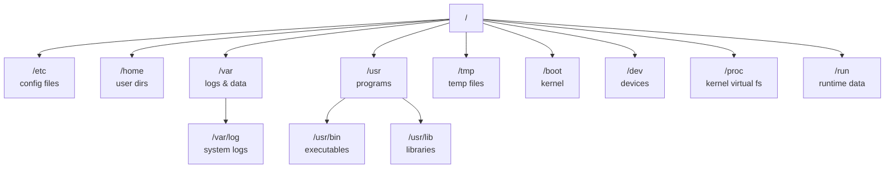

[↑ Back to TOC](#toc)

# Shell Basics — pwd, ls, cd
[](../LICENSE.md)
[](https://access.redhat.com/products/red-hat-enterprise-linux)
[](https://www.redhat.com)

The shell is your primary interface to RHEL. This chapter covers the commands
you will use every single session.

The **Bash shell** (Bourne Again SHell) is the default interactive shell on RHEL 10. It acts as the command interpreter between you and the kernel: you type a command, Bash parses it, locates the program on disk, forks a child process, and reports the result. Every administrative action — from reading logs to configuring services — begins here.

The mental model you need is simple: the shell is a **working-directory cursor** moving through a tree of directories. At any moment you are standing in exactly one directory. Commands either operate on the current directory or accept explicit paths. Knowing where you are and how to navigate efficiently is the foundation of everything else.

On RHEL, Bash inherits configuration from `/etc/profile`, `/etc/profile.d/*.sh`, and your personal `~/.bashrc` and `~/.bash_profile`. System-wide defaults live in `/etc/`; per-user overrides live in your home directory.

---
<a name="toc"></a>

## Table of contents

- [The prompt](#the-prompt)
- [Where am I? — `pwd`](#where-am-i-pwd)
- [What is here? — `ls`](#what-is-here-ls)
- [Moving around — `cd`](#moving-around-cd)
- [Absolute vs relative paths](#absolute-vs-relative-paths)
- [Important directories to know](#important-directories-to-know)
- [Filesystem layout diagram](#filesystem-layout-diagram)
- [Useful shortcuts](#useful-shortcuts)
- [Command history and recall](#command-history-and-recall)
- [Worked example](#worked-example)
- [Common mistakes and how to diagnose them](#common-mistakes-and-how-to-diagnose-them)


## The prompt

When you log in you see a prompt like:

```text
[rhel@rhel10-lab ~]$
```

| Part | Meaning |
|---|---|
| `rhel` | Current username |
| `rhel10-lab` | Hostname |
| `~` | Current directory (`~` = your home directory) |
| `$` | Regular user (would be `#` for root) |

The prompt is defined by the `PS1` environment variable. On RHEL the default value includes colour escape codes and the components above. You can inspect it with `echo $PS1`.

> **Exam tip:** The `#` prompt means you are root. Commands that require `sudo` on a normal user account run directly as root. Be deliberate — there is no undo.


[↑ Back to TOC](#toc)

---

## Where am I? — `pwd`

```bash
$ pwd
```

Output: `/home/rhel` (or wherever you are)

`pwd` = **p**rint **w**orking **d**irectory.

`pwd` reads the `PWD` environment variable which Bash updates on every `cd`. When you need the canonical (symlink-resolved) path use `pwd -P`.

```bash
# Symlink-aware physical path
pwd -P
```


[↑ Back to TOC](#toc)

---

## What is here? — `ls`

```bash
# List current directory
ls

# Long format (permissions, owner, size, date)
ls -l

# Include hidden files (names starting with .)
ls -la

# Human-readable file sizes
ls -lh

# List a specific directory
ls -l /etc

# Sort by modification time, newest first
ls -lt

# Reverse sort (oldest first)
ls -ltr

# Show inode numbers (useful for hard-link diagnostics)
ls -li
```

`ls` output columns in long format:

```text
-rw-r--r--. 1 root root 174 Jan 10 09:00 /etc/hosts
│            │ │    │    │   │             └─ filename
│            │ │    │    │   └─ last modified
│            │ │    │    └─ size in bytes
│            │ │    └─ group owner
│            │ └─ user owner
│            └─ hard link count
└─ type + permission bits + SELinux context indicator (.)
```

> **Exam tip:** `ls -ltr` (long, time-sorted, reversed) is the fastest way to find the most recently modified file in a directory.


[↑ Back to TOC](#toc)

---

## Moving around — `cd`

```bash
# Go to your home directory
cd

# Go to a specific path (absolute)
cd /etc/sysconfig

# Go up one level
cd ..

# Go up two levels
cd ../..

# Go to the previous directory
cd -
```

> **💡 Tab completion**
> Press `Tab` to auto-complete paths and command names. Press `Tab` twice
> to see all options when there are multiple matches. Use it constantly.
>


[↑ Back to TOC](#toc)

---

## Absolute vs relative paths

| Type | Example | Meaning |
|---|---|---|
| Absolute | `/etc/hosts` | Always starts from root `/` |
| Relative | `../hosts` | Relative to your current directory |

A leading `/` always means absolute. Everything else is relative. The special entries `.` (current directory) and `..` (parent directory) appear in every directory and are used to construct relative paths.

```bash
# Absolute — works from anywhere
cat /etc/hosts

# Relative — only works if you are in /etc
cat ./hosts

# Relative going up two levels then down
cat ../../etc/hosts
```


[↑ Back to TOC](#toc)

---

## Important directories to know

| Path | Contents |
|---|---|
| `/` | Root of the filesystem |
| `/home` | User home directories |
| `/etc` | System configuration files |
| `/var` | Variable data (logs, spool, databases) |
| `/usr` | Installed programs and libraries |
| `/usr/bin` | User-space executables (from packages) |
| `/usr/sbin` | System administration executables |
| `/usr/lib` | Shared libraries |
| `/usr/local` | Locally compiled software (not managed by dnf) |
| `/tmp` | Temporary files (cleared on reboot) |
| `/boot` | Kernel and bootloader files |
| `/dev` | Device files |
| `/proc` | Virtual filesystem for kernel/process info |
| `/sys` | Virtual filesystem for hardware/kernel data |
| `/run` | Runtime data (PIDs, sockets) — cleared on reboot |
| `/srv` | Data served by this host (web, ftp) |
| `/opt` | Optional third-party software |
| `/mnt` | Temporary mount points |
| `/media` | Removable media mount points |


[↑ Back to TOC](#toc)

---

## Filesystem layout diagram




[↑ Back to TOC](#toc)

---

## Useful shortcuts

| Shortcut | Effect |
|---|---|
| `Ctrl+C` | Cancel a running command |
| `Ctrl+L` | Clear the screen |
| `Ctrl+A` | Jump to start of line |
| `Ctrl+E` | Jump to end of line |
| `Ctrl+W` | Delete word backwards |
| `Ctrl+U` | Delete entire line |
| `Ctrl+R` | Reverse search through history |
| `Up arrow` | Previous command |
| `!!` | Repeat last command |
| `!$` | Last argument of previous command |
| `!*` | All arguments of previous command |
| `history` | Show command history |
| `Alt+.` | Insert last argument of previous command (same as `!$`) |


[↑ Back to TOC](#toc)

---

## Command history and recall

Bash records every command in `~/.bash_history`. The in-memory history is flushed to disk when the shell exits.

```bash
# Show the last 20 commands
history 20

# Re-run command number 42 from history
!42

# Reverse-interactive search (Ctrl+R then type)
# Press Ctrl+R, type part of a command, press Enter to execute

# Delete a specific history entry
history -d 42

# Clear all history (use with caution)
history -c
```

The number of entries kept in memory is controlled by `HISTSIZE`; the number saved to disk by `HISTFILESIZE`. On RHEL the defaults are 1000 entries each.

```bash
# Add to ~/.bashrc to keep more history
echo 'export HISTSIZE=5000' >> ~/.bashrc
echo 'export HISTFILESIZE=10000' >> ~/.bashrc
```


[↑ Back to TOC](#toc)

---

## Worked example

**Scenario:** You have just SSH'd into a production web server for the first time. You need to orient yourself quickly.

```bash
# 1. Where am I?
pwd
# /home/rhel

# 2. Who am I, and what groups do I belong to?
id
# uid=1000(rhel) gid=1000(rhel) groups=1000(rhel),10(wheel)

# 3. What is this server?
cat /etc/hostname
hostnamectl

# 4. Navigate to the web root and see what is there
cd /var/www/html
ls -ltr
# Shows files sorted by modification time — newest at the bottom

# 5. Check recent log entries
ls -lt /var/log/ | head -10
# Which log file was touched most recently?

# 6. Go back to where I came from
cd -
# Returns to /home/rhel

# 7. Review what I just did
history 10
```

Notice the pattern: navigate → inspect → act. Building this habit prevents accidental changes in the wrong directory.


[↑ Back to TOC](#toc)

---

## Common mistakes and how to diagnose them

| Symptom | Likely cause | Fix |
|---|---|---|
| `bash: cd: /etc/sysocnfig: No such file or directory` | Typo in path | Use Tab completion; double-check spelling with `ls` |
| `ls` shows nothing but the directory is not empty | Files are hidden (start with `.`) | Use `ls -la` to show hidden files |
| `Permission denied` when running a script | Execute bit not set | `chmod +x script.sh` |
| Command not found for a root-only tool | `/sbin` not in normal user's `$PATH` | Use `sudo` or switch to root; check `echo $PATH` |
| `pwd` shows the wrong path after a symlink | `pwd` returns the logical path | Use `pwd -P` for the physical (resolved) path |
| History not saving between sessions | `HISTFILESIZE=0` or shell killed | Check `~/.bashrc`; use `history -a` to flush immediately |


[↑ Back to TOC](#toc)

---

## Further reading

| Resource | Notes |
|---|---|
| [The Linux Command Line (free book)](https://linuxcommand.org/tlcl.php) | Comprehensive introduction to the Bash shell |
| [Bash Reference Manual](https://www.gnu.org/software/bash/manual/bash.html) | Official GNU Bash documentation |
| [Filesystem Hierarchy Standard](https://refspecs.linuxfoundation.org/FHS_3.0/fhs/index.html) | Defines where everything lives under `/` |

---


[↑ Back to TOC](#toc)

## Next step

→ [Files and Text](02-files-and-text.md)

[↑ Back to TOC](#toc)

---

© 2026 UncleJS — Licensed under CC BY-NC-SA 4.0
