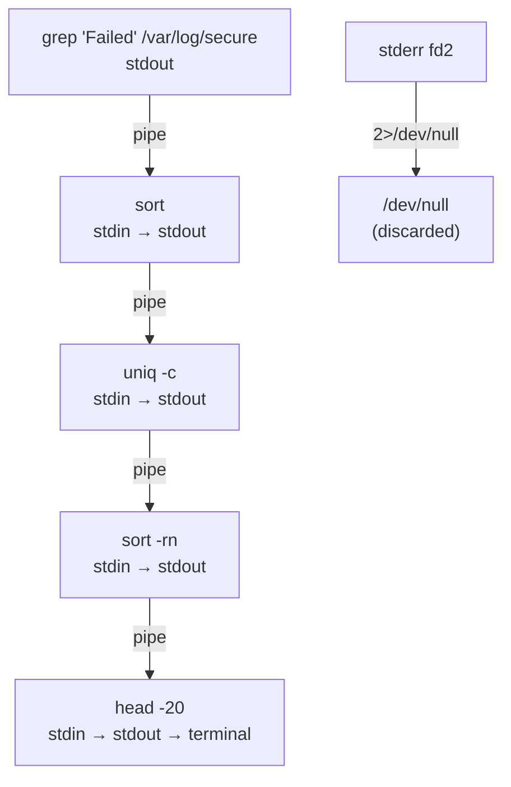

[↑ Back to TOC](#toc)

# Pipes and Redirection
[](../LICENSE.md)
[](https://access.redhat.com/products/red-hat-enterprise-linux)
[](https://www.redhat.com)

Pipes and redirection let you combine simple commands into powerful workflows.
This is one of the most useful concepts in Linux.

Every process on Linux inherits three standard file descriptors from the kernel: **stdin** (fd 0), **stdout** (fd 1), and **stderr** (fd 2). By default stdin reads from the terminal keyboard and stdout/stderr write to the terminal screen. Redirection and pipes let you rewire these connections — sending output to files, reading input from files, or chaining the output of one process directly into the input of the next.

The UNIX philosophy behind this design is: **each tool does one thing well**. `grep` filters lines, `sort` orders them, `wc` counts them. By composing tools with pipes you build powerful ad-hoc data pipelines without writing a single script. A sysadmin who is fluent with pipes can answer operational questions in seconds that would otherwise require dedicated monitoring software.

Pipes are implemented by the kernel as a small in-memory buffer. The writing process blocks when the buffer is full; the reading process blocks when it is empty. This back-pressure mechanism means the pipeline is naturally flow-controlled — no data is lost and no process runs ahead of the others.

---
<a name="toc"></a>

## Table of contents

- [Output redirection](#output-redirection)
- [Input redirection](#input-redirection)
- [Pipes — `|`](#pipes)
- [Pipe data flow diagram](#pipe-data-flow-diagram)
- [Useful commands for pipes](#useful-commands-for-pipes)
  - [`sort`](#sort)
  - [`uniq`](#uniq)
  - [`cut`](#cut)
  - [`awk`](#awk)
  - [`tee`](#tee)
  - [`tr`](#tr)
  - [`sed`](#sed)
- [Here-strings and here-documents](#here-strings-and-here-documents)
- [Process substitution](#process-substitution)
- [Worked example](#worked-example)
- [Common mistakes and how to diagnose them](#common-mistakes-and-how-to-diagnose-them)


## Output redirection

```bash
# Write stdout to a file (overwrites)
ls -l /etc > /tmp/etc-listing.txt

# Append stdout to a file
echo "new line" >> /tmp/myfile.txt

# Discard output
sudo dnf upgrade -y > /dev/null

# Redirect stderr (error output) to a file
ls /nonexistent 2> /tmp/errors.txt

# Redirect both stdout and stderr to the same file
sudo dnf upgrade -y > /tmp/upgrade.log 2>&1

# Short form (bash 4+)
sudo dnf upgrade -y &> /tmp/upgrade.log

# Append both stdout and stderr
sudo dnf upgrade -y >> /tmp/upgrade.log 2>&1

# Discard stderr entirely (suppress error messages)
find / -name "*.conf" 2>/dev/null
```

The `2>&1` token means "redirect fd 2 to wherever fd 1 currently points". Order matters: `> file 2>&1` sends both to the file; `2>&1 > file` sends stderr to the original stdout (terminal) and only stdout to the file.

> **Exam tip:** `&>` and `&>>` are Bash extensions. In POSIX `sh` scripts use the explicit form `> file 2>&1` to ensure portability.


[↑ Back to TOC](#toc)

---

## Input redirection

```bash
# Feed a file as input to a command
sort < /etc/passwd

# Equivalent (using a pipe instead)
cat /etc/passwd | sort

# Both are equivalent; the first uses no extra process
```

Input redirection with `<` is less common in interactive use because most commands accept filename arguments directly. It is more useful in scripts to feed pre-prepared data to a command.


[↑ Back to TOC](#toc)

---

## Pipes — `|`

A pipe sends the output of one command as the input to the next.

```bash
# Count lines in a directory listing
ls /etc | wc -l

# Find errors in a log
grep -i error /var/log/messages | less

# Page through long output
systemctl list-units | less

# Combine multiple pipes
grep "Failed" /var/log/secure | sort | uniq -c | sort -rn | head -20

# Show top 5 processes by CPU usage
ps aux --sort=-%cpu | head -6
```

> **💡 Think of pipes as assembly lines**
> Each command does one small job. Pipes chain them together.
> The UNIX philosophy: do one thing well.
>


[↑ Back to TOC](#toc)

---

## Pipe data flow diagram




[↑ Back to TOC](#toc)

---

## Useful commands for pipes

### `sort`

```bash
# Sort alphabetically
sort /etc/passwd

# Sort by field (delimiter :, field 3 = UID, numeric)
sort -t: -k3 -n /etc/passwd

# Sort in reverse order
sort -r /etc/passwd

# Sort and remove duplicates in one pass
sort -u /tmp/iplist.txt

# Sort by multiple keys: primary field 1, secondary field 2
sort -t: -k1,1 -k2,2n /etc/passwd
```

### `uniq`

```bash
# Remove adjacent duplicate lines (usually sort first)
grep "error" /var/log/messages | sort | uniq

# Count occurrences — most frequent errors first
grep "error" /var/log/messages | sort | uniq -c | sort -rn

# Show only lines that appear more than once
grep "error" /var/log/messages | sort | uniq -d

# Show only lines that appear exactly once
grep "error" /var/log/messages | sort | uniq -u
```

### `cut`

```bash
# Extract first field (delimiter :)
cut -d: -f1 /etc/passwd

# Extract multiple fields
cut -d: -f1,3 /etc/passwd

# Extract by byte position
cut -c1-10 /etc/passwd

# Extract IP addresses from ip addr output
ip addr | grep "inet " | cut -d/ -f1 | awk '{print $NF}'
```

### `awk`

```bash
# Print second column of output
df -h | awk '{print $2}'

# Print lines where field 3 > 1000 (regular users)
awk -F: '$3 >= 1000 {print $1}' /etc/passwd

# Print filename and size from ls -l
ls -l /etc | awk '{print $5, $9}'

# Sum a column
df -k | awk 'NR>1 {sum += $3} END {print sum " KB used"}'

# Custom output formatting
awk -F: '{printf "User: %-15s UID: %d\n", $1, $3}' /etc/passwd
```

`awk` programs follow the pattern `condition { action }`. Special patterns `BEGIN` and `END` run before and after all input is processed. `NR` is the current line number; `NF` is the number of fields.

### `tee`

Write to both screen and file simultaneously:

```bash
sudo dnf upgrade -y | tee /tmp/upgrade.log

# Append to file (do not overwrite)
sudo dnf upgrade -y | tee -a /tmp/upgrade.log

# Write to multiple files
sudo dnf upgrade -y | tee /tmp/upgrade.log /tmp/upgrade-copy.log
```

`tee` is invaluable for capturing long-running command output while still watching it in real time.

### `tr`

```bash
# Convert lowercase to uppercase
echo "hello world" | tr 'a-z' 'A-Z'

# Delete characters
echo "hello 123 world" | tr -d '0-9'

# Squeeze repeated characters
echo "hello    world" | tr -s ' '

# Replace colons with newlines (e.g., list PATH entries)
echo $PATH | tr ':' '\n'
```

### `sed`

`sed` (stream editor) applies editing operations to each line of input.

```bash
# Replace first occurrence per line
echo "root:x:0" | sed 's/root/admin/'

# Replace all occurrences per line (global)
echo "root root root" | sed 's/root/admin/g'

# Delete lines matching a pattern
sed '/^#/d' /etc/ssh/sshd_config

# Print only lines matching a pattern
sed -n '/PermitRootLogin/p' /etc/ssh/sshd_config

# In-place edit with backup (use carefully on system files)
sed -i.bak 's/PermitRootLogin yes/PermitRootLogin no/' /etc/ssh/sshd_config
```

> **Exam tip:** `sed -i` modifies the file in place. Always specify a backup suffix (`.bak`) on production files so you can recover: `sed -i.bak 's/old/new/' /etc/file`.


[↑ Back to TOC](#toc)

---

## Here-strings and here-documents

```bash
# Feed a string as stdin
grep "root" <<< "root:x:0:0:root:/root:/bin/bash"

# Feed a multi-line block as stdin (heredoc)
cat <<EOF
Line one
Line two
EOF

# Heredoc to create a file
cat > /tmp/myconfig.conf <<EOF
[global]
timeout = 30
retries = 3
EOF

# Heredoc with variable expansion disabled (single-quote the delimiter)
cat <<'EOF'
This $variable will NOT be expanded
EOF
```

Heredocs are useful in scripts to embed configuration snippets or pass multi-line input to commands without creating temporary files.


[↑ Back to TOC](#toc)

---

## Process substitution

Process substitution (`<(cmd)`) treats the output of a command as if it were a file. This is useful when a command requires two file arguments but you want to compare live output.

```bash
# Diff the output of two commands without temp files
diff <(sort /etc/passwd) <(sort /etc/group)

# Compare current hosts file with a reference
diff <(cat /etc/hosts) <(ssh remotehost cat /etc/hosts)

# Use wc on command output as if it were a file
wc -l <(find /etc -name "*.conf")
```


[↑ Back to TOC](#toc)

---

## Worked example

**Scenario:** You need to find the top 10 IP addresses making failed SSH login attempts in `/var/log/secure`, then write the results to a report file while also printing them to screen.

```bash
# Extract failed password lines, pull out the IP, count and rank them
grep "Failed password" /var/log/secure \
  | awk '{print $(NF-3)}' \
  | sort \
  | uniq -c \
  | sort -rn \
  | head -10 \
  | tee /tmp/failed-ssh-ips.txt

# Annotate the report with a timestamp header
{
  echo "=== Failed SSH IPs as of $(date) ==="
  grep "Failed password" /var/log/secure \
    | awk '{print $(NF-3)}' \
    | sort | uniq -c | sort -rn | head -10
} > /tmp/failed-ssh-report.txt

cat /tmp/failed-ssh-report.txt
```

Breaking it down:
1. `grep` — filter to failed password lines only
2. `awk '{print $(NF-3)}'` — print the IP field (3rd from end)
3. `sort` — put IPs in order so `uniq` can count adjacent duplicates
4. `uniq -c` — prepend count to each unique line
5. `sort -rn` — sort numerically descending (highest count first)
6. `head -10` — take only the top 10
7. `tee` — write to file and stdout simultaneously


[↑ Back to TOC](#toc)

---

## Common mistakes and how to diagnose them

| Symptom | Likely cause | Fix |
|---|---|---|
| `2>&1 > file` does not redirect stderr to file | Order is wrong: stderr redirected before stdout is changed | Use `> file 2>&1` (stdout first, then redirect stderr to same destination) |
| `uniq` does not deduplicate all duplicates | Input not sorted — `uniq` only removes *adjacent* duplicates | Always `sort` before `uniq` |
| Pipe chain silently returns wrong result | An intermediate command errors and outputs nothing | Test each stage in isolation; check exit codes with `echo $?` |
| `awk` prints blank lines | Column number wrong — printing empty field | Print `$0` to see full line; recount fields |
| `sed -i` corrupts the file | Writing to a file that is also being read by a service | Stop the service first, or write to a temp file then `mv` atomically |
| `tee` output not appearing | stdout of previous command is buffered | Add `stdbuf -oL` before the command: `stdbuf -oL long-cmd \| tee file` |


[↑ Back to TOC](#toc)

---

## Further reading

| Resource | Notes |
|---|---|
| [Bash Reference Manual — Redirections](https://www.gnu.org/software/bash/manual/bash.html#Redirections) | Complete redirection syntax including `&>`, `>>`, heredocs |
| [Bash Reference Manual — Pipelines](https://www.gnu.org/software/bash/manual/bash.html#Pipelines) | Pipeline semantics and exit codes |
| [UNIX Power Tools (O'Reilly)](https://www.oreilly.com/library/view/unix-power-tools/0596003307/) | Deep coverage of pipes, filters, and text processing |

---


[↑ Back to TOC](#toc)

## Next step

→ [Editing Files](04-editors.md)

[↑ Back to TOC](#toc)

---

© 2026 UncleJS — Licensed under CC BY-NC-SA 4.0
