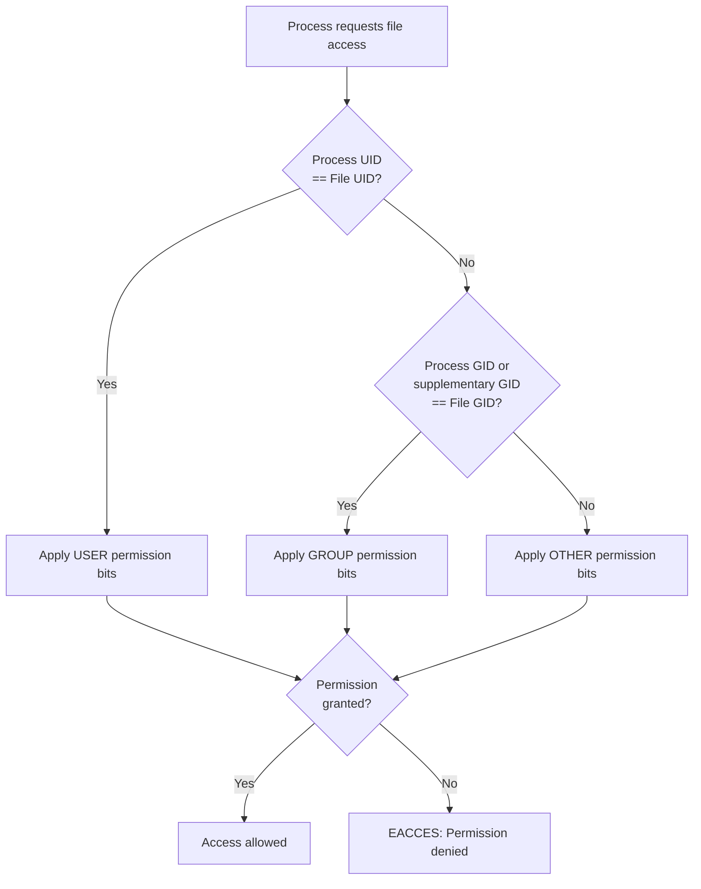

[↑ Back to TOC](#toc)

# Users, Groups, and Permissions
[](../LICENSE.md)
[](https://access.redhat.com/products/red-hat-enterprise-linux)
[](https://www.redhat.com)

Linux uses a permission model based on **users**, **groups**, and a set of
**read/write/execute** bits. Understanding this is essential for everything
that follows.

RHEL uses **Discretionary Access Control (DAC)** as its base permission model. "Discretionary" means the owner of a resource controls who can access it. Every process runs with a **UID** (user ID) and one or more **GIDs** (group IDs). Every file and directory has an owning UID and an owning GID. When a process tries to access a file, the kernel compares the process credentials against the file's permission bits and makes a grant/deny decision.

This model has been part of UNIX since the 1970s and is deliberately simple: three subjects (user, group, other) and three permissions (read, write, execute). That simplicity is also its limitation — it cannot express "user A and user B can read, but user C cannot" without adding both to a group and rearranging ownership. ACLs (covered in the next section) solve that problem while keeping DAC as the foundation.

On top of DAC, RHEL 10 runs **SELinux** in enforcing mode. SELinux is a **Mandatory Access Control (MAC)** system — it applies independently of DAC and can deny access even when DAC would allow it. Both layers must permit an operation for it to succeed. This chapter focuses on DAC. SELinux is covered separately.

---
<a name="toc"></a>

## Table of contents

- [The permission model](#the-permission-model)
  - [Permission bits](#permission-bits)
- [DAC permission check flow](#dac-permission-check-flow)
- [Viewing permissions — `ls -l`](#viewing-permissions-ls-l)
- [Changing permissions — `chmod`](#changing-permissions-chmod)
  - [Common permission patterns](#common-permission-patterns)
- [Changing ownership — `chown`](#changing-ownership-chown)
- [Changing group — `chgrp`](#changing-group-chgrp)
- [Managing groups](#managing-groups)
- [umask — default permissions](#umask-default-permissions)
- [Special permission bits](#special-permission-bits)
- [Worked example](#worked-example)
- [Common mistakes and how to diagnose them](#common-mistakes-and-how-to-diagnose-them)


## The permission model

Every file and directory has three permission sets:

```text
-rw-r--r--  1  rhel  rhel  1234  Feb 23 10:00  file.txt
│└┬┘└┬┘└┬┘     │     │
│ │   │   │     │     └── Group owner
│ │   │   │     └──────── User owner
│ │   │   └────────────── Other (everyone else)
│ │   └────────────────── Group permissions
│ └────────────────────── User permissions
└──────────────────────── File type (- = file, d = dir, l = symlink)
```

### Permission bits

| Symbol | Numeric | File meaning | Directory meaning |
|---|---|---|---|
| `r` | 4 | Read file contents | List directory contents |
| `w` | 2 | Modify file | Create/delete files inside |
| `x` | 1 | Execute file | Enter (cd into) directory |
| `-` | 0 | Permission not set | Permission not set |

The three sets are represented as three octal digits: **user | group | other**. `644` = `rw-r--r--` = user has 6 (4+2), group has 4, other has 4.


[↑ Back to TOC](#toc)

---

## DAC permission check flow

When a process accesses a file, the kernel applies this check in order:



Key point: the kernel evaluates **only one** of the three sets — the most specific match. If the process UID matches the file owner, the user bits apply **and the group/other bits are ignored entirely**, even if they would grant broader access.

> **Exam tip:** `chmod 777` does not bypass SELinux — a process still needs the correct SELinux type label (`_t`) in addition to the DAC bits. Two independent layers must both grant access.


[↑ Back to TOC](#toc)

---

## Viewing permissions — `ls -l`

```bash
ls -l /etc/hosts
```

Example output:

```text
-rw-r--r--. 1 root root 174 Jan 10 09:00 /etc/hosts
```

The `.` after the permission string indicates an SELinux context is set.

```bash
# Also show ACLs and SELinux context
ls -lZ /etc/hosts

# Show numeric permissions
stat -c "%a %n" /etc/hosts
# 644 /etc/hosts

# Show octal permissions for all files in a directory
stat -c "%a %n" /etc/*
```


[↑ Back to TOC](#toc)

---

## Changing permissions — `chmod`

```bash
# Symbolic form
chmod u+x script.sh        # add execute for user
chmod g-w file.txt         # remove write for group
chmod o= file.txt          # clear all permissions for other
chmod a+r file.txt         # add read for all (user, group, other)
chmod ug+rw file.txt       # add read+write for user and group

# Numeric (octal) form
chmod 644 file.txt         # rw-r--r--
chmod 755 script.sh        # rwxr-xr-x
chmod 600 private.key      # rw-------
chmod 700 private-dir/     # rwx------

# Recursive — apply to directory and all contents
chmod -R 755 /srv/www/
```

The symbolic form is safer for interactive use because you only change what you specify. The numeric form is faster when you know the exact target permissions.

### Common permission patterns

| Octal | Pattern | Use case |
|---|---|---|
| `600` | rw------- | Private key, secret file |
| `644` | rw-r--r-- | Config file, web content |
| `664` | rw-rw-r-- | Group-editable file |
| `755` | rwxr-xr-x | Executable script, public directory |
| `750` | rwxr-x--- | Script accessible to group only |
| `700` | rwx------ | Private directory |
| `440` | r--r----- | Read-only to owner and group (e.g., sudoers) |


[↑ Back to TOC](#toc)

---

## Changing ownership — `chown`

```bash
# Change user owner
sudo chown rhel file.txt

# Change user and group owner
sudo chown rhel:developers file.txt

# Change group only
sudo chown :developers file.txt

# Recursive (directory and all contents)
sudo chown -R rhel:developers /srv/project/

# Only regular users can give away their own files if --preserve-root is respected
# root can assign any UID/GID
```

> **Exam tip:** Only `root` can change a file's owning user. A regular user can change the owning group of a file they own — but only to a group they belong to.


[↑ Back to TOC](#toc)

---

## Changing group — `chgrp`

```bash
sudo chgrp developers file.txt

# Recursive
sudo chgrp -R developers /srv/project/
```

`chgrp` is a subset of `chown :group`. Both do the same thing; `chown` is more commonly used because it can also change the user in the same command.


[↑ Back to TOC](#toc)

---

## Managing groups

```bash
# Create a group
sudo groupadd developers

# Create a group with a specific GID
sudo groupadd -g 2001 developers

# Add a user to a group
sudo usermod -aG developers rhel

# Add a user to multiple groups at once
sudo usermod -aG developers,wheel rhel

# View your groups
groups

# View groups for a specific user
groups alice

# View all groups
getent group

# View members of a specific group
getent group developers
```

> **💡 The -aG flag**
> `-aG` means **append** to groups. Without `-a`, `usermod -G` **replaces**
> all supplementary groups — a common mistake that locks users out.
>

Group membership changes take effect on the user's **next login**. For the current session, use `newgrp <groupname>` to activate a new group without logging out:

```bash
sudo usermod -aG developers rhel
newgrp developers       # activate in current session
groups                  # verify
```


[↑ Back to TOC](#toc)

---

## umask — default permissions

`umask` defines permissions that are **removed** from newly created files and
directories.

```bash
umask          # show current umask (default: 0022)
```

With `umask 0022`:
- New files: `0666 - 0022 = 0644` (rw-r--r--)
- New directories: `0777 - 0022 = 0755` (rwxr-xr-x)

Note: the kernel never grants execute permission to newly created regular files, regardless of umask. The starting point for files is `0666`, not `0777`.

```bash
# Temporarily change umask for a session
umask 0027
# Now new files will be 640, new dirs will be 750

# Permanently set umask in ~/.bashrc or /etc/profile
echo 'umask 0027' >> ~/.bashrc
```

Common umask values:

| umask | New file perms | New dir perms | Use case |
|---|---|---|---|
| `0022` | `644` | `755` | Default — world-readable |
| `0027` | `640` | `750` | Group access only — no world read |
| `0077` | `600` | `700` | Private — owner only |
| `0002` | `664` | `775` | Group-writable (shared dev environments) |


[↑ Back to TOC](#toc)

---

## Special permission bits

| Bit | On file | On directory |
|---|---|---|
| **SUID** (`4xxx`) | Run as file owner | N/A |
| **SGID** (`2xxx`) | Run as file group | New files inherit group |
| **Sticky** (`1xxx`) | N/A | Only owner can delete their own files |

```bash
# SGID on a shared directory (new files inherit group)
chmod g+s /srv/shared/
# or
chmod 2775 /srv/shared/

# Sticky bit (e.g., /tmp)
ls -ld /tmp
# drwxrwxrwt — the 't' is the sticky bit

# Apply sticky bit
chmod +t /srv/shared/
# or
chmod 1777 /srv/shared/

# View SUID binaries (security audit)
find / -perm /4000 -type f 2>/dev/null
```

Recognising special bits in `ls -l` output:

```text
drwxrwsr-x   SGID on directory — note 's' in group execute position
drwxrwxrwt   Sticky bit — note 't' in other execute position
-rwsr-xr-x   SUID on file — note 's' in user execute position
```

If the execute bit is not set alongside the special bit, it appears as uppercase (`S` or `T`), indicating the special bit is set but execute is not — this is unusual and often a misconfiguration.

> **Exam tip:** SGID on a directory is the key mechanism for shared team directories. Combined with a `umask 0002`, it ensures new files belong to the shared group and are group-writable.


[↑ Back to TOC](#toc)

---

## Worked example

**Scenario:** Set up a shared web root that the `apache` service user can read but that your admin group (`webadmin`) can write.

```bash
# 1. Create the group and add yourself
sudo groupadd webadmin
sudo usermod -aG webadmin rhel
newgrp webadmin

# 2. Create the web root directory
sudo mkdir -p /var/www/myapp

# 3. Assign ownership: root owns it, group is webadmin
sudo chown root:webadmin /var/www/myapp

# 4. Set permissions:
#    - root: rwx
#    - webadmin group: rwx
#    - other (apache runs as apache user, falls into 'other'): r-x
#    - SGID so new files inherit webadmin group
sudo chmod 2775 /var/www/myapp

# 5. Verify
ls -ld /var/www/myapp
# drwxrwsr-x. 2 root webadmin 6 ... /var/www/myapp

# 6. Create a test file as your user
echo "<h1>Hello</h1>" > /var/www/myapp/index.html
ls -l /var/www/myapp/index.html
# -rw-rw-r--. 1 rhel webadmin 17 ... index.html
# Note: group is webadmin (SGID), not rhel

# 7. Verify apache can read it
sudo -u apache cat /var/www/myapp/index.html
# Output: <h1>Hello</h1>

# 8. Verify apache cannot write
sudo -u apache bash -c "echo test >> /var/www/myapp/index.html"
# bash: /var/www/myapp/index.html: Permission denied
```


[↑ Back to TOC](#toc)

---

## Common mistakes and how to diagnose them

| Symptom | Likely cause | Fix |
|---|---|---|
| `usermod -aG` change has no effect in current session | Group membership only applies on next login | Run `newgrp <group>` or log out and back in |
| `Permission denied` even though permissions look correct | SELinux is denying access | Check `ausearch -m avc -ts recent` or `sealert -a /var/log/audit/audit.log` |
| `usermod -G` removed user from other groups | `-G` without `-a` replaces all supplementary groups | Always use `usermod -aG`; recover with `usermod -aG group1,group2 user` |
| SGID bit disappeared after `chmod` | Used a 3-digit octal (e.g., `chmod 775`) which implicitly sets special bits to 0 | Use 4-digit octal: `chmod 2775`; or symbolic: `chmod g+s` |
| New files in shared directory not group-writable | `umask 0022` strips group write | Set `umask 0002` for users in the shared group, or set the sticky bit |
| `chown` fails with "Operation not permitted" | Only root can change the owning user | Use `sudo chown user:group file` |


[↑ Back to TOC](#toc)

---

## Further reading

| Resource | Notes |
|---|---|
| [RHEL 10 — Managing users and groups](https://access.redhat.com/documentation/en-us/red_hat_enterprise_linux/10/html/configuring_basic_system_settings/managing-users-and-groups_configuring-basic-system-settings) | Official user and group management guide |
| [`chmod` man page](https://man7.org/linux/man-pages/man1/chmod.1.html) | Symbolic and octal mode reference |
| [`umask` — Bash Reference](https://www.gnu.org/software/bash/manual/bash.html#index-umask) | How default permissions are set for new files |

---


[↑ Back to TOC](#toc)

## Next step

→ [ACLs](06-acls.md)

[↑ Back to TOC](#toc)

---

© 2026 UncleJS — Licensed under CC BY-NC-SA 4.0
