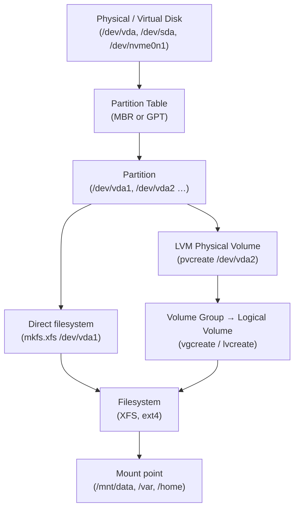

[↑ Back to TOC](#toc)

# Storage Overview — lsblk, blkid, mounts
[](../LICENSE.md)
[](https://access.redhat.com/products/red-hat-enterprise-linux)
[](https://www.redhat.com)

Before managing storage, you need to understand what devices exist, how they
are partitioned, and what is currently mounted.

The Linux storage stack is layered. At the bottom are physical (or virtual)
block devices — raw disks that expose a linear array of fixed-size blocks.
Above that layer come partition tables (MBR or GPT), which carve the disk
into named segments. Partitions can be used directly, or they can be handed
to a volume manager such as LVM, which adds another logical layer before
filesystems see the storage. Filesystems finally impose structure (directories,
inodes, journals) on the raw blocks. Everything is exposed to userspace by
mounting the filesystem onto a directory.

Understanding the full stack matters because failures and configuration
problems can occur at any layer. A disk present in `lsblk` but missing
from `blkid` typically means it is unpartitioned. A partition in `blkid` but
absent from `df` means it is not mounted. Knowing which tool interrogates
which layer speeds diagnosis considerably.

On RHEL VMs you will encounter three common disk naming conventions:
`/dev/vda` (KVM virtio), `/dev/sda` (SCSI emulation, VMware, bare metal),
and `/dev/nvme0n1` (NVMe). Partitions append a number (`vda1`) or a `p`
prefix for NVMe (`nvme0n1p1`). Device names can change across reboots;
always use UUIDs in `/etc/fstab`.

---
<a name="toc"></a>

## Table of contents

- [Block device hierarchy](#block-device-hierarchy)
- [Storage stack diagram](#storage-stack-diagram)
- [List block devices — `lsblk`](#list-block-devices-lsblk)
- [Identify filesystems — `blkid`](#identify-filesystems-blkid)
- [View current mounts](#view-current-mounts)
- [Partition tools](#partition-tools)
  - [`fdisk` (MBR and GPT, interactive)](#fdisk-mbr-and-gpt-interactive)
  - [`gdisk` (GPT only)](#gdisk-gpt-only)
  - [`parted` (scriptable, GPT-aware)](#parted-scriptable-gpt-aware)
- [Creating a filesystem](#creating-a-filesystem)
- [Mounting a filesystem](#mounting-a-filesystem)
  - [Persistent mount via `/etc/fstab`](#persistent-mount-via-etcfstab)
- [Swap](#swap)
- [Worked example](#worked-example)
- [Common mistakes and how to diagnose them](#common-mistakes-and-how-to-diagnose-them)


## Block device hierarchy

```text
Physical disk (e.g., /dev/vda)
  └── Partition (e.g., /dev/vda1, /dev/vda2)
        └── Filesystem (e.g., XFS, ext4)
              └── Mount point (e.g., /, /boot, /home)
```

On RHEL VMs you typically see:
- `/dev/vda` — KVM/QEMU virtual disk
- `/dev/sda` — SCSI/SATA disk (bare metal or VMware)
- `/dev/nvme0n1` — NVMe disk (modern bare metal)


[↑ Back to TOC](#toc)

---

## Storage stack diagram




[↑ Back to TOC](#toc)

---

## List block devices — `lsblk`

```bash
lsblk
```

Example output:

```text
NAME   MAJ:MIN RM  SIZE RO TYPE MOUNTPOINTS
vda    252:0    0   20G  0 disk
├─vda1 252:1    0    1G  0 part /boot
├─vda2 252:2    0    2G  0 part [SWAP]
└─vda3 252:3    0   17G  0 part /
```

```bash
# Show filesystem type and UUID
lsblk -f

# Show size in bytes
lsblk -b

# Show topology (useful for NVMe multiqueue)
lsblk -t

# Output as JSON (useful in scripts)
lsblk -J
```

`lsblk` reads from the kernel's sysfs and does not require root. It is the
quickest way to confirm a new disk has been recognised by the kernel after
hot-plugging or provisioning a VM disk.


[↑ Back to TOC](#toc)

---

## Identify filesystems — `blkid`

```bash
sudo blkid
```

Output shows UUID, type, and label for each partition. UUIDs are what `/etc/fstab`
uses to identify devices reliably (device names like `/dev/vda1` can change).

```bash
# Show info for a specific device
sudo blkid /dev/vda1

# Output in a specific format (udev-style key=value)
sudo blkid -o udev /dev/vda1

# Find a partition by UUID
sudo blkid -U "xxxxxxxx-xxxx-xxxx-xxxx-xxxxxxxxxxxx"
```

> **Exam tip:** After running `mkfs`, always capture the UUID with
> `sudo blkid /dev/vdbX` before editing `/etc/fstab` — copy-paste errors
> here cause boot failures.


[↑ Back to TOC](#toc)

---

## View current mounts

```bash
# All currently mounted filesystems
mount | column -t

# Only real filesystems (not virtual)
mount | grep -v " (tmpfs\|sysfs\|proc\|devtmpfs\|cgroup)"

# Disk usage per mount
df -h

# Inode usage (if disk is "full" but df looks OK)
df -ih

# Show mount options for a specific path
findmnt /mnt/data

# Show entire mount tree
findmnt --tree
```

`findmnt` is more structured than `mount` output and is the recommended
modern alternative for scripting.


[↑ Back to TOC](#toc)

---

## Partition tools

### `fdisk` (MBR and GPT, interactive)

```bash
sudo fdisk /dev/vdb      # interactive mode — type m for help
sudo fdisk -l            # list all partition tables
sudo fdisk -l /dev/vda   # list one disk
```

Key `fdisk` interactive commands:

| Key | Action |
|---|---|
| `n` | New partition |
| `d` | Delete partition |
| `t` | Change partition type |
| `p` | Print partition table |
| `w` | Write changes and exit |
| `q` | Quit without saving |

### `gdisk` (GPT only)

```bash
sudo gdisk /dev/vdb
```

Use `gdisk` when you need GPT-specific partition type GUIDs (e.g., Linux
LVM type `8e00`). Accepts the same interactive subcommands as `fdisk`.

### `parted` (scriptable, GPT-aware)

```bash
sudo parted /dev/vdb print
sudo parted /dev/vdb mklabel gpt
sudo parted /dev/vdb mkpart primary xfs 1MiB 100%

# Non-interactive one-liner (safe for scripts)
sudo parted -s /dev/vdb mklabel gpt mkpart primary xfs 1MiB 100%
```

After partitioning, inform the kernel:

```bash
sudo partprobe /dev/vdb
```


[↑ Back to TOC](#toc)

---

## Creating a filesystem

```bash
# XFS (default on RHEL)
sudo mkfs.xfs /dev/vdb1

# XFS with a label
sudo mkfs.xfs -L mydata /dev/vdb1

# XFS — force creation even if existing filesystem detected
sudo mkfs.xfs -f /dev/vdb1

# ext4 (legacy, occasionally needed)
sudo mkfs.ext4 /dev/vdb1

# ext4 with a label
sudo mkfs.ext4 -L mydata /dev/vdb1
```

XFS is the correct choice on RHEL 10 for new filesystems. Use ext4 only when
a specific requirement dictates it (e.g., the LV will need to be shrunk later).


[↑ Back to TOC](#toc)

---

## Mounting a filesystem

```bash
# Create mount point
sudo mkdir -p /mnt/data

# Mount temporarily
sudo mount /dev/vdb1 /mnt/data

# Mount by UUID
sudo mount UUID="<uuid-from-blkid>" /mnt/data

# Mount with specific options
sudo mount -o noatime,noexec /dev/vdb1 /mnt/data

# Unmount
sudo umount /mnt/data

# Lazy unmount (defers until all processes exit)
sudo umount -l /mnt/data
```

### Persistent mount via `/etc/fstab`

```bash
sudo blkid /dev/vdb1   # get UUID
sudo vim /etc/fstab
```

Add a line:

```text
UUID=<your-uuid>  /mnt/data  xfs  defaults  0 0
```

Test without rebooting:

```bash
sudo mount -a
```

> **🚨 Always test fstab before rebooting**
> A bad fstab entry can prevent the system from booting. Always run
> `sudo mount -a` after editing fstab to catch errors immediately.
>


[↑ Back to TOC](#toc)

---

## Swap

```bash
# Check current swap
swapon --show

# Create a swap partition
sudo mkswap /dev/vdb2
sudo swapon /dev/vdb2

# Add to fstab for persistence
UUID=<swap-uuid>  swap  swap  defaults  0 0

# Create a swap file (alternative to partition)
sudo dd if=/dev/zero of=/swapfile bs=1M count=2048   # 2 GB
sudo chmod 600 /swapfile
sudo mkswap /swapfile
sudo swapon /swapfile

# Adjust swap priority (higher = preferred)
sudo swapon -p 10 /dev/vdb2

# Disable swap temporarily
sudo swapoff /dev/vdb2
```

Swap should equal RAM for systems up to 8 GB. For larger systems, 4–8 GB
of swap is usually sufficient unless hibernation is required (then swap must
be ≥ RAM).


[↑ Back to TOC](#toc)

---

## Worked example

**Scenario:** A new database server has been provisioned with a second
50 GB disk (`/dev/vdb`). Plan and implement storage for:
- `/var/lib/mysql` — 40 GB XFS (database data)
- swap — 8 GB (server has 8 GB RAM)

```bash
# 1 — Confirm the disk is visible
lsblk /dev/vdb

# 2 — Create GPT partition table with two partitions
sudo parted -s /dev/vdb \
  mklabel gpt \
  mkpart swap linux-swap 1MiB 8193MiB \
  mkpart data xfs 8193MiB 100%

# 3 — Inform kernel
sudo partprobe /dev/vdb
lsblk /dev/vdb   # should show vdb1 and vdb2

# 4 — Create filesystems
sudo mkswap -L dbswap /dev/vdb1
sudo mkfs.xfs -L mysqldata /dev/vdb2

# 5 — Activate swap immediately
sudo swapon /dev/vdb1
swapon --show

# 6 — Create the MySQL data directory mount point
sudo mkdir -p /var/lib/mysql

# 7 — Capture UUIDs
sudo blkid /dev/vdb1
sudo blkid /dev/vdb2

# 8 — Add to /etc/fstab (replace UUIDs with actual values)
sudo tee -a /etc/fstab <<'EOF'
UUID=<swap-uuid>   swap            swap  defaults        0 0
UUID=<data-uuid>   /var/lib/mysql  xfs   defaults,noatime 0 0
EOF

# 9 — Test mount
sudo mount -a
df -h /var/lib/mysql

# 10 — Fix ownership for MySQL
sudo chown mysql:mysql /var/lib/mysql
```

This gives MySQL its own isolated filesystem. If it fills up, you can extend
the partition or migrate to LVM without touching the OS disk.


[↑ Back to TOC](#toc)

---

## Common mistakes and how to diagnose them

| Mistake | Symptom | Fix |
|---|---|---|
| Device name used in fstab instead of UUID | System fails to mount after disk order changes | Replace `/dev/vdb1` with `UUID=...` from `blkid` |
| Forgot `partprobe` after partitioning | New partition invisible to `lsblk` | Run `sudo partprobe /dev/vdb` or reboot |
| `mkfs.xfs` on a disk that already has data | Data silently destroyed | Always `lsblk -f` before formatting to check for existing filesystems; use `-f` flag intentionally |
| `mount -a` not run after fstab edit | Error only discovered at reboot | Always run `sudo mount -a` immediately after editing fstab |
| Swap partition not activated on boot | Low-memory OOM events after reboot despite swap existing | Ensure swap UUID is in fstab with type `swap` |
| Mount point directory does not exist | `mount: /mnt/data: mount point does not exist` | `sudo mkdir -p /mnt/data` before mounting |


[↑ Back to TOC](#toc)

---

## Further reading

| Resource | Notes |
|---|---|
| [RHEL 10 — Managing storage devices](https://access.redhat.com/documentation/en-us/red_hat_enterprise_linux/10/html/managing_storage_devices/index) | Official storage overview, device naming, partitioning |
| [`lsblk` man page](https://man7.org/linux/man-pages/man8/lsblk.8.html) | Full option reference |
| [`blkid` man page](https://man7.org/linux/man-pages/man8/blkid.8.html) | Block device attribute querying |

---


[↑ Back to TOC](#toc)

## Next step

→ [Filesystems and fstab](03-filesystems-fstab.md)

[↑ Back to TOC](#toc)

---

© 2026 UncleJS — Licensed under CC BY-NC-SA 4.0
