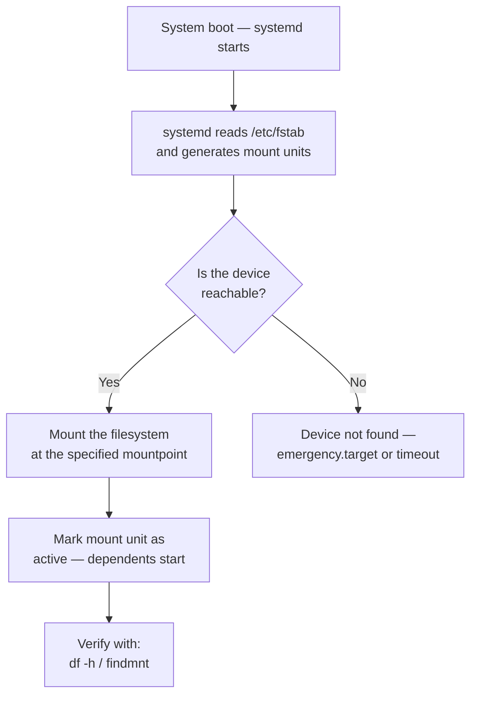

[↑ Back to TOC](#toc)

# Filesystems and fstab
[](../LICENSE.md)
[](https://access.redhat.com/products/red-hat-enterprise-linux)
[](https://www.redhat.com)

This chapter covers XFS filesystem management and persistent mounts via
`/etc/fstab` — the foundation of storage configuration on RHEL.

A **filesystem** imposes a directory hierarchy, ownership, permissions, and
metadata (inodes) on a raw block device. Without a filesystem, a partition is
just an undifferentiated sequence of blocks the OS cannot address by filename.
The filesystem choice affects performance, maximum capacity, and operational
behaviour (especially around growth and recovery).

**XFS** is RHEL's default filesystem for a reason: it was designed for large
files and high-throughput I/O, scales to 8 EiB, and recovers from crashes
using its journal without a full fsck pass. Its one deliberate limitation —
no online shrink — pushes administrators to plan partition sizes correctly
rather than resize carelessly.

`/etc/fstab` is the authoritative record of what gets mounted at boot. Each
line maps a block device to a mount point, specifies the filesystem type and
mount options, and tells init tools whether to run integrity checks. A
malformed fstab is one of the most common causes of a non-booting RHEL system,
so the workflow of edit → `mount -a` → verify is critical discipline.

---
<a name="toc"></a>

## Table of contents

- [XFS — RHEL's default filesystem](#xfs-rhels-default-filesystem)
- [Create and mount XFS](#create-and-mount-xfs)
- [`/etc/fstab` — persistent mounts](#etcfstab-persistent-mounts)
  - [Format](#format)
  - [Add an entry](#add-an-entry)
  - [Test immediately (do not wait for reboot)](#test-immediately-do-not-wait-for-reboot)
- [fstab mount sequence diagram](#fstab-mount-sequence-diagram)
- [Common mount options](#common-mount-options)
- [Growing an XFS filesystem](#growing-an-xfs-filesystem)
- [XFS tools](#xfs-tools)
- [Diagnosing full filesystems](#diagnosing-full-filesystems)
- [Worked example](#worked-example)
- [Common mistakes and how to diagnose them](#common-mistakes-and-how-to-diagnose-them)


## XFS — RHEL's default filesystem

XFS is a high-performance 64-bit journaling filesystem. It is the default
on RHEL and the best choice for most workloads.

| Feature | Value |
|---|---|
| Max filesystem size | 8 EiB |
| Max file size | 8 EiB |
| Journal | Metadata only (fast recovery) |
| Growing | Supported online (no unmount needed) |
| Shrinking | **Not supported** — size wisely |
| Allocation groups | Parallel I/O via multiple internal allocation units |
| Delayed allocation | Batches small writes for efficiency |

> **⚠️ XFS cannot be shrunk**
> Plan your XFS partition sizes with room to grow. Once created, an XFS
> filesystem can only be extended, not reduced.
>

**ext4** remains available for cases where shrinking is required — for example,
an LV that might need to be reduced in an emergency. For all other new
workloads, prefer XFS.


[↑ Back to TOC](#toc)

---

## Create and mount XFS

```bash
# Partition (if starting from a raw disk)
sudo parted /dev/vdb mklabel gpt
sudo parted /dev/vdb mkpart primary xfs 1MiB 100%
sudo partprobe /dev/vdb    # inform kernel of new partition table

# Format
sudo mkfs.xfs /dev/vdb1

# Format with a human-readable label (visible in blkid / lsblk -f)
sudo mkfs.xfs -L appdata /dev/vdb1

# Mount point
sudo mkdir -p /mnt/data

# Temporary mount (lost on reboot)
sudo mount /dev/vdb1 /mnt/data

# Verify
df -h /mnt/data
```

Labels are optional but useful in `/etc/fstab` when they are more readable
than a UUID. Use `LABEL=appdata` as the device field.


[↑ Back to TOC](#toc)

---

## `/etc/fstab` — persistent mounts

`/etc/fstab` defines what gets mounted at boot.

### Format

```text
<device>  <mountpoint>  <fstype>  <options>  <dump>  <pass>
```

| Field | Value | Notes |
|---|---|---|
| device | `UUID=...` | Prefer UUID over device name |
| mountpoint | `/mnt/data` | Must exist before mounting |
| fstype | `xfs` | Filesystem type |
| options | `defaults` | Common mount options |
| dump | `0` | `0` = do not back up with dump |
| pass | `0` | `0` = no fsck at boot (XFS handles its own recovery) |

For XFS, always use `pass 0` — XFS replays its journal automatically and
does not use `fsck`. Using `pass 1` or `2` on XFS triggers `xfs_repair`,
which is slower and designed for corrupted filesystems, not routine checks.

### Add an entry

```bash
# Get the UUID
sudo blkid /dev/vdb1
```

```bash
sudo vim /etc/fstab
```

```text
UUID=xxxxxxxx-xxxx-xxxx-xxxx-xxxxxxxxxxxx  /mnt/data  xfs  defaults  0 0
```

### Test immediately (do not wait for reboot)

```bash
sudo mount -a
```

> **✅ Verify**
> ```bash
> df -h /mnt/data
> ```
> Look for: `/mnt/data` with the expected size
>

> **Exam tip:** `mount -a` attempts to mount every entry in fstab that is
> not already mounted. If it returns an error, fix fstab before rebooting.
> A system that cannot mount its filesystems drops to emergency mode.


[↑ Back to TOC](#toc)

---

## fstab mount sequence diagram




[↑ Back to TOC](#toc)

---

## Common mount options

| Option | Meaning |
|---|---|
| `defaults` | rw, suid, exec, auto, nouser, async |
| `noexec` | Prevent executing binaries from this mount |
| `nosuid` | Ignore SUID/SGID bits |
| `noatime` | Don't update access time (performance gain) |
| `relatime` | Update atime only if older than mtime (default on most kernels) |
| `ro` | Read-only |
| `_netdev` | Wait for network before mounting (NFS, iSCSI) |
| `nofail` | Do not fail boot if this mount is unavailable |
| `x-systemd.automount` | Automount on first access (lazy mount) |

Combine options with commas: `defaults,noatime,noexec`.

Security-sensitive mounts (e.g., `/tmp`, `/var/tmp`) should include
`noexec,nosuid,nodev` to prevent privilege escalation via those paths.


[↑ Back to TOC](#toc)

---

## Growing an XFS filesystem

XFS supports online growth (filesystem stays mounted):

```bash
# First, grow the underlying partition or LV (see LVM chapter)
# Then grow the filesystem to fill the new space:
sudo xfs_growfs /mnt/data

# Specify the new size explicitly (in filesystem blocks)
sudo xfs_growfs -D <newsize> /mnt/data

# Show current filesystem geometry before and after
sudo xfs_info /mnt/data
```

`xfs_growfs` takes the **mount point** as its argument, not the device path.
If the filesystem is not mounted, growth is not possible — mount it first.


[↑ Back to TOC](#toc)

---

## XFS tools

```bash
# View filesystem info (block size, AG count, geometry)
sudo xfs_info /mnt/data

# Repair (must be unmounted)
sudo xfs_repair /dev/vdb1

# Dry-run repair (reports issues without fixing)
sudo xfs_repair -n /dev/vdb1

# Dump/restore (for backup)
sudo xfsdump -l 0 -f /backup/data.dump /mnt/data
sudo xfsrestore -f /backup/data.dump /mnt/restore

# Freeze/thaw filesystem (for consistent snapshots)
sudo xfs_freeze -f /mnt/data    # freeze writes
sudo xfs_freeze -u /mnt/data    # unfreeze
```

`xfs_repair` requires the filesystem to be **unmounted**. If it is the root
filesystem, boot from rescue media to repair it.


[↑ Back to TOC](#toc)

---

## Diagnosing full filesystems

```bash
# Check disk usage
df -h

# Find directories consuming the most space
sudo du -sh /var/* | sort -rh | head -20

# Recursive find in a specific directory
sudo du -sh /var/log/* | sort -rh

# Find files consuming inodes (inode exhaustion looks like full disk)
df -ih

# Find large individual files (>100MB)
sudo find /var -size +100M -type f -ls 2>/dev/null

# Find files that have been deleted but are still held open by a process
sudo lsof +L1 | grep deleted
```

**Inode exhaustion** deserves special attention: a filesystem can have space
available but zero free inodes, making it impossible to create new files. This
is common with logging services that create millions of tiny files. `df -ih`
shows inode usage; `df -i /path` scopes it to one filesystem.


[↑ Back to TOC](#toc)

---

## Worked example

**Scenario:** A developer reports that `/var/www/html` is on the root
filesystem and consuming it. You must create a dedicated 10 GB XFS
filesystem and bind-mount it to `/var/www/html` without disrupting the
running web server.

```bash
# 1 — Confirm available disk (assume /dev/vdb is free)
lsblk /dev/vdb

# 2 — Partition and format
sudo parted -s /dev/vdb mklabel gpt mkpart primary xfs 1MiB 100%
sudo partprobe /dev/vdb
sudo mkfs.xfs -L webdata /dev/vdb1

# 3 — Mount to a temporary location to copy data
sudo mkdir -p /mnt/webstage
sudo mount /dev/vdb1 /mnt/webstage

# 4 — Copy existing data preserving permissions
sudo rsync -aAX /var/www/html/ /mnt/webstage/

# 5 — Get UUID
sudo blkid /dev/vdb1
# e.g. UUID=aabbccdd-1234-...

# 6 — Add persistent fstab entry
# Mount on /var/www/html directly
sudo tee -a /etc/fstab <<'EOF'
UUID=aabbccdd-1234-5678-xxxx-xxxxxxxxxxxx  /var/www/html  xfs  defaults,noatime  0 0
EOF

# 7 — Umount staging, remount to real path
sudo umount /mnt/webstage

# 8 — Mount everything from fstab (mounts the new entry)
sudo mount -a

# 9 — Verify
df -h /var/www/html
ls /var/www/html    # confirm data is present

# 10 — Reload the web server (it may need to re-open file handles)
sudo systemctl reload httpd
```


[↑ Back to TOC](#toc)

---

## Common mistakes and how to diagnose them

| Mistake | Symptom | Fix |
|---|---|---|
| Wrong UUID in fstab | System drops to emergency mode at boot | Boot rescue, edit `/etc/fstab`, verify UUID with `blkid` |
| `pass` set to `1` or `2` for XFS | `xfs_repair` runs unnecessarily at boot, causing delays | Set `pass` to `0` for all XFS filesystems |
| Mount point does not exist | `mount: /mnt/data: mount point does not exist` | `sudo mkdir -p /mnt/data` before mounting |
| Forgot `partprobe` after `parted` | Partition invisible; `mkfs` fails with "no such file" | `sudo partprobe /dev/vdb` |
| Running `xfs_growfs` before extending the LV/partition | `xfs_growfs: XFS_IOC_FSGROWFSDATA ioctl: Invalid argument` | Extend the LV first (`lvextend`), then run `xfs_growfs` |
| Disk full due to deleted-but-open files | `df` shows 100% but `du` finds far less | `sudo lsof +L1` to find culprit process, restart it to release handles |


[↑ Back to TOC](#toc)

---

## Further reading

| Resource | Notes |
|---|---|
| [RHEL 10 — Managing file systems](https://access.redhat.com/documentation/en-us/red_hat_enterprise_linux/10/html/managing_file_systems/index) | XFS, ext4, fstab, and mount options |
| [`fstab` man page](https://man7.org/linux/man-pages/man5/fstab.5.html) | Complete mount options and field descriptions |
| [XFS documentation](https://xfs.wiki.kernel.org/) | Upstream XFS project wiki and performance notes |
| [`xfs_repair` man page](https://man7.org/linux/man-pages/man8/xfs_repair.8.html) | Recovery tool reference |

---


[↑ Back to TOC](#toc)

## Next step

→ [LVM](04-lvm.md)

[↑ Back to TOC](#toc)

---

© 2026 UncleJS — Licensed under CC BY-NC-SA 4.0
