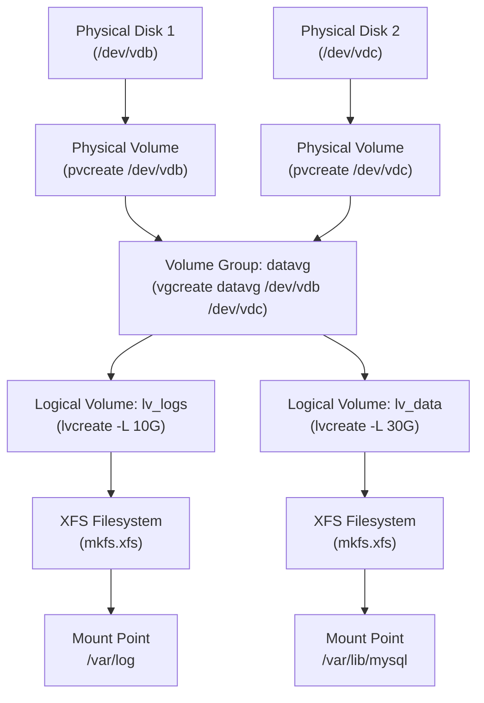

[↑ Back to TOC](#toc)

# LVM — Create, Extend, Reduce Safely
[](../LICENSE.md)
[](https://access.redhat.com/products/red-hat-enterprise-linux)
[](https://www.redhat.com)

**Logical Volume Management (LVM)** adds a flexible abstraction layer between
physical storage and filesystems. It lets you resize, snapshot, and reorganise
storage without downtime.

The mental model has three layers: think of **Physical Volumes (PVs)** as raw
material — each is a disk or partition donated to LVM. PVs are contributed into
a **Volume Group (VG)**, which acts as a single storage pool regardless of how
many physical disks back it. From that pool you carve out **Logical Volumes
(LVs)**, which look like ordinary block devices to the rest of the system.
Filesystems and applications see only the LV; they are completely unaware of
how many physical disks or partitions underlie it.

This abstraction unlocks three key capabilities unavailable with raw partitions:
**online extension** (grow an LV while it is mounted and in use), **disk
addition** (add a new PV to a VG to increase the pool without touching existing
data), and **snapshots** (a copy-on-write point-in-time image of an LV,
useful for backups or safe upgrades). The cost is a small amount of overhead
and slightly more operational complexity.

LVM is the default storage architecture for RHEL installations. The root,
swap, and home filesystems are typically LVs in a `rhel` volume group. You
will extend these LVs constantly in production work.

---
<a name="toc"></a>

## Table of contents

- [LVM concepts](#lvm-concepts)
- [LVM layer diagram](#lvm-layer-diagram)
- [Create an LVM setup from scratch](#create-an-lvm-setup-from-scratch)
  - [1 — Initialise the PV](#1-initialise-the-pv)
  - [2 — Create a VG](#2-create-a-vg)
  - [3 — Create an LV](#3-create-an-lv)
  - [4 — Format and mount](#4-format-and-mount)
  - [5 — Add to fstab](#5-add-to-fstab)
- [Extend an LV (online, no downtime)](#extend-an-lv-online-no-downtime)
- [Reduce an LV (ext4 only — not XFS)](#reduce-an-lv-ext4-only-not-xfs)
- [Add a new PV to an existing VG](#add-a-new-pv-to-an-existing-vg)
- [Remove a PV from a VG (pvmove)](#remove-a-pv-from-a-vg-pvmove)
- [LVM snapshot (basics)](#lvm-snapshot-basics)
- [LVM status commands](#lvm-status-commands)
- [Worked example](#worked-example)
- [Common mistakes and how to diagnose them](#common-mistakes-and-how-to-diagnose-them)


## LVM concepts

```text
Physical disk(s)
    └── Physical Volume (PV)   [pvcreate]
          └── Volume Group (VG) [vgcreate]
                ├── Logical Volume (LV) [lvcreate]
                └── Logical Volume (LV)
                      └── Filesystem (mkfs.xfs)
                            └── Mount point
```

| Term | Description |
|---|---|
| **PV** (Physical Volume) | A disk or partition initialised for LVM |
| **VG** (Volume Group) | A pool of storage from one or more PVs |
| **LV** (Logical Volume) | A slice of a VG; behaves like a partition |
| **PE** (Physical Extent) | Smallest allocation unit (default 4 MiB) |
| **LE** (Logical Extent) | Logical counterpart of a PE; 1 LE maps to 1 PE |
| **thin pool** | A VG sub-pool for over-provisioned (thin) LVs |


[↑ Back to TOC](#toc)

---

## LVM layer diagram




[↑ Back to TOC](#toc)

---

## Create an LVM setup from scratch

Assumes a raw extra disk `/dev/vdb` (adjust to your device).

### 1 — Initialise the PV

```bash
sudo pvcreate /dev/vdb
```

You can also initialise a partition instead of a whole disk:

```bash
sudo parted -s /dev/vdb mklabel gpt mkpart primary 1MiB 100%
sudo partprobe /dev/vdb
sudo pvcreate /dev/vdb1
```

> **✅ Verify**
> ```bash
> sudo pvs
> ```
> Look for `/dev/vdb` in the output.
>

### 2 — Create a VG

```bash
sudo vgcreate datavg /dev/vdb
```

A VG can span multiple PVs from the start:

```bash
sudo vgcreate datavg /dev/vdb /dev/vdc
```

> **✅ Verify**
> ```bash
> sudo vgs
> ```
> Look for: `datavg` with free space shown.
>

### 3 — Create an LV

```bash
# Create a 5 GB logical volume named 'datalv'
sudo lvcreate -L 5G -n datalv datavg

# Or use 100% of free space
sudo lvcreate -l 100%FREE -n datalv datavg

# Use 80% of free space (leave room for snapshots)
sudo lvcreate -l 80%FREE -n datalv datavg
```

> **✅ Verify**
> ```bash
> sudo lvs
> ```
> Look for: `datalv` in `datavg` with size `5.00g`.
>

### 4 — Format and mount

```bash
sudo mkfs.xfs /dev/datavg/datalv
sudo mkdir -p /mnt/data
sudo mount /dev/datavg/datalv /mnt/data
```

The device mapper also exposes the LV as `/dev/mapper/datavg-datalv`.
Both paths are equivalent; prefer `/dev/VG/LV` for readability.

### 5 — Add to fstab

```bash
sudo blkid /dev/datavg/datalv
```

Add to `/etc/fstab`:

```text
/dev/datavg/datalv  /mnt/data  xfs  defaults  0 0
```

(LVM device paths are stable — using the `/dev/VG/LV` path is fine for LVM.)

```bash
# Test immediately
sudo mount -a
```


[↑ Back to TOC](#toc)

---

## Extend an LV (online, no downtime)

```bash
# Extend LV by 2 GB
sudo lvextend -L +2G /dev/datavg/datalv

# Extend to an absolute size
sudo lvextend -L 10G /dev/datavg/datalv

# Use all remaining free space in the VG
sudo lvextend -l +100%FREE /dev/datavg/datalv

# Grow XFS filesystem to fill (online)
sudo xfs_growfs /mnt/data
```

Or extend and grow in one command:

```bash
sudo lvextend -L +2G -r /dev/datavg/datalv
```

(`-r` = resize filesystem automatically after extending)

> **Exam tip:** `lvextend -r` resizes the filesystem in one step. Without
> `-r` you must run `xfs_growfs /mountpoint` (XFS) or `resize2fs /dev/VG/LV`
> (ext4) separately. Forgetting the filesystem resize is a common exam error —
> the LV is larger but the filesystem still reports the old size.


[↑ Back to TOC](#toc)

---

## Reduce an LV (ext4 only — not XFS)

> **⚠️ XFS cannot be shrunk**
> Reduction only works with ext4. For XFS, create a new LV at the right size.
>

```bash
# ext4 only — unmount first
sudo umount /mnt/data
sudo e2fsck -f /dev/datavg/datalv
sudo resize2fs /dev/datavg/datalv 4G
sudo lvreduce -L 4G /dev/datavg/datalv
sudo mount /dev/datavg/datalv /mnt/data
```

Always run `resize2fs` **before** `lvreduce`. Shrinking the LV first and then
the filesystem will corrupt data.


[↑ Back to TOC](#toc)

---

## Add a new PV to an existing VG

When a VG runs low on space:

```bash
sudo pvcreate /dev/vdc
sudo vgextend datavg /dev/vdc
sudo vgs   # confirm new free space
```

You can immediately use the new free space to extend existing LVs.


[↑ Back to TOC](#toc)

---

## Remove a PV from a VG (pvmove)

To retire a physical disk without data loss, first migrate its extents:

```bash
# Move all extents off /dev/vdb onto remaining PVs in the VG
sudo pvmove /dev/vdb

# Watch progress (runs in background by default with -b)
sudo pvmove -b /dev/vdb
sudo lvs -a -o +devices   # check device assignment

# Once pvmove completes, remove PV from VG
sudo vgreduce datavg /dev/vdb

# Remove LVM metadata from the disk
sudo pvremove /dev/vdb
```

`pvmove` is live and online — data remains accessible throughout the migration.


[↑ Back to TOC](#toc)

---

## LVM snapshot (basics)

```bash
# Create a read-only snapshot of datalv (2G COW space)
sudo lvcreate -L 2G -s -n datalv-snap /dev/datavg/datalv

# Mount the snapshot read-only
sudo mount -o ro /dev/datavg/datalv-snap /mnt/snap

# Remove when done
sudo umount /mnt/snap
sudo lvremove /dev/datavg/datalv-snap
```

The snapshot only stores blocks that change after creation (copy-on-write).
Size the snapshot COW space generously — if it fills up, the snapshot becomes
invalid. Monitor with `lvs -a -o +snap_percent`.


[↑ Back to TOC](#toc)

---

## LVM status commands

```bash
sudo pvs          # physical volumes (brief)
sudo pvdisplay    # physical volumes (detailed)
sudo pvdisplay /dev/vdb    # specific PV

sudo vgs          # volume groups (brief)
sudo vgdisplay    # volume groups (detailed)
sudo vgdisplay datavg

sudo lvs          # logical volumes (brief)
sudo lvdisplay    # logical volumes (detailed)
sudo lvdisplay /dev/datavg/datalv

# Show LVs with the underlying device columns
sudo lvs -o +devices

# Show PV-level extent map
sudo pvs -v
```


[↑ Back to TOC](#toc)

---

## Worked example

**Scenario:** `/var/log` is on an LV (`/dev/rhel/lv_log`, 5 GB) and is at
92% full. Extend it online by 5 GB using free space already in the VG.
No downtime is acceptable.

```bash
# 1 — Confirm the problem
df -h /var/log
# Filesystem                   Size  Used Avail Use% Mounted on
# /dev/mapper/rhel-lv_log      5.0G  4.6G  400M  92% /var/log

# 2 — Check available free space in the VG
sudo vgs rhel
# VFree shows available space, e.g. 10.00g

# 3 — Extend the LV AND resize the filesystem in one step
sudo lvextend -L +5G -r /dev/rhel/lv_log

# 4 — Confirm the filesystem is now larger
df -h /var/log
# Filesystem                   Size  Used Avail Use% Mounted on
# /dev/mapper/rhel-lv_log      10.0G  4.6G  5.4G  46% /var/log

# 5 — Confirm LV size
sudo lvs /dev/rhel/lv_log
```

The `-r` flag ran `xfs_growfs` automatically. The service writing to
`/var/log` was never interrupted.

**Variation — VG is also full:**

```bash
# Add a new disk and extend the VG first
sudo pvcreate /dev/vdc
sudo vgextend rhel /dev/vdc

# Now extend the LV as above
sudo lvextend -L +5G -r /dev/rhel/lv_log
```


[↑ Back to TOC](#toc)

---

## Common mistakes and how to diagnose them

| Mistake | Symptom | Fix |
|---|---|---|
| `lvextend` without `-r` | LV is larger but `df` still shows old size | Run `xfs_growfs /mountpoint` (XFS) or `resize2fs /dev/VG/LV` (ext4) |
| Shrinking XFS LV | `xfs_growfs: XFS_IOC_FSGROWFSDATA ioctl: Invalid argument` | XFS cannot shrink; back up data, remove LV, recreate smaller, restore |
| Snapshot COW space fills up | Snapshot auto-deactivated; data reads fail | Resize snapshot: `lvextend -L +2G /dev/VG/snap` or recreate it |
| `pvcreate` on a disk already in use | Overwrites partition table / existing data | Always verify with `lsblk -f` before `pvcreate` |
| fstab uses `/dev/vdb1` instead of `/dev/VG/LV` | Mount breaks when disk is renamed | Use `/dev/VG/LV` or the UUID for LVM volumes |
| Ran `lvreduce` before `resize2fs` | Filesystem corruption, data loss | Run `e2fsck -f` and try `resize2fs`; may need restore from backup |


[↑ Back to TOC](#toc)

---

## Further reading

| Resource | Notes |
|---|---|
| [RHEL 10 — Configuring and managing logical volumes](https://access.redhat.com/documentation/en-us/red_hat_enterprise_linux/10/html/configuring_and_managing_logical_volumes/index) | Official LVM guide including thin provisioning and snapshots |
| [LVM2 resource page](https://sourceware.org/lvm2/) | Upstream LVM2 project and man pages |
| [`lvmconfig` man page](https://man7.org/linux/man-pages/man8/lvmconfig.8.html) | LVM configuration file reference |

---


[↑ Back to TOC](#toc)

## Next step

→ [systemd Essentials](05-systemd-basics.md)

[↑ Back to TOC](#toc)

---

© 2026 UncleJS — Licensed under CC BY-NC-SA 4.0
