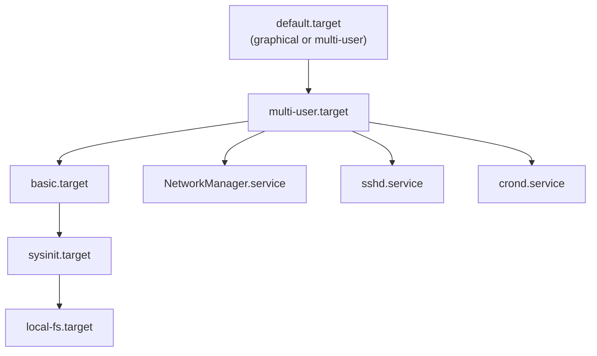

[↑ Back to TOC](#toc)

# systemd Essentials
[](../LICENSE.md)
[](https://access.redhat.com/products/red-hat-enterprise-linux)
[](https://www.redhat.com)

systemd is the init system and service manager for RHEL 10. Understanding
it is non-negotiable for RHEL administration.

systemd replaces the old SysV init scripts with a declarative, dependency-driven
model. Instead of numbered runlevels and hand-crafted shell scripts, you write
small **unit files** that describe what a service needs and how to run it.
systemd reads all unit files at boot, builds a dependency graph, and starts
units in parallel wherever possible — dramatically improving boot times on
modern multi-core hardware.

Every managed resource is a **unit**. Services, filesystems, sockets, timers,
device events, and swap partitions all have corresponding unit types. This
uniformity means the same `systemctl` command works for all of them: start,
stop, enable, disable, and inspect any unit the same way regardless of type.

The concept of **targets** replaces runlevels. A target is simply a group of
units that together define a desired system state. `multi-user.target`
corresponds to runlevel 3 (headless multi-user), `graphical.target` to
runlevel 5 (GUI). Targets can depend on other targets, forming a DAG that
systemd walks at boot.

Unit files you create or override live in `/etc/systemd/system/`. Files
provided by packages live in `/usr/lib/systemd/system/` — never edit those
directly. Use `systemctl edit` to create drop-ins that override specific
directives without touching the vendor file.

---
<a name="toc"></a>

## Table of contents

- [Key concepts](#key-concepts)
- [Unit dependency diagram](#unit-dependency-diagram)
- [The `systemctl` command](#the-systemctl-command)
  - [Start, stop, restart, reload](#start-stop-restart-reload)
  - [Enable and disable (start at boot)](#enable-and-disable-start-at-boot)
  - [Status and introspection](#status-and-introspection)
- [Listing units](#listing-units)
- [System state (targets)](#system-state-targets)
- [Unit files](#unit-files)
  - [View a unit file](#view-a-unit-file)
  - [Edit a unit (use systemctl — not vim directly)](#edit-a-unit-use-systemctl-not-vim-directly)
  - [Reload after editing](#reload-after-editing)
- [Creating a simple service unit](#creating-a-simple-service-unit)
- [Service types](#service-types)
- [Restart policies](#restart-policies)
- [Power management](#power-management)
- [Worked example](#worked-example)
- [Common mistakes and how to diagnose them](#common-mistakes-and-how-to-diagnose-them)


## Key concepts

| Term | Meaning |
|---|---|
| **unit** | A resource systemd manages (service, mount, socket, timer, etc.) |
| **service unit** | A daemon or process managed by systemd (`.service`) |
| **target** | A group of units representing a system state (e.g., `multi-user.target`) |
| **socket unit** | Socket activation — start service on first connection |
| **timer unit** | Scheduled activation (replaces cron for new services) |
| **drop-in** | Override file that extends a unit without modifying the original |
| **wants** | Weak dependency — if the wanted unit fails, this unit still starts |
| **requires** | Hard dependency — if required unit fails, this unit fails too |
| **after/before** | Ordering constraint (independent of dependency) |


[↑ Back to TOC](#toc)

---

## Unit dependency diagram



Boot flows from left to right / top to bottom. `local-fs.target` (all local
filesystems mounted) must complete before `sysinit.target`, which must
complete before `basic.target`, before `multi-user.target` starts services
like `sshd` and `crond`.


[↑ Back to TOC](#toc)

---

## The `systemctl` command

### Start, stop, restart, reload

```bash
sudo systemctl start sshd
sudo systemctl stop sshd
sudo systemctl restart sshd      # stop + start
sudo systemctl reload sshd       # reload config without stopping (if supported)
sudo systemctl reload-or-restart sshd  # try reload, fall back to restart
```

### Enable and disable (start at boot)

```bash
sudo systemctl enable sshd           # enable at boot
sudo systemctl disable sshd          # disable at boot
sudo systemctl enable --now sshd     # enable AND start immediately
sudo systemctl disable --now sshd    # disable AND stop immediately
```

> **Exam tip:** `systemctl enable` does **not** start the unit immediately —
> it only creates the symlink that causes it to start at next boot. Use
> `--now` to enable and start in one command. Missing this distinction is a
> common exam mistake.

### Status and introspection

```bash
# Rich status view (recent logs included)
sudo systemctl status sshd

# Is the service running?
systemctl is-active sshd

# Is it enabled at boot?
systemctl is-enabled sshd

# Did it fail?
systemctl is-failed sshd

# List all failed units
systemctl --failed

# Show all properties of a unit
systemctl show sshd

# Show a specific property
systemctl show sshd --property=MainPID
```


[↑ Back to TOC](#toc)

---

## Listing units

```bash
# All loaded and active units
systemctl list-units

# All service units (loaded)
systemctl list-units --type=service

# All units including inactive
systemctl list-units --all

# Units that failed
systemctl list-units --state=failed

# All unit files (installed, not necessarily active)
systemctl list-unit-files

# Unit files for services only
systemctl list-unit-files --type=service
```


[↑ Back to TOC](#toc)

---

## System state (targets)

```bash
# Current default target (runlevel equivalent)
systemctl get-default

# Change default target
sudo systemctl set-default multi-user.target    # headless (no GUI)
sudo systemctl set-default graphical.target     # GUI

# Switch to a target immediately (non-persistent)
sudo systemctl isolate rescue.target

# Common targets
# poweroff.target  — shutdown
# rescue.target    — single-user repair mode
# multi-user.target — full multi-user, no GUI
# graphical.target  — multi-user + GUI
# emergency.target  — minimal environment, root shell only
```

| Legacy runlevel | systemd target |
|---|---|
| 0 | `poweroff.target` |
| 1 | `rescue.target` |
| 3 | `multi-user.target` |
| 5 | `graphical.target` |
| 6 | `reboot.target` |


[↑ Back to TOC](#toc)

---

## Unit files

Unit files live in:

| Path | Contents |
|---|---|
| `/usr/lib/systemd/system/` | Shipped by packages (do not edit) |
| `/etc/systemd/system/` | Admin-created or admin-modified units |
| `/run/systemd/system/` | Runtime units (ephemeral) |

Files in `/etc/systemd/system/` override same-named files in
`/usr/lib/systemd/system/`. Drop-in files live in
`/etc/systemd/system/<unit>.d/override.conf`.

### View a unit file

```bash
systemctl cat sshd.service
```

### Edit a unit (use systemctl — not vim directly)

```bash
# Create a drop-in (recommended — preserves original)
sudo systemctl edit sshd.service

# Edit the full unit file (replaces shipped file)
sudo systemctl edit --full sshd.service
```

### Reload after editing

```bash
sudo systemctl daemon-reload
```

Always run `daemon-reload` after manually editing unit files in
`/etc/systemd/system/`. systemd reads unit files at daemon start; the
reload re-scans without restarting all services.


[↑ Back to TOC](#toc)

---

## Creating a simple service unit

```bash
sudo vim /etc/systemd/system/myscript.service
```

```ini
[Unit]
Description=My Custom Script
After=network.target

[Service]
Type=oneshot
ExecStart=/usr/local/bin/myscript.sh
RemainAfterExit=yes

[Install]
WantedBy=multi-user.target
```

```bash
sudo systemctl daemon-reload
sudo systemctl enable --now myscript.service
sudo systemctl status myscript.service
```


[↑ Back to TOC](#toc)

---

## Service types

The `Type=` directive tells systemd how to track readiness of the process:

| Type | Behaviour |
|---|---|
| `simple` | Process started is the main process (default) |
| `exec` | Like simple but waits until `execve()` succeeds before reporting started |
| `forking` | Process forks and exits; systemd tracks the child PID |
| `oneshot` | Process runs once and exits; systemd waits for exit before continuing |
| `notify` | Process sends `sd_notify()` signal when ready |
| `dbus` | Service is considered ready when its D-Bus name is acquired |
| `idle` | Like simple, but delays start until all jobs are dispatched |

Use `Type=notify` for well-behaved daemons that support it (e.g., newer
versions of nginx, postfix). Use `Type=simple` for simple long-running
processes. Use `Type=oneshot` for scripts.


[↑ Back to TOC](#toc)

---

## Restart policies

```ini
[Service]
Restart=on-failure        # restart if exit code != 0 or killed by signal
RestartSec=5              # wait 5 seconds before restarting
StartLimitIntervalSec=60  # within 60 seconds...
StartLimitBurst=3         # ...allow at most 3 restarts before giving up
```

| `Restart=` value | Restarts on |
|---|---|
| `no` | Never (default) |
| `on-success` | Clean exit (code 0) only |
| `on-failure` | Non-zero exit, killed by signal, timeout |
| `on-abnormal` | Signal, timeout, watchdog |
| `always` | Every exit regardless of reason |

For production services, `Restart=on-failure` with a `RestartSec` and
`StartLimitBurst` is the recommended pattern — it recovers from transient
errors but stops thrashing if the service is fatally misconfigured.


[↑ Back to TOC](#toc)

---

## Power management

```bash
sudo systemctl poweroff
sudo systemctl reboot
sudo systemctl suspend
sudo systemctl hibernate
```


[↑ Back to TOC](#toc)

---

## Worked example

**Scenario:** Deploy a Python web application (`/opt/webapp/app.py`) as a
systemd service. It should start automatically at boot, restart on failure,
and run as a dedicated `webapp` user.

```bash
# 1 — Create the user
sudo useradd -r -s /sbin/nologin webapp

# 2 — Create the unit file
sudo tee /etc/systemd/system/webapp.service <<'EOF'
[Unit]
Description=Python Web Application
Documentation=https://github.com/example/webapp
After=network.target
Wants=network.target

[Service]
Type=simple
User=webapp
Group=webapp
WorkingDirectory=/opt/webapp
ExecStart=/usr/bin/python3 /opt/webapp/app.py
Restart=on-failure
RestartSec=5
StartLimitIntervalSec=60
StartLimitBurst=3

# Security hardening
NoNewPrivileges=true
PrivateTmp=true
ProtectSystem=strict
ReadWritePaths=/var/lib/webapp /var/log/webapp

[Install]
WantedBy=multi-user.target
EOF

# 3 — Create log directory
sudo mkdir -p /var/log/webapp
sudo chown webapp:webapp /var/log/webapp

# 4 — Reload systemd and enable the service
sudo systemctl daemon-reload
sudo systemctl enable --now webapp.service

# 5 — Verify
sudo systemctl status webapp.service
journalctl -u webapp.service -f
```

> **Exam tip:** The `[Install]` section is required for `systemctl enable`
> to work — it tells systemd which target to hook the unit into. A unit
> without `[Install]` can only be started manually, not enabled.


[↑ Back to TOC](#toc)

---

## Common mistakes and how to diagnose them

| Mistake | Symptom | Fix |
|---|---|---|
| `systemctl enable` without `--now` | Service not running after enabling | Also run `systemctl start` or use `--now` |
| Forgot `daemon-reload` after editing unit file | Changes have no effect | `sudo systemctl daemon-reload` |
| Unit file in wrong directory | `systemctl enable` says "Unit file not found" | Place file in `/etc/systemd/system/`, not `/tmp` or `/root` |
| `ExecStart` path is wrong or not executable | Service enters failed state immediately | `systemctl status` shows "No such file"; verify with `ls -l /path/to/bin` |
| Missing `[Install]` section | `systemctl enable` says "Unit does not support enable" | Add `[Install]` with appropriate `WantedBy=` |
| `Type=forking` used for non-forking daemon | Service reports started but then immediately stops | Change to `Type=simple`; check process behaviour with `strace` |


[↑ Back to TOC](#toc)

---

## Further reading

| Resource | Notes |
|---|---|
| [`systemd.unit` man page](https://www.freedesktop.org/software/systemd/man/latest/systemd.unit.html) | Unit file format and all common directives |
| [`systemd.service` man page](https://www.freedesktop.org/software/systemd/man/latest/systemd.service.html) | Service-specific directives |
| [systemd.io](https://systemd.io/) | Upstream blog and documentation index |
| [RHEL 10 — Configuring services using systemd](https://access.redhat.com/documentation/en-us/red_hat_enterprise_linux/10/html/configuring_basic_system_settings/index) | Official RHEL systemd configuration guide |

---


[↑ Back to TOC](#toc)

## Next step

→ [Logs and journalctl](06-logging-journald.md)

[↑ Back to TOC](#toc)

---

© 2026 UncleJS — Licensed under CC BY-NC-SA 4.0
