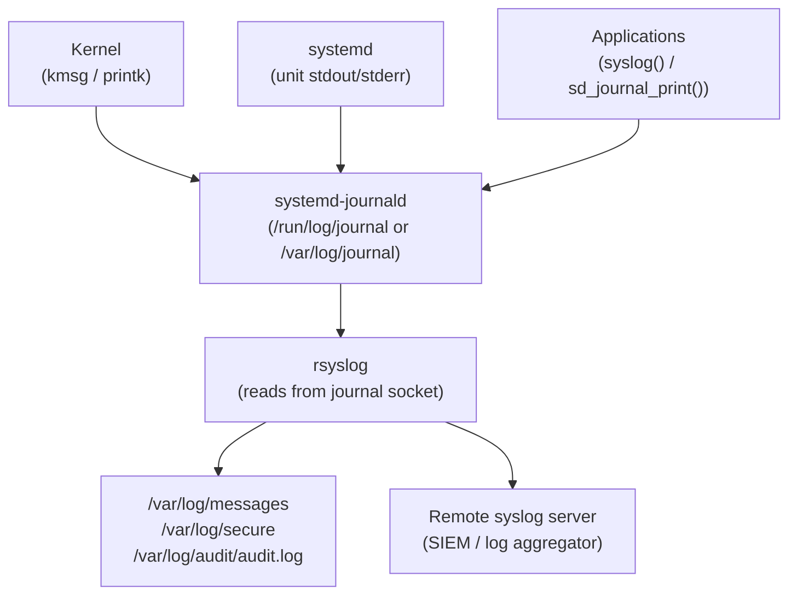

[↑ Back to TOC](#toc)

# Logs and journalctl
[](../LICENSE.md)
[](https://access.redhat.com/products/red-hat-enterprise-linux)
[](https://www.redhat.com)

systemd captures all service output in the **journal** — a binary, indexed
log store. `journalctl` is your primary tool for reading it.

On RHEL, two complementary logging subsystems run in parallel. **systemd-journald**
collects log data from the kernel, early boot, systemd itself, and every service
it manages. It stores data in a structured binary format under `/var/log/journal/`
(persistent) or `/run/log/journal/` (volatile). Binary storage enables indexed
queries by time, unit, priority, and custom fields — far more efficiently than
grepping plain text.

**rsyslog** runs alongside journald and forwards log entries from the journal
into traditional text files in `/var/log/`. This dual-path design ensures
compatibility with legacy tooling and applications that write directly to
syslog. For most administrative tasks you will use `journalctl`; for
integrating with SIEM systems or log shippers that expect text files, you
will use `/var/log/`.

The journal's binary format also means entries cannot be tampered with by
truncating a file — journald detects corruption. For high-security
environments, forward logs to a remote destination (rsyslog's TCP
forwarding or a dedicated log management platform) so that a compromised
host cannot destroy evidence.

---
<a name="toc"></a>

## Table of contents

- [Basic usage](#basic-usage)
- [Log flow diagram](#log-flow-diagram)
- [Filter by unit (service)](#filter-by-unit-service)
- [Filter by time](#filter-by-time)
- [Filter by priority (log level)](#filter-by-priority-log-level)
- [Filter by field](#filter-by-field)
- [Kernel messages](#kernel-messages)
- [Search output](#search-output)
- [Persistent journal](#persistent-journal)
  - [Control journal disk usage](#control-journal-disk-usage)
- [journald configuration](#journald-configuration)
- [Traditional log files](#traditional-log-files)
- [Worked example](#worked-example)
- [Common mistakes and how to diagnose them](#common-mistakes-and-how-to-diagnose-them)


## Basic usage

```bash
# Show all logs (newest at bottom), page through with less
journalctl

# Reverse order (newest first)
journalctl -r

# Follow in real time (like tail -f)
journalctl -f

# Show only the last 50 lines
journalctl -n 50

# Show only the last 10 lines (default when combined with -u)
journalctl -u sshd -n 10

# Output format — short (default), verbose, json, cat
journalctl -o verbose -u sshd
journalctl -o json -u sshd | python3 -m json.tool
```


[↑ Back to TOC](#toc)

---

## Log flow diagram




[↑ Back to TOC](#toc)

---

## Filter by unit (service)

```bash
# Logs for one service
journalctl -u sshd.service

# Follow a service's logs live
journalctl -f -u sshd.service

# Multiple units
journalctl -u sshd.service -u firewalld.service

# Include kernel messages alongside a unit
journalctl -u httpd.service -k
```


[↑ Back to TOC](#toc)

---

## Filter by time

```bash
# Since a specific time
journalctl --since "2026-02-23 08:00:00"

# Between two times
journalctl --since "2026-02-23 08:00:00" --until "2026-02-23 09:00:00"

# Relative times
journalctl --since "1 hour ago"
journalctl --since "yesterday"
journalctl --since "today"

# Since boot
journalctl -b

# Previous boot
journalctl -b -1

# Two boots ago
journalctl -b -2

# List available boots
journalctl --list-boots
```

> **Exam tip:** `journalctl -b -1` is invaluable for diagnosing a service
> that crashed during the previous boot. Use `--list-boots` to see how many
> boot records are available — this depends on journal persistence being
> enabled.


[↑ Back to TOC](#toc)

---

## Filter by priority (log level)

| Level | Meaning |
|---|---|
| `emerg` (0) | System unusable |
| `alert` (1) | Immediate action required |
| `crit` (2) | Critical condition |
| `err` (3) | Error |
| `warning` (4) | Warning |
| `notice` (5) | Normal but significant |
| `info` (6) | Informational |
| `debug` (7) | Debug messages |

```bash
# Only errors and above
journalctl -p err

# Between warning and error
journalctl -p warning..err

# Errors from today
journalctl -p err --since today

# Critical and above, last 100 lines
journalctl -p crit -n 100
```


[↑ Back to TOC](#toc)

---

## Filter by field

journald stores structured key=value fields with every entry. Query them
directly:

```bash
# All messages from a specific PID
journalctl _PID=1234

# All messages from a binary
journalctl _EXE=/usr/sbin/sshd

# Combine filters (AND)
journalctl _EXE=/usr/sbin/sshd _PID=1234

# Show all available fields for a unit
journalctl -u sshd -o verbose | head -40
```

Custom fields written by applications via `sd_journal_print()` or
`systemd-cat` also appear here and are queryable the same way.


[↑ Back to TOC](#toc)

---

## Kernel messages

```bash
# Journal kernel messages
journalctl -k

# Since last boot
journalctl -k -b

# Kernel errors only
journalctl -k -p err

# Traditional dmesg equivalent
dmesg -T

# Follow kernel ring buffer
dmesg -w
```


[↑ Back to TOC](#toc)

---

## Search output

```bash
# Grep inside journalctl output
journalctl -u sshd | grep "Failed"

# Case-insensitive
journalctl -u sshd | grep -i "failed"

# Use journalctl's built-in grep (faster — does not page output)
journalctl -u sshd -g "Failed password"

# Count matching lines
journalctl -u sshd --since today | grep -c "Failed"
```


[↑ Back to TOC](#toc)

---

## Persistent journal

By default on RHEL, the journal is persistent across reboots (stored in
`/var/log/journal/`). If yours is not:

```bash
sudo mkdir -p /var/log/journal
sudo systemd-tmpfiles --create --prefix /var/log/journal
sudo systemctl restart systemd-journald
```

### Control journal disk usage

```bash
# View current disk usage
journalctl --disk-usage

# Vacuum to keep only last 2 weeks
sudo journalctl --vacuum-time=2weeks

# Vacuum to 1 GB max
sudo journalctl --vacuum-size=1G

# Vacuum keeping only last 5 boot records
sudo journalctl --vacuum-files=5

# Force rotation of journal files
sudo journalctl --rotate
```

Journal retention is configured in `/etc/systemd/journald.conf`:

```ini
[Journal]
SystemMaxUse=2G
MaxRetentionSec=1month
```


[↑ Back to TOC](#toc)

---

## journald configuration

Key settings in `/etc/systemd/journald.conf`:

```ini
[Journal]
# Where to store the journal
Storage=persistent          # persistent (default on RHEL), volatile, auto, none

# Maximum disk space for journal on persistent storage
SystemMaxUse=2G

# Keep at least this much disk free
SystemKeepFree=500M

# Max size of a single journal file
SystemMaxFileSize=128M

# Maximum age of entries to retain
MaxRetentionSec=1month

# Forward to syslog socket (rsyslog reads this)
ForwardToSyslog=yes

# Forward to /dev/kmsg (kernel ring buffer)
ForwardToKMsg=no

# Compress journal files
Compress=yes

# Rate limiting — reduce to capture more messages per second
RateLimitIntervalSec=30s
RateLimitBurst=10000
```

After editing `/etc/systemd/journald.conf`:

```bash
sudo systemctl restart systemd-journald
```


[↑ Back to TOC](#toc)

---

## Traditional log files

systemd-journald forwards to `rsyslog` on RHEL, so traditional log files
in `/var/log/` still exist:

| File | Contents |
|---|---|
| `/var/log/messages` | General system messages |
| `/var/log/secure` | Authentication events (SSH, sudo) |
| `/var/log/audit/audit.log` | SELinux AVC denials, audit events |
| `/var/log/dnf.log` | Package operations |
| `/var/log/boot.log` | Boot messages |
| `/var/log/cron` | cron/anacron execution records |
| `/var/log/maillog` | Mail server events |

These files are rotated by **logrotate**, configured in `/etc/logrotate.conf`
and `/etc/logrotate.d/`. Check rotation schedules to know how far back text
logs go — the journal may have more history.


[↑ Back to TOC](#toc)

---

## Worked example

**Scenario:** A monitoring alert fires at 06:30 saying that `webapp.service`
has been failing every night around 03:00 for the past three days. Diagnose
the root cause.

```bash
# 1 — Check current service status
sudo systemctl status webapp.service

# 2 — List recent boot records to understand when failures occurred
journalctl --list-boots

# 3 — Check all errors from the service across recent boots
journalctl -u webapp.service -p err --since "3 days ago"

# 4 — Narrow to the 03:00 window
journalctl -u webapp.service \
  --since "2026-03-24 02:55:00" \
  --until "2026-03-24 03:10:00"

# 5 — Look at what ran right before the failure
journalctl -u webapp.service \
  --since "2026-03-24 02:50:00" \
  --until "2026-03-24 03:05:00" \
  -n 100

# 6 — Check for related kernel or system messages at the same time
journalctl --since "2026-03-24 02:55:00" --until "2026-03-24 03:05:00" \
  -p warning

# 7 — Cross-reference with traditional logs
sudo grep "Mar 24 03:" /var/log/messages | grep -i "error\|fail\|oom"

# 8 — Check if a cron job or timer fires at 03:00 and interferes
systemctl list-timers --all | grep "03:"
sudo grep "03 " /etc/cron.d/*

# Example finding: a nightly backup cron job at 03:00 exhausts
# disk space on /var/lib/webapp, causing the app to fail on write.
# Fix: extend the LV or redirect backups to a separate filesystem.
```

The pattern `journalctl --since/--until` around the known failure window is
the fastest way to isolate intermittent failures. Combine with `-p warning`
to catch contributing events from other units.


[↑ Back to TOC](#toc)

---

## Common mistakes and how to diagnose them

| Mistake | Symptom | Fix |
|---|---|---|
| Journal not persistent | `journalctl -b -1` returns "no entries" | `mkdir /var/log/journal` and restart journald |
| Journal disk usage grows unchecked | `/var/log/journal` fills the disk | Set `SystemMaxUse=` in `journald.conf` or run `journalctl --vacuum-size=` |
| Rate limiting drops messages during high-load events | "N journal messages suppressed" in logs | Increase `RateLimitBurst` in `journald.conf` |
| Looking at old logs in `/var/log/messages` instead of journal | Misses structured metadata, shorter history | Use `journalctl` for richer filtering; text files for integration |
| Forgetting `-u` filter when diagnosing a specific service | Overwhelmed by unrelated output | Always use `journalctl -u <service> --since <time>` for targeted queries |
| Not checking previous boot after a crash | Believes service was always running | `journalctl -b -1 -u <service>` to see the last session's logs |


[↑ Back to TOC](#toc)

---

## Further reading

| Resource | Notes |
|---|---|
| [`journalctl` man page](https://www.freedesktop.org/software/systemd/man/latest/journalctl.html) | Complete option and filter reference |
| [`journald.conf` man page](https://www.freedesktop.org/software/systemd/man/latest/journald.conf.html) | Retention, storage, and forwarding configuration |
| [RHEL 10 — Using the journal](https://access.redhat.com/documentation/en-us/red_hat_enterprise_linux/10/html/using_systemd_unit_files_in_rhel/index) | Official logging and journal guide |

---


[↑ Back to TOC](#toc)

## Next step

→ [Scheduling (timers + cron)](07-scheduling.md)

[↑ Back to TOC](#toc)

---

© 2026 UncleJS — Licensed under CC BY-NC-SA 4.0
