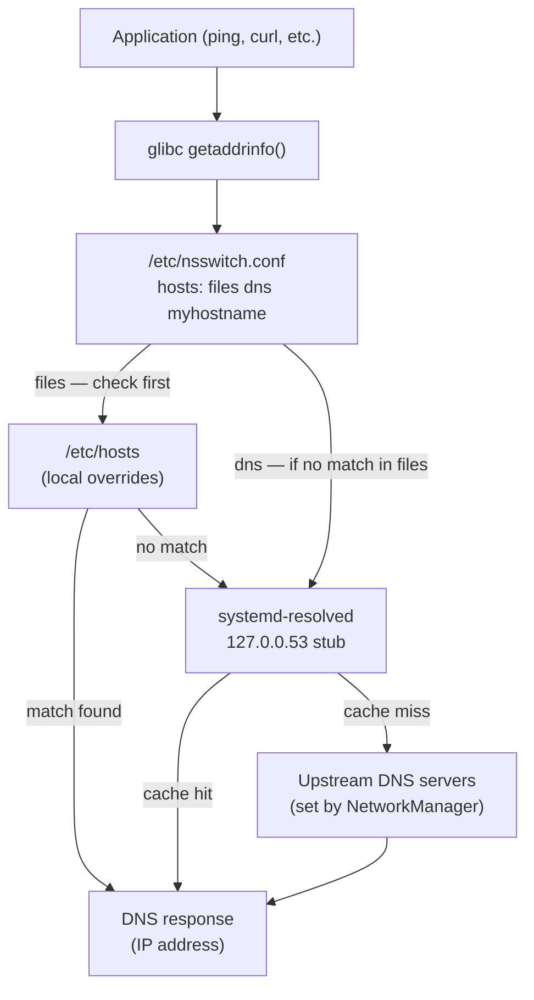

[↑ Back to TOC](#toc)

# DNS and Name Resolution
[](../LICENSE.md)
[](https://access.redhat.com/products/red-hat-enterprise-linux)
[](https://www.redhat.com)

Understanding how RHEL resolves names is essential for troubleshooting
connectivity issues. The resolution stack on RHEL 10 uses
**systemd-resolved** integrated with **NetworkManager**.

DNS resolution is the process of converting a human-readable hostname (such as
`access.redhat.com`) into an IP address the kernel can route to. Without it,
every service address would need to be specified as a raw IP, making
configuration brittle and unmaintainable. DNS problems are one of the most
common connectivity complaints from users — and they are almost always
sysadmin-fixable without upstream DNS changes.

RHEL 10 uses a layered resolution stack. The application asks the C library
(`glibc`) to resolve a name. The C library consults `/etc/nsswitch.conf` to
learn the order of sources. Typically it checks `/etc/hosts` first (local
overrides), then passes the query to `systemd-resolved`, which acts as a
caching stub resolver at `127.0.0.53`. Systemd-resolved forwards to the
upstream DNS servers that NetworkManager configured for the active connection.

Understanding this chain lets you pinpoint where a failure is occurring:
bad entry in `/etc/hosts`, wrong upstream DNS server, `systemd-resolved` not
running, or the upstream server itself is unavailable.

---
<a name="toc"></a>

## Table of contents

- [Resolution order](#resolution-order)
- [Resolution chain diagram](#resolution-chain-diagram)
- [`/etc/hosts`](#etchosts)
- [`/etc/resolv.conf`](#etcresolvconf)
- [Check DNS resolution](#check-dns-resolution)
- [`resolvectl` — systemd-resolved control](#resolvectl-systemd-resolved-control)
- [Set DNS servers per connection](#set-dns-servers-per-connection)
- [Search domains](#search-domains)
- [`/etc/nsswitch.conf`](#etcnsswitchconf)
- [Troubleshooting DNS](#troubleshooting-dns)
  - ["Name not resolving"](#name-not-resolving)
- [Worked example](#worked-example)
- [Common mistakes and how to diagnose them](#common-mistakes-and-how-to-diagnose-them)
- [systemd-resolved advanced configuration](#systemd-resolved-advanced-configuration)
- [DNS tools comparison](#dns-tools-comparison)


## Resolution order

When you `ping hostname`, RHEL checks:

1. `/etc/hosts` (local overrides — checked first)
2. `systemd-resolved` stub resolver (`127.0.0.53`)
3. Upstream DNS servers (from NetworkManager connection config)


[↑ Back to TOC](#toc)

---

## Resolution chain diagram




[↑ Back to TOC](#toc)

---

## `/etc/hosts`

Local static name-to-IP mappings. Takes priority over DNS.

```bash
cat /etc/hosts
```

```text
127.0.0.1   localhost localhost.localdomain
::1         localhost localhost.localdomain
192.168.1.10  app01.lab.local app01
```

To add a local override:

```bash
sudo vim /etc/hosts
```

`/etc/hosts` is useful for:
- Overriding DNS for testing (point a name to a different IP)
- Providing name resolution in environments without DNS
- Adding short aliases for frequently accessed hosts

Entries are space-separated: IP first, then one or more hostnames. Multiple
names on the same line are all aliases for that IP. Changes take effect
immediately — no service restart needed.

> **Exam tip:** If a task says "ensure `app01` resolves to `192.168.1.10`
> without changing DNS", add an entry to `/etc/hosts`. This is faster and
> takes precedence over DNS automatically.


[↑ Back to TOC](#toc)

---

## `/etc/resolv.conf`

Points to the stub resolver. On RHEL 10 with systemd-resolved this is
managed automatically — do not edit it by hand.

```bash
cat /etc/resolv.conf
```

```text
nameserver 127.0.0.53
options edns0 trust-ad
```

On RHEL 10, `/etc/resolv.conf` is a symlink to
`/run/systemd/resolve/stub-resolv.conf`. Editing it directly will be
overwritten the next time NetworkManager or systemd-resolved reconfigures the
system. Manage DNS servers through `nmcli` or `resolved.conf`.

If you need to temporarily test with a different DNS server without changing
NetworkManager config, use `dig @<server>` for one-off queries instead of
editing `resolv.conf`.


[↑ Back to TOC](#toc)

---

## Check DNS resolution

```bash
# Simple lookup
host access.redhat.com

# Detailed A record lookup
dig access.redhat.com

# Specific record type
dig MX redhat.com
dig AAAA access.redhat.com

# Reverse lookup (IP to name)
dig -x 8.8.8.8

# Short answer only
dig +short access.redhat.com

# Query a specific DNS server
dig @8.8.8.8 access.redhat.com
```

`dig` is the most useful DNS diagnostic tool. The `ANSWER SECTION` in its
output shows the resolved records. If the answer section is empty, the domain
has no record of that type. If the `status:` field shows `SERVFAIL` or
`NXDOMAIN`, that indicates a server error or a non-existent domain
respectively.


[↑ Back to TOC](#toc)

---

## `resolvectl` — systemd-resolved control

```bash
# Show current DNS configuration per interface
resolvectl status

# Query a name (uses systemd-resolved)
resolvectl query access.redhat.com

# Flush the DNS cache
sudo resolvectl flush-caches

# Show statistics
resolvectl statistics
```

`resolvectl status` is your first stop when diagnosing DNS problems. It
shows, per interface:
- Which DNS servers are configured
- The search domains active for that interface
- Whether DNSSEC validation is active
- The current DNS protocol (Do53, DoT, DoH)

The `Global` section shows system-wide fallback DNS servers from
`/etc/systemd/resolved.conf`.


[↑ Back to TOC](#toc)

---

## Set DNS servers per connection

```bash
sudo nmcli connection modify "Wired connection 1" \
  ipv4.dns "192.168.1.1 8.8.8.8 2001:4860:4860::8888"

sudo nmcli connection up "Wired connection 1"
```


[↑ Back to TOC](#toc)

---

## Search domains

```bash
sudo nmcli connection modify "Wired connection 1" \
  ipv4.dns-search "lab.local example.com"

sudo nmcli connection up "Wired connection 1"
```

Now `ping app01` resolves to `app01.lab.local` automatically.

Search domains are appended to unqualified hostnames (single-label names).
The resolver tries each domain in order until one matches. For example, with
`ipv4.dns-search "lab.local example.com"`, the query `ping app01` becomes
`app01.lab.local` first, then `app01.example.com` if the first fails.

Do not add too many search domains — each unresolvable attempt adds latency
to every hostname query.


[↑ Back to TOC](#toc)

---

## `/etc/nsswitch.conf`

Controls the resolution order for names, passwords, groups, etc.:

```bash
grep hosts /etc/nsswitch.conf
```

```yaml
hosts: files dns myhostname
```

- `files` = `/etc/hosts`
- `dns` = DNS resolver
- `myhostname` = resolve the machine's own hostname

The order matters: `files` before `dns` means `/etc/hosts` always wins.
Changing this order to `dns files` would make DNS queries go first, with
`/etc/hosts` only as a fallback. This is rarely appropriate on servers — the
default order is correct in almost all cases.

Other databases in `nsswitch.conf` control resolution of users (`passwd`),
groups (`group`), and services (`services`). They follow the same source-list
syntax.


[↑ Back to TOC](#toc)

---

## Troubleshooting DNS

### "Name not resolving"

```bash
# 1. Is it a DNS or routing problem?
ping 8.8.8.8              # if this works, network is up
ping access.redhat.com    # if this fails, DNS is the problem

# 2. Check what DNS server is being used
resolvectl status | grep "DNS Server"

# 3. Test with a known-good resolver
dig @8.8.8.8 access.redhat.com

# 4. Check /etc/hosts for stale entries
grep access.redhat.com /etc/hosts

# 5. Flush cache and retry
sudo resolvectl flush-caches
```


[↑ Back to TOC](#toc)

---

## Worked example

**Scenario:** After migrating a VM to a new network segment, `dnf update`
fails with "Could not resolve host: cdn.redhat.com". IP connectivity is fine.

```bash
# Step 1 — confirm IP works (rules out routing)
ping -c 3 8.8.8.8
# Success — network and routing are fine.

# Step 2 — confirm DNS is broken
ping -c 3 cdn.redhat.com
# ping: cdn.redhat.com: Name or service not known

# Step 3 — check which DNS server is configured
resolvectl status | grep "DNS Server"
# DNS Server: 10.0.1.1   <-- old segment's DNS, now unreachable

# Step 4 — test with a known-working server
dig @8.8.8.8 cdn.redhat.com +short
# Returns an IP — DNS record is fine, just wrong server configured.

# Step 5 — update DNS in the connection profile
sudo nmcli connection modify "Wired connection 1" \
  ipv4.dns "10.0.2.1 8.8.8.8"
sudo nmcli connection up "Wired connection 1"

# Step 6 — verify and retry
resolvectl status | grep "DNS Server"
ping -c 3 cdn.redhat.com
```

Root cause: the VM carried its old DNS server setting into the new network
segment. The fix is always to update the connection profile, not to edit
`/etc/resolv.conf`.


[↑ Back to TOC](#toc)

---

## Common mistakes and how to diagnose them

| Symptom | Likely cause | Diagnosis | Fix |
|---|---|---|---|
| Name resolution fails, IP ping works | Wrong or unreachable DNS server | `resolvectl status` — check DNS server IPs | Update DNS via `nmcli ... ipv4.dns` |
| `/etc/hosts` entry ignored | `nsswitch.conf` has `dns` before `files` | `grep hosts /etc/nsswitch.conf` | Restore default: `files dns myhostname` |
| Editing `/etc/resolv.conf` has no effect | It is a managed symlink | `ls -la /etc/resolv.conf` — shows symlink target | Manage DNS via `nmcli` instead |
| `dig` works but `ping hostname` fails | `systemd-resolved` not running | `systemctl status systemd-resolved` | `sudo systemctl enable --now systemd-resolved` |
| DNS works for some names, fails for internal names | Missing search domain | `resolvectl status` — no search domain configured | `nmcli ... ipv4.dns-search "internal.example.com"` |
| Stale DNS cache returning old IP | Cache not flushed after DNS change | `resolvectl statistics` shows non-zero cache hits | `sudo resolvectl flush-caches` |


[↑ Back to TOC](#toc)

---

## systemd-resolved advanced configuration

Global DNS settings for `systemd-resolved` are stored in `/etc/systemd/resolved.conf`.
These settings are used as fallbacks when no per-interface DNS is configured:

```bash
sudo vim /etc/systemd/resolved.conf
```

```ini
[Resolve]
# Fallback DNS servers (used when no interface DNS is configured)
FallbackDNS=8.8.8.8 8.8.4.4

# Global DNS search domains
Domains=lab.local

# DNSSEC validation: off, allow-downgrade, or yes
DNSSEC=allow-downgrade

# DNS-over-TLS: no, opportunistic, or yes
DNSOverTLS=opportunistic

# Cache: yes (default) or no
Cache=yes
```

After editing, restart the service:

```bash
sudo systemctl restart systemd-resolved
```

The `resolvectl` command gives a detailed view of the active configuration
including which settings came from per-interface vs global config:

```bash
resolvectl status
```

The `Global` section at the top shows settings from `resolved.conf`. Each
interface section below shows settings from NetworkManager for that connection.
Interface-level DNS always takes precedence over global fallback DNS.

To see DNS query statistics (useful for verifying caching is working):

```bash
resolvectl statistics
# Shows: current cache size, cache hits, cache misses, DNSSEC successes/failures
```


[↑ Back to TOC](#toc)

---

## DNS tools comparison

| Tool | Package | Best for |
|---|---|---|
| `dig` | `bind-utils` | Detailed DNS queries, troubleshooting, scripting |
| `host` | `bind-utils` | Quick lookups, readable output |
| `nslookup` | `bind-utils` | Interactive queries (legacy, avoid in scripts) |
| `resolvectl query` | `systemd` | Queries via systemd-resolved (tests the actual resolver stack) |
| `getent hosts` | `glibc` | Tests the full nsswitch.conf resolution stack (as applications see it) |

The key distinction between `dig` and `getent hosts`:

- `dig` bypasses `nsswitch.conf` and `/etc/hosts` — it goes directly to DNS.
  Use `dig` to test DNS server responses in isolation.
- `getent hosts <name>` uses the full resolution stack — the same path as
  `ping`, `curl`, and other applications. Use it to verify the end-to-end
  behaviour an application will see.

```bash
# Test DNS server directly
dig @192.168.1.1 app01.lab.local

# Test full resolution stack (as application sees it)
getent hosts app01.lab.local

# Test with /etc/hosts taking priority
getent hosts localhost   # always returns 127.0.0.1 from /etc/hosts
```

> **Exam tip:** When asked "does DNS resolve correctly?", use both `dig` AND
> `getent hosts`. `dig` can succeed while `getent hosts` fails if
> `nsswitch.conf` is wrong, or vice versa.


[↑ Back to TOC](#toc)

---

## Further reading

| Resource | Notes |
|---|---|
| [`systemd-resolved` man page](https://www.freedesktop.org/software/systemd/man/latest/systemd-resolved.service.html) | Resolved configuration, DNS-over-TLS, LLMNR |
| [`resolved.conf` man page](https://www.freedesktop.org/software/systemd/man/latest/resolved.conf.html) | All configuration knobs for DNS behaviour |
| [RHEL 10 — Managing DNS](https://access.redhat.com/documentation/en-us/red_hat_enterprise_linux/10/html/configuring_and_managing_networking/index) | Official DNS configuration and troubleshooting guide |

---


[↑ Back to TOC](#toc)

## Next step

→ [Firewalling (firewalld)](11-firewalld.md)

[↑ Back to TOC](#toc)

---

© 2026 UncleJS — Licensed under CC BY-NC-SA 4.0
