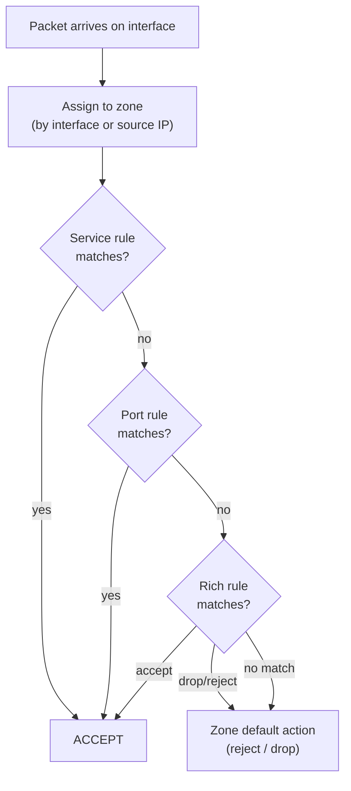

[↑ Back to TOC](#toc)


[↑ Back to TOC](#toc)

# Firewalling with firewalld
[](../LICENSE.md)
[](https://access.redhat.com/products/red-hat-enterprise-linux)
[](https://www.redhat.com)

`firewalld` is the default firewall manager on RHEL 10. It uses the concept
of **zones** to apply rules based on network trust level.

On RHEL 10, `firewalld` sits in front of the kernel's **nftables** subsystem.
You never write nftables rules directly — `firewalld` translates zone, service,
port, and rich-rule definitions into nftables rules at runtime. This separation
lets you manage firewall policy at a meaningful, human-readable level without
needing to understand nftables syntax.

The key mental model is: every network packet arriving on an interface is
assigned to a **zone** based on that interface's zone assignment (or by source
IP policy). Once in a zone, the packet is checked against that zone's
allowed services, ports, and rich rules. If nothing matches, the zone's
default action applies — typically reject or drop.

`firewalld` maintains two distinct rule sets: **runtime** (active now, lost
on reload/reboot) and **permanent** (saved to disk, loaded on every start).
They are independent. A common beginner mistake is adding rules without
`--permanent`, then being surprised when they vanish on reboot. The safest
workflow is always: add `--permanent`, then `--reload`.

---
<a name="toc"></a>

## Table of contents

- [Core concepts](#core-concepts)
- [Packet ingress flow diagram](#packet-ingress-flow-diagram)
- [Check firewalld status](#check-firewalld-status)
- [Default zone](#default-zone)
- [Allow a service](#allow-a-service)
- [Remove a service](#remove-a-service)
- [Allow a port](#allow-a-port)
- [Remove a port](#remove-a-port)
- [List rules](#list-rules)
- [Predefined services](#predefined-services)
- [Zones in practice](#zones-in-practice)
  - [Assign an interface to a zone](#assign-an-interface-to-a-zone)
- [Rich rules (advanced)](#rich-rules-advanced)
- [Masquerading (NAT for outbound)](#masquerading-nat-for-outbound)
- [Worked example](#worked-example)
- [Common mistakes and how to diagnose them](#common-mistakes-and-how-to-diagnose-them)
- [Direct rules and the nftables backend](#direct-rules-and-the-nftables-backend)
- [Firewalld runtime vs permanent — synchronisation](#firewalld-runtime-vs-permanent--synchronisation)
- [Source-based policies](#source-based-policies)


## Core concepts

| Term | Meaning |
|---|---|
| **zone** | A trust level applied to a network interface or source IP |
| **service** | A named rule set (e.g., `ssh`, `http`) defined in XML |
| **port** | A direct port/protocol rule (e.g., `8080/tcp`) |
| **rich rule** | More expressive rule with source/destination/action |
| **runtime** | Currently active rules (lost on reload) |
| **permanent** | Rules saved to disk (survive reload/reboot) |


[↑ Back to TOC](#toc)

---

## Packet ingress flow diagram




[↑ Back to TOC](#toc)

---

## Check firewalld status

```bash
sudo firewall-cmd --state          # running or not running
sudo firewall-cmd --list-all       # show active zone + all rules
sudo firewall-cmd --get-zones      # list all available zones
sudo firewall-cmd --get-default-zone
sudo firewall-cmd --get-active-zones
```


[↑ Back to TOC](#toc)

---

## Default zone

The default zone applies to interfaces not explicitly assigned to another zone.
On most RHEL VMs the default zone is `public`.

```bash
sudo firewall-cmd --get-default-zone

# Change default zone
sudo firewall-cmd --set-default-zone=home
```

Changing the default zone is permanent automatically — it modifies
`/etc/firewalld/firewalld.conf` and does not require `--permanent` or
`--reload`. All interfaces not explicitly assigned elsewhere move to the
new default immediately.


[↑ Back to TOC](#toc)

---

## Allow a service

```bash
# Runtime only (lost on firewalld reload)
sudo firewall-cmd --add-service=http

# Permanent (survives reload/reboot)
sudo firewall-cmd --permanent --add-service=http

# Both: add permanently AND reload to activate immediately
sudo firewall-cmd --permanent --add-service=http
sudo firewall-cmd --reload
```

> **💡 Best practice: always use --permanent + --reload**
> Using `--permanent` first and then `--reload` ensures your rules survive
> reboots and avoids confusion between runtime and permanent state.
>

> **Exam tip:** Always add `--permanent` AND then run `--reload`. Runtime-only
> rules vanish on the next `firewall-cmd --reload` or system reboot. The exam
> tests that rules survive after a reboot — `--permanent` is required.


[↑ Back to TOC](#toc)

---

## Remove a service

```bash
sudo firewall-cmd --permanent --remove-service=http
sudo firewall-cmd --reload
```


[↑ Back to TOC](#toc)

---

## Allow a port

```bash
sudo firewall-cmd --permanent --add-port=8080/tcp
sudo firewall-cmd --reload
```

Use `--add-port` when no predefined service definition exists for the port
you need to open. The format is `<port>/<protocol>` where protocol is `tcp`
or `udp`. To open a range: `--add-port=8000-8100/tcp`.


[↑ Back to TOC](#toc)

## Remove a port

```bash
sudo firewall-cmd --permanent --remove-port=8080/tcp
sudo firewall-cmd --reload
```


[↑ Back to TOC](#toc)

---

## List rules

```bash
# All rules in the default zone
sudo firewall-cmd --list-all

# Rules in a specific zone
sudo firewall-cmd --list-all --zone=public

# List only services
sudo firewall-cmd --list-services

# List only ports
sudo firewall-cmd --list-ports

# Show permanent (saved) rules — compare to runtime
sudo firewall-cmd --permanent --list-all
```

Running `--list-all` without `--permanent` shows the **runtime** state.
Adding `--permanent` shows the **saved** state. If they differ, you have
either added rules without `--permanent` (runtime only) or added `--permanent`
rules without `--reload` (permanent but not yet active).


[↑ Back to TOC](#toc)

---

## Predefined services

```bash
# See all available predefined services
sudo firewall-cmd --get-services

# Where service definitions live
ls /usr/lib/firewalld/services/
ls /etc/firewalld/services/   # custom overrides go here
```

A predefined service is an XML file that maps a service name to one or more
ports. For example, `ssh.xml` defines port 22/tcp. Using service names instead
of raw port numbers makes `--list-all` output human-readable and reduces the
chance of opening the wrong port.

To create a custom service:

```bash
sudo cp /usr/lib/firewalld/services/http.xml /etc/firewalld/services/myapp.xml
sudo vim /etc/firewalld/services/myapp.xml
# Change port to match your application
sudo firewall-cmd --reload
sudo firewall-cmd --permanent --add-service=myapp
sudo firewall-cmd --reload
```


[↑ Back to TOC](#toc)

---

## Zones in practice

Common zones and their default posture:

| Zone | Intended use |
|---|---|
| `public` | Untrusted public networks — only explicitly allowed traffic in |
| `home` | Trusted home network — less restrictive |
| `work` | Work networks |
| `trusted` | All traffic allowed (use with extreme care) |
| `drop` | All inbound traffic silently dropped |
| `block` | All inbound traffic rejected with ICMP unreachable |
| `dmz` | Servers in a DMZ — limited inbound |
| `internal` | Internal network |

### Assign an interface to a zone

> **💡 Find your interface name first**
> Run `nmcli device status` to see your interface name (e.g., `ens3`, `eth0`,
> `enp1s0`). Replace `ens3` below with your actual interface name.

```bash
sudo firewall-cmd --permanent --zone=internal --change-interface=ens3
sudo firewall-cmd --reload
```

To verify which zone an interface is in:

```bash
sudo firewall-cmd --get-zone-of-interface=ens3
```


[↑ Back to TOC](#toc)

---

## Rich rules (advanced)

```bash
# Allow SSH from a specific subnet only
sudo firewall-cmd --permanent \
  --add-rich-rule='rule family="ipv4" source address="192.168.1.0/24" service name="ssh" accept'

# Block a specific IP
sudo firewall-cmd --permanent \
  --add-rich-rule='rule family="ipv4" source address="10.0.0.5" drop'

# Rate-limit new connections (e.g., anti-bruteforce)
sudo firewall-cmd --permanent \
  --add-rich-rule='rule family="ipv4" service name="ssh" limit value="3/m" accept'

sudo firewall-cmd --reload
```

Rich rules are evaluated after service and port rules. If a service rule
already accepts the traffic, the rich rule for the same service is never
reached. Order of evaluation: service rules → port rules → rich rules →
zone default.

To list all rich rules:

```bash
sudo firewall-cmd --list-rich-rules
```


[↑ Back to TOC](#toc)

---

## Masquerading (NAT for outbound)

```bash
sudo firewall-cmd --permanent --add-masquerade
sudo firewall-cmd --reload
```

Masquerading is SNAT (Source NAT) — it rewrites the source IP of outgoing
packets to the interface's public IP. Use this on a router VM or container
host that forwards traffic from an internal network to the internet.


[↑ Back to TOC](#toc)

---

> **⚠️ Do NOT do this**
> ```bash
> sudo systemctl stop firewalld
> sudo systemctl disable firewalld
> ```
> Disabling the firewall is not a fix for a connectivity problem. Diagnose
> the correct port or service to open instead.
>

---

## Worked example

**Scenario:** Configure a web server to accept only HTTPS (443) and SSH (22)
traffic. All other inbound connections must be blocked.

```bash
# Step 1 — check current state
sudo firewall-cmd --list-all
# Output shows: services: cockpit dhcpv6-client ssh
# (http and https are not yet open)

# Step 2 — remove services you don't want
sudo firewall-cmd --permanent --remove-service=cockpit
sudo firewall-cmd --permanent --remove-service=dhcpv6-client

# Step 3 — add HTTPS
sudo firewall-cmd --permanent --add-service=https

# Step 4 — confirm SSH is already present (it is by default in public zone)
sudo firewall-cmd --permanent --list-services
# Should show: https ssh

# Step 5 — reload to activate permanent rules
sudo firewall-cmd --reload

# Step 6 — verify runtime state matches permanent
sudo firewall-cmd --list-all
# services: https ssh

# Step 7 — test from another host
# ssh user@<server-ip>        should succeed
# curl https://<server-ip>    should succeed
# curl http://<server-ip>     should fail (no http service)
# telnet <server-ip> 8080     should fail (not open)
```


[↑ Back to TOC](#toc)

---

## Common mistakes and how to diagnose them

| Symptom | Likely cause | Diagnosis | Fix |
|---|---|---|---|
| Rule vanishes after reboot | Added without `--permanent` | `firewall-cmd --permanent --list-all` — rule absent | Re-add with `--permanent` then `--reload` |
| `--permanent` rule not active yet | Forgot `--reload` | `firewall-cmd --list-all` vs `--permanent --list-all` differ | `sudo firewall-cmd --reload` |
| Service still blocked despite rule | Rule in wrong zone | `firewall-cmd --get-active-zones` — check which zone the interface is in | Add rule to the correct zone with `--zone=<zone>` |
| Port open but service unreachable | Service not listening | `ss -tlnp` — port not in LISTEN state | Fix the application / start the service |
| Rich rule has no effect | Service rule matches first | `firewall-cmd --list-all` shows service already accepted | Remove the service rule or re-order logic using `--priority` |
| Cannot ping host but SSH works | ICMP blocked by zone | No `icmp` passthrough in zone | `firewall-cmd --permanent --add-protocol=icmp` + `--reload` |


[↑ Back to TOC](#toc)

---

## Direct rules and the nftables backend

`firewalld` on RHEL 10 uses **nftables** as its backend. You can verify:

```bash
sudo firewall-cmd --info-zone=public
sudo nft list ruleset   # view the raw nftables rules firewalld generated
```

Do not write rules directly with `nft` while `firewalld` is running —
`firewalld` will overwrite them on the next reload. The only correct way
to customise firewall rules on a `firewalld`-managed system is through
`firewall-cmd` or the `firewalld` D-Bus API.

If you need a rule that cannot be expressed with zones/services/rich rules,
use `--direct` rules as a last resort:

```bash
# Add a direct nftables rule (permanent)
sudo firewall-cmd --permanent --direct --add-rule ipv4 filter INPUT 0 \
  -p tcp --dport 9090 -j ACCEPT
sudo firewall-cmd --reload
```

Direct rules are passed as-is to nftables and are evaluated before zone rules.
They bypass the zone model entirely — use with caution and document thoroughly.


[↑ Back to TOC](#toc)

---

## Firewalld runtime vs permanent — synchronisation

A common source of confusion is the two independent rule stores:

```bash
# Show RUNTIME state (currently active)
sudo firewall-cmd --list-all

# Show PERMANENT state (what survives reload/reboot)
sudo firewall-cmd --permanent --list-all
```

These can diverge:

| Scenario | Runtime | Permanent | What happens on reload |
|---|---|---|---|
| Added with `--permanent` only | old rules | new rules | Rules become active |
| Added without `--permanent` | new rules | old rules | Rules disappear |
| Added both ways correctly | new rules | new rules | No change |

To synchronise (make permanent match runtime, if you made runtime-only changes
and want to keep them):

```bash
sudo firewall-cmd --runtime-to-permanent
```

To synchronise (make runtime match permanent, discarding any runtime-only
changes):

```bash
sudo firewall-cmd --reload
```

> **Exam tip:** On the RHCSA exam, always use `--permanent` and then
> `--reload`. Never rely on runtime-only rules — the exam tests that your
> configuration persists after a reboot.


[↑ Back to TOC](#toc)

---

## Source-based policies

In addition to interface-based zone assignment, firewalld supports assigning
a zone based on the **source IP** of the packet. This is useful when a single
interface carries traffic from multiple subnets with different trust levels.

```bash
# Assign all traffic from the management subnet to the trusted zone
sudo firewall-cmd --permanent --zone=trusted --add-source=10.0.0.0/24

# Assign traffic from a specific IP to the block zone (block all from this IP)
sudo firewall-cmd --permanent --zone=block --add-source=192.168.99.55

sudo firewall-cmd --reload

# Verify
sudo firewall-cmd --list-all --zone=trusted
```

Source-based rules take precedence over interface-based rules. If a packet
arrives from `10.0.0.5` and `10.0.0.0/24` is assigned to `trusted`, the
packet is evaluated in the `trusted` zone regardless of which interface it
arrived on.

This is commonly used for:
- Management networks that need unrestricted access from admin subnets
- Blocking specific known-bad IP ranges (use `drop` zone)
- Allowing monitoring agents (Prometheus, SNMP) from a specific monitoring subnet

```bash
# Remove a source assignment
sudo firewall-cmd --permanent --zone=trusted --remove-source=10.0.0.0/24
sudo firewall-cmd --reload
```


[↑ Back to TOC](#toc)

---

## Further reading

| Resource | Notes |
|---|---|
| [RHEL 10 — Using and configuring firewalld](https://access.redhat.com/documentation/en-us/red_hat_enterprise_linux/10/html/securing_networks/using-and-configuring-firewalld_securing-networks) | Official firewalld guide including zones, rich rules, and nftables backend |
| [`firewalld` man page](https://firewalld.org/documentation/man-pages/firewalld.html) | Daemon configuration reference |
| [`firewall-cmd` man page](https://firewalld.org/documentation/man-pages/firewall-cmd.html) | Complete CLI option reference |

---


[↑ Back to TOC](#toc)

## Next step

→ [SSH (Keys, Server Basics)](12-ssh.md)

[↑ Back to TOC](#toc)

---

© 2026 UncleJS — Licensed under CC BY-NC-SA 4.0
