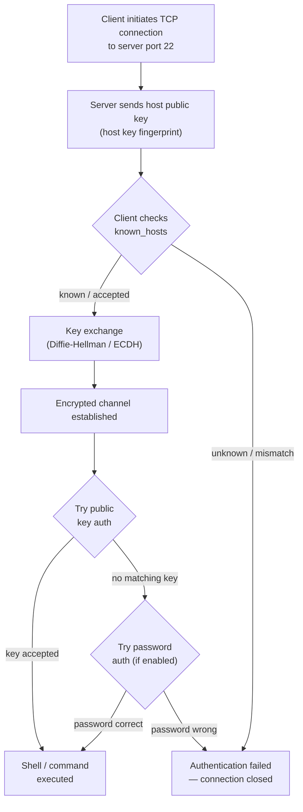

[↑ Back to TOC](#toc)

# SSH — Keys, Server Basics
[](../LICENSE.md)
[](https://access.redhat.com/products/red-hat-enterprise-linux)
[](https://www.redhat.com)

SSH is how you administer RHEL remotely. This chapter covers key-based
authentication (the right way) and basic server hardening.

SSH (Secure Shell) provides an encrypted, authenticated channel between a
client and a server. On RHEL 10, the SSH server is **OpenSSH** (`sshd`),
enabled by default. Every RHEL system you encounter in production will be
accessible via SSH — it is the primary interface for remote administration.

Key-based authentication is strongly preferred over password authentication.
A private key on the client and a matching public key on the server replace
the password exchange. The private key never leaves the client. Even if an
attacker can read network traffic or capture the authentication exchange, they
cannot recover the private key. Password authentication is vulnerable to
brute-force and credential stuffing attacks.

Understanding the SSH authentication sequence helps when diagnosing connection
failures. The client and server first negotiate algorithms and perform a
cryptographic key exchange. The server then presents its host key — the client
must verify this against its `~/.ssh/known_hosts`. Once the channel is
established, authentication proceeds (public key, then optionally password).
A failure at any stage produces a different error message, pointing to the
correct remediation.

---
<a name="toc"></a>

## Table of contents

- [Connect to a remote host](#connect-to-a-remote-host)
- [SSH authentication sequence](#ssh-authentication-sequence)
- [Key-based authentication](#key-based-authentication)
  - [Generate a key pair](#generate-a-key-pair)
  - [Copy public key to a remote host](#copy-public-key-to-a-remote-host)
  - [Test key login](#test-key-login)
- [SSH config file — `~/.ssh/config`](#ssh-config-file-sshconfig)
- [SSH agent (avoid repeated passphrase entry)](#ssh-agent-avoid-repeated-passphrase-entry)
- [sshd configuration](#sshd-configuration)
  - [Recommended hardening settings](#recommended-hardening-settings)
- [Firewall: allow SSH](#firewall-allow-ssh)
- [SSH tunneling (basics)](#ssh-tunneling-basics)
- [Worked example](#worked-example)
- [Common mistakes and how to diagnose them](#common-mistakes-and-how-to-diagnose-them)
- [Host key management](#host-key-management)
- [sshd_config drop-in files](#sshdconfig-drop-in-files)


## Connect to a remote host

```bash
# Connect as the same username
ssh 192.168.1.100

# Connect as a specific user
ssh rhel@192.168.1.100

# Connect on a non-default port
ssh -p 2222 rhel@192.168.1.100

# Connect with a specific key
ssh -i ~/.ssh/id_lab rhel@192.168.1.100
```


[↑ Back to TOC](#toc)

---

## SSH authentication sequence




[↑ Back to TOC](#toc)

---

## Key-based authentication

### Generate a key pair

```bash
ssh-keygen -t ed25519 -C "rhel-lab-key"
```

- Private key: `~/.ssh/id_ed25519` — **keep this secret, never share it**
- Public key: `~/.ssh/id_ed25519.pub` — share this freely

> **💡 Key type choices**
> `ed25519` is recommended: modern, fast, small. Avoid `rsa` with keys
> shorter than 3072 bits. Never use `dsa` or `ecdsa` unless required.
>

The passphrase is optional but strongly recommended. It encrypts the private
key on disk — even if someone copies your private key file, they cannot use
it without the passphrase. Use `ssh-agent` (see below) to avoid typing the
passphrase repeatedly during a work session.

### Copy public key to a remote host

```bash
ssh-copy-id -i ~/.ssh/id_ed25519.pub rhel@192.168.1.100
```

Or manually:

```bash
# On the remote host
mkdir -p ~/.ssh
chmod 700 ~/.ssh
echo "<contents of your .pub file>" >> ~/.ssh/authorized_keys
chmod 600 ~/.ssh/authorized_keys
```

The permissions on `~/.ssh/` (700) and `~/.ssh/authorized_keys` (600) are
enforced by sshd — if they are too permissive, sshd ignores the file and
falls back to password authentication. This is a common source of confusion
when keys don't work.

### Test key login

```bash
ssh -i ~/.ssh/id_ed25519 rhel@192.168.1.100
```


[↑ Back to TOC](#toc)

---

## SSH config file — `~/.ssh/config`

Saves you from typing options every time:

```text
Host lab
    HostName 192.168.1.100
    User rhel
    IdentityFile ~/.ssh/id_ed25519
    Port 22

Host bastion
    HostName 10.0.0.1
    User admin
    IdentityFile ~/.ssh/id_bastion
```

Now connect with:

```bash
ssh lab
```

Additional useful config options:

```text
Host *
    ServerAliveInterval 60
    ServerAliveCountMax 3
    StrictHostKeyChecking accept-new
```

- `ServerAliveInterval`: sends a keepalive packet every N seconds to prevent
  idle connection drops
- `StrictHostKeyChecking accept-new`: auto-accept new hosts but refuse changed
  keys (safe default for lab use)


[↑ Back to TOC](#toc)

---

## SSH agent (avoid repeated passphrase entry)

```bash
eval "$(ssh-agent -s)"
ssh-add ~/.ssh/id_ed25519
```

The agent holds decrypted private keys in memory for the duration of your
session. Once added, SSH uses the agent automatically without prompting for
the passphrase again. The keys are gone when the agent process terminates
(e.g., on logout).

On RHEL desktop sessions, `gnome-keyring` or `ssh-agent` is started
automatically. On headless servers, start the agent manually in your shell
profile if needed.


[↑ Back to TOC](#toc)

---

## sshd configuration

The SSH server is configured in `/etc/ssh/sshd_config`.

> **🚨 Always use sshd -t before restarting**
> ```bash
> sudo sshd -t    # test config syntax
> sudo systemctl restart sshd
> ```
> Restarting sshd with a bad config can lock you out. Always test first.
>

### Recommended hardening settings

```bash
sudo vim /etc/ssh/sshd_config
```

Key settings to review and set:

```text
# Disable root login (use sudo instead)
PermitRootLogin no

# Disable password auth (force key-only)
PasswordAuthentication no
PubkeyAuthentication yes

# Disable empty passwords
PermitEmptyPasswords no

# Limit which users can log in
AllowUsers rhel admin

# Set a login grace time
LoginGraceTime 30

# Log level for auditing
LogLevel VERBOSE
```

```bash
sudo sshd -t && sudo systemctl restart sshd
```

> **Exam tip:** `PasswordAuthentication no` in `sshd_config` only takes
> effect after `systemctl reload sshd` (or restart). Editing the file alone
> does nothing. Always follow the edit with a reload and a syntax check first.

> **⚠️ Disable PasswordAuthentication only after keys work**
> Confirm key login works from another terminal before disabling password
> auth. Disabling it without working keys will lock you out.
>
> **If you do get locked out of a lab VM**, recover via the hypervisor console
> (no SSH needed):
> 1. Open the VM console in your hypervisor (virt-manager, VMware, VirtualBox)
> 2. Log in locally as `root` or your admin user
> 3. Re-enable password auth: `sudo sed -i 's/^PasswordAuthentication no/PasswordAuthentication yes/' /etc/ssh/sshd_config`
> 4. Restart sshd: `sudo systemctl restart sshd`
> 5. SSH back in, add your public key correctly, then re-disable password auth
>

On RHEL 10, `sshd_config` supports drop-in files in `/etc/ssh/sshd_config.d/`.
Create a file like `90-hardening.conf` there for your changes — this keeps
the base config clean and makes it easier to track customisations.

```bash
sudo vim /etc/ssh/sshd_config.d/90-hardening.conf
```

```text
PermitRootLogin no
PasswordAuthentication no
LoginGraceTime 30
LogLevel VERBOSE
```


[↑ Back to TOC](#toc)

---

## Firewall: allow SSH

SSH is allowed by default in the `public` zone. If you removed it:

```bash
sudo firewall-cmd --permanent --add-service=ssh
sudo firewall-cmd --reload
```


[↑ Back to TOC](#toc)

---

## SSH tunneling (basics)

```bash
# Local port forwarding: forward local 8080 to remote 80
ssh -L 8080:localhost:80 rhel@192.168.1.100

# SOCKS proxy
ssh -D 1080 rhel@192.168.1.100

# Jump host (ProxyJump)
ssh -J admin@bastion.example.com rhel@10.0.0.50
```

Local port forwarding (`-L`) is useful for accessing a service on the remote
host that is only listening on loopback (e.g., a database or admin UI).
After the tunnel is up, connect to `localhost:8080` locally and traffic is
forwarded over SSH to the remote service.


[↑ Back to TOC](#toc)

---

## Worked example

**Scenario:** Set up key-based authentication for a `deploy` user that
must not be able to log in with a password.

```bash
# Step 1 — on the control machine, generate a dedicated key
ssh-keygen -t ed25519 -C "deploy-key" -f ~/.ssh/id_deploy
# No passphrase for an automated deploy key (document this decision)

# Step 2 — create the deploy user on the server (with console or existing SSH)
sudo useradd -m -s /bin/bash deploy

# Step 3 — copy the public key to the server
ssh-copy-id -i ~/.ssh/id_deploy.pub deploy@192.168.1.100

# Step 4 — test key login works before disabling passwords
ssh -i ~/.ssh/id_deploy deploy@192.168.1.100
# Confirm: logged in without password prompt

# Step 5 — on the server, disable password auth for this user specifically
# (or globally if appropriate)
# Add to /etc/ssh/sshd_config.d/90-deploy.conf:
echo "Match User deploy
    PasswordAuthentication no
    PubkeyAuthentication yes" | sudo tee /etc/ssh/sshd_config.d/90-deploy.conf

# Step 6 — validate config and reload
sudo sshd -t && sudo systemctl reload sshd

# Step 7 — verify password login is now rejected
ssh -o PasswordAuthentication=yes deploy@192.168.1.100
# Expected: Permission denied (publickey).

# Step 8 — verify key login still works
ssh -i ~/.ssh/id_deploy deploy@192.168.1.100
# Expected: success
```


[↑ Back to TOC](#toc)

---

## Common mistakes and how to diagnose them

| Symptom | Likely cause | Diagnosis | Fix |
|---|---|---|---|
| `Permission denied (publickey)` despite correct key | Wrong permissions on `~/.ssh/` or `authorized_keys` | `ls -la ~/.ssh/` on remote — should be 700 / 600 | `chmod 700 ~/.ssh && chmod 600 ~/.ssh/authorized_keys` |
| Password prompt despite `PasswordAuthentication no` | sshd not reloaded after config change | Check sshd modification time vs config | `sudo systemctl reload sshd` |
| `WARNING: REMOTE HOST IDENTIFICATION HAS CHANGED` | Server host key changed (reinstall, new VM) | `ssh-keygen -R <host>` to clear old key | `ssh-keygen -R 192.168.1.100` then reconnect |
| Key-based auth fails for root | `PermitRootLogin` is `no` or `without-password` | `grep PermitRootLogin /etc/ssh/sshd_config` | Use a regular user with `sudo` — do not re-enable root login |
| `ssh-copy-id` fails | Password auth already disabled | Run `ssh-copy-id` from a host that still has access | Copy public key manually via console |
| Config change has no effect | Drop-in file overridden by main config | Check `/etc/ssh/sshd_config.d/` load order | Ensure drop-in filename sorts after conflicting files (e.g., `90-` prefix) |


[↑ Back to TOC](#toc)

---

## Host key management

Every SSH server generates host keys during installation. These keys identify
the server to clients. They are stored in `/etc/ssh/`:

```bash
ls /etc/ssh/ssh_host_*
# ssh_host_ecdsa_key      ssh_host_ecdsa_key.pub
# ssh_host_ed25519_key    ssh_host_ed25519_key.pub
# ssh_host_rsa_key        ssh_host_rsa_key.pub
```

When a client connects for the first time, it sees the server's host key
fingerprint and (optionally) asks the user to verify it. The fingerprint is
stored in `~/.ssh/known_hosts` on the client.

```bash
# View fingerprints of the server's host keys
sudo ssh-keygen -l -f /etc/ssh/ssh_host_ed25519_key.pub

# View all known_hosts entries on the client
cat ~/.ssh/known_hosts

# Remove a stale entry (e.g., after server reinstall)
ssh-keygen -R 192.168.1.100

# Or for a named host
ssh-keygen -R myserver.lab.local
```

If the host key changes (server reinstalled, new VM from same IP), clients
will see:

```text
WARNING: REMOTE HOST IDENTIFICATION HAS CHANGED!
```

This is a security warning — do not bypass it blindly. In a lab, it means you
rebuilt the VM. In production, it may indicate a man-in-the-middle attack.
Remove the stale entry with `ssh-keygen -R <host>` and then reconnect, verifying
the new fingerprint through a trusted channel.

To distribute host keys to clients without manual interaction (useful in
Ansible or provisioning workflows):

```bash
# Add a host's public key to known_hosts without connecting
ssh-keyscan -H 192.168.1.100 >> ~/.ssh/known_hosts
```


[↑ Back to TOC](#toc)

---

## sshd_config drop-in files

RHEL 10 OpenSSH supports a `Match` block in `sshd_config` and drop-in files
in `/etc/ssh/sshd_config.d/`. Use drop-ins to manage settings without
modifying the base config:

```bash
# Create a hardening drop-in
sudo vim /etc/ssh/sshd_config.d/90-hardening.conf
```

```text
# Disable root and password authentication
PermitRootLogin no
PasswordAuthentication no
PermitEmptyPasswords no

# Restrict to specific users
AllowUsers admin deploy

# Set shorter idle timeout (seconds)
ClientAliveInterval 300
ClientAliveCountMax 2
```

Drop-in files are loaded in alphabetical order. A setting in `90-hardening.conf`
overrides the same setting in the base `sshd_config`. Numbering the file with
a high prefix (80–99) ensures it takes precedence.

The `Match` block applies settings conditionally:

```text
# Different settings for specific users or source IPs
Match User deploy
    ForceCommand /usr/local/bin/deploy-wrapper.sh
    AllowTcpForwarding no

Match Address 192.168.1.0/24
    PasswordAuthentication yes   # allow password from trusted subnet
```

Always validate after changes:

```bash
sudo sshd -t     # syntax check
sudo systemctl reload sshd   # apply without dropping existing sessions
```

`reload` (SIGHUP) makes sshd re-read its config for new connections while
keeping existing sessions alive. `restart` terminates all connections.
Use `reload` in production to avoid dropping active administrative sessions.


[↑ Back to TOC](#toc)

---

## Further reading

| Resource | Notes |
|---|---|
| [`sshd_config` man page](https://man.openbsd.org/sshd_config) | Complete server configuration reference |
| [`ssh_config` man page](https://man.openbsd.org/ssh_config) | Client configuration and `~/.ssh/config` options |
| [RHEL 10 — Securing networks: SSH](https://access.redhat.com/documentation/en-us/red_hat_enterprise_linux/10/html/securing_networks/assembly_using-secure-communications-between-two-systems-with-openssh_securing-networks) | RHEL hardening recommendations for OpenSSH |
| [Mozilla SSH Hardening Guide](https://infosec.mozilla.org/guidelines/openssh) | Industry-standard SSH server hardening recommendations |

---


[↑ Back to TOC](#toc)

## Next step

→ [SELinux Fundamentals](13-selinux-fundamentals.md)

[↑ Back to TOC](#toc)

---

© 2026 UncleJS — Licensed under CC BY-NC-SA 4.0
