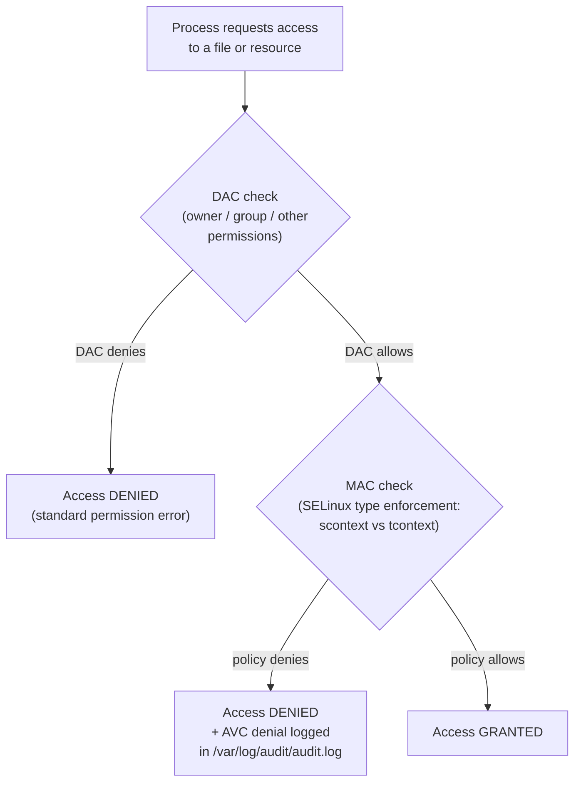

[↑ Back to TOC](#toc)

# SELinux Fundamentals
[](../LICENSE.md)
[](https://access.redhat.com/products/red-hat-enterprise-linux)
[](https://www.redhat.com)

SELinux (Security-Enhanced Linux) is a **Mandatory Access Control (MAC)**
system built into the Linux kernel. It enforces security policies that go
far beyond standard Unix permissions.

Standard Unix permissions (DAC — Discretionary Access Control) let the file
owner decide who can read, write, or execute a file. The problem is that once
a process is compromised, it runs with the same permissions as the user who
started it. A web server running as `apache` can, in principle, read any file
readable by `apache` — including sensitive configuration files, SSH keys, and
user data. DAC cannot prevent this once the process is exploited.

SELinux adds a second, independent check. Every process and every file has a
**security context** (a label). The SELinux policy defines which process types
may access which file types. Even if a web server is compromised and the
attacker has full control of the `apache` process, the SELinux policy prevents
`httpd_t` from opening files labelled `shadow_t` (the password file) or
`sshd_key_t` (SSH host keys). The attacker is **confined** by the policy.

On RHEL 10, SELinux runs in **enforcing** mode by default, with a
comprehensive targeted policy covering all major services. The targeted policy
focuses enforcement on network-facing daemons — httpd, sshd, named, vsftpd —
while leaving user processes largely unconstrained. This gives strong
protection where it matters most without imposing day-to-day friction on
administrators.

---
<a name="toc"></a>

## Table of contents

- [MAC vs DAC](#mac-vs-dac)
- [SELinux decision flow](#selinux-decision-flow)
- [SELinux modes](#selinux-modes)
  - [Temporarily switch modes (no reboot, not persistent)](#temporarily-switch-modes-no-reboot-not-persistent)
  - [Permanent mode (requires reboot)](#permanent-mode-requires-reboot)
- [SELinux contexts](#selinux-contexts)
- [File contexts — `restorecon`](#file-contexts-restorecon)
- [SELinux booleans](#selinux-booleans)
- [Install SELinux tools](#install-selinux-tools)
- [Worked example](#worked-example)
- [Common mistakes and how to diagnose them](#common-mistakes-and-how-to-diagnose-them)
- [semanage — persistent policy management](#semanage--persistent-policy-management)
- [File context database operations](#file-context-database-operations)


## MAC vs DAC

| Model | Name | Controls access via |
|---|---|---|
| **DAC** | Discretionary Access Control | File owner sets permissions (`chmod`) |
| **MAC** | Mandatory Access Control | Policy defines what processes can access |

With SELinux, even if a file has `777` permissions, a process still needs
the correct SELinux type to access it. This is why "fix it with chmod 777"
is wrong — SELinux may still block the access.


[↑ Back to TOC](#toc)

---

## SELinux decision flow



Both checks must pass. A DAC denial never reaches SELinux. An SELinux denial
only occurs after DAC has already approved the access — which is why you must
fix standard permissions before diagnosing SELinux issues.


[↑ Back to TOC](#toc)

---

## SELinux modes

| Mode | Behaviour |
|---|---|
| **Enforcing** | Policy is enforced; violations are blocked and logged |
| **Permissive** | Policy is NOT enforced; violations are logged only |
| **Disabled** | SELinux is completely off — requires reboot to re-enable |

```bash
# Check current mode
getenforce

# Detailed status
sestatus
```

`sestatus` shows more detail than `getenforce`: the mode, the policy type
(`targeted` on RHEL), and the policy version. Use it when you need to confirm
the full SELinux state.

### Temporarily switch modes (no reboot, not persistent)

```bash
sudo setenforce 0    # Permissive (troubleshooting ONLY)
sudo setenforce 1    # Enforcing (put it back immediately)
```

> **⚠️ Do NOT set Permissive as a fix**
> Permissive mode is for **temporary troubleshooting only**. Running in
> permissive mode defeats the entire point of SELinux. Always fix the
> root cause and return to enforcing.
>

### Permanent mode (requires reboot)

```bash
sudo vim /etc/selinux/config
```

```text
SELINUX=enforcing    # recommended
SELINUX=permissive   # temp troubleshooting only
SELINUX=disabled     # never in production
```

> **🚨 Never set SELINUX=disabled in production**
> Re-enabling after disabling requires a full filesystem relabel at next
> boot, which takes time and can cause issues if interrupted.
>

> **Exam tip:** Never set SELinux to `disabled` in an exam environment —
> use `permissive` for temporary debugging. Going from `disabled` back to
> `enforcing` requires a full relabel on the next boot (`touch /.autorelabel`
> or `fixfiles -F onboot`), costs significant time, and may leave your system
> unbootable if interrupted.


[↑ Back to TOC](#toc)

---

## SELinux contexts

Every file, process, and socket has a **security context** (label):

```text
user:role:type:level
```

The **type** is the most important component — it determines what can access what.

```bash
# Show file context
ls -Z /etc/hosts
ls -Z /var/www/html/

# Show process context
ps -eZ | grep httpd
ps -eZ | grep sshd

# Show your own context
id -Z
```

Common type suffixes and what they mean:

| Suffix | Typical meaning |
|---|---|
| `_t` | A process type or file type |
| `_exec_t` | An executable that transitions to a new domain |
| `_content_t` | Read-only content for a service (e.g., `httpd_sys_content_t`) |
| `_rw_content_t` | Writable content for a service |
| `_port_t` | A network port type |

The four-component context format `user:role:type:level` comes from
Bell-LaPadula MLS (Multi-Level Security). In the targeted policy, `user` and
`role` are usually `system_u:system_r` for daemons and `unconfined_u:unconfined_r`
for user processes. The `level` component (`s0`) is the MLS sensitivity level —
also generally ignored in targeted policy. Focus on the **type** field.


[↑ Back to TOC](#toc)

---

## File contexts — `restorecon`

Files must have the correct context for the service that accesses them.
The most common SELinux issue is a file with the wrong context.

```bash
# Restore the correct context (from policy definition)
sudo restorecon -v /var/www/html/index.html

# Recursive restore
sudo restorecon -Rv /var/www/html/

# Check what context a path should have (without changing it)
sudo matchpathcon /var/www/html/index.html
```

If you move files with `mv`, they keep the context from the source.
If you copy with `cp`, they get the context of the destination.

> **💡 Use cp not mv for web content**
> When placing content into `/var/www/html/`, use `cp` or `restorecon` after
> moving to ensure the correct `httpd_sys_content_t` context is applied.
>

The file context database is managed by `semanage fcontext`. When you run
`restorecon`, it looks up the target path in this database and applies the
matching context. If the path is not in the database (e.g., a custom
application directory), `restorecon` has nothing to apply and the context
remains wrong. In that case, first add a policy entry with `semanage fcontext`,
then run `restorecon`.

```bash
# Add a custom path to the policy database
sudo semanage fcontext -a -t httpd_sys_content_t "/srv/myapp(/.*)?"

# Then apply it
sudo restorecon -Rv /srv/myapp/
```


[↑ Back to TOC](#toc)

---

## SELinux booleans

Booleans are policy switches that enable/disable specific behaviours
without writing custom policy.

```bash
# List all booleans
sudo getsebool -a

# Search booleans related to httpd
sudo getsebool -a | grep httpd

# Get status of a specific boolean
getsebool httpd_can_network_connect

# Turn a boolean ON (runtime only)
sudo setsebool httpd_can_network_connect on

# Turn a boolean ON persistently (survives reboot)
sudo setsebool -P httpd_can_network_connect on
```

Common booleans for new admins:

| Boolean | What it enables |
|---|---|
| `httpd_can_network_connect` | Apache to make outbound network connections |
| `httpd_use_nfs` | Apache to serve NFS-mounted content |
| `samba_enable_home_dirs` | Samba to share home directories |
| `ftpd_anon_write` | FTP anonymous upload |
| `httpd_enable_cgi` | Apache to execute CGI scripts |
| `named_tcp_bind_http_port` | BIND to bind HTTP ports |

> **Exam tip:** Before writing a custom SELinux policy, always check whether
> a boolean already covers your use case. Most common service integrations
> are handled by booleans. `getsebool -a | grep <service>` takes 5 seconds
> and is almost always worth running.


[↑ Back to TOC](#toc)

---

## Install SELinux tools

```bash
sudo dnf install -y policycoreutils-python-utils setroubleshoot-server
```

These provide `semanage`, `sealert`, and improved audit analysis.

| Package | Tools provided |
|---|---|
| `policycoreutils` | `restorecon`, `semanage`, `secon`, `fixfiles` (installed by default) |
| `policycoreutils-python-utils` | `audit2allow`, `audit2why`, `semanage` Python extensions |
| `setroubleshoot-server` | `sealert`, `setroubleshootd` daemon |
| `setools-console` | `sesearch`, `seinfo` — policy query tools |


[↑ Back to TOC](#toc)

---

## Worked example

**Scenario:** A development team deploys a Python web app to `/opt/webapp/`.
After starting Apache to proxy it, users get 403 errors. SELinux is enforcing.

```bash
# Step 1 — check Apache is running
systemctl status httpd
# Active: active (running)

# Step 2 — check standard permissions (DAC)
ls -l /opt/webapp/
# drwxr-xr-x. 2 webapp webapp 4096 Jan 15 10:00 .
# DAC looks fine — apache can read it.

# Step 3 — check SELinux context
ls -Z /opt/webapp/
# system_u:object_r:usr_t:s0  index.html
# "usr_t" is wrong — httpd needs "httpd_sys_content_t"

# Step 4 — check AVC denials
sudo ausearch -m avc -ts recent
# type=AVC ... avc: denied { read } for ... comm="httpd" ...
# tcontext=...:usr_t:s0

# Step 5 — fix: add context mapping for the custom path
sudo semanage fcontext -a -t httpd_sys_content_t "/opt/webapp(/.*)?"

# Step 6 — apply context to existing files
sudo restorecon -Rv /opt/webapp/
# restorecon reset /opt/webapp/index.html context
# system_u:object_r:usr_t:s0 -> system_u:object_r:httpd_sys_content_t:s0

# Step 7 — verify
ls -Z /opt/webapp/
# system_u:object_r:httpd_sys_content_t:s0  index.html

# Step 8 — test
curl http://localhost/
# Expected: 200 OK with app content
```


[↑ Back to TOC](#toc)

---

## Common mistakes and how to diagnose them

| Symptom | Likely cause | Diagnosis | Fix |
|---|---|---|---|
| `chmod 777` doesn't fix the 403 | SELinux is blocking, not DAC | `ls -Z <file>` — wrong context type | `restorecon -Rv <path>` or `semanage fcontext` + restorecon |
| `restorecon` doesn't fix the context | No policy entry for custom path | `sudo matchpathcon <path>` — returns `<<none>>` | `semanage fcontext -a -t <type> "<path>(/.*)?"`  first |
| Context correct but service still denied | A boolean needs to be set | `sealert -a /var/log/audit/audit.log` — suggests boolean | `setsebool -P <boolean> on` |
| `semanage: command not found` | Package not installed | `rpm -q policycoreutils-python-utils` | `sudo dnf install policycoreutils-python-utils` |
| SELinux set to permissive "temporarily" and forgotten | `setenforce 0` without follow-up fix | `getenforce` — returns `Permissive` | Fix root cause, then `setenforce 1` |
| Context lost after reboot | Used `chcon` instead of `semanage + restorecon` | `chcon` changes runtime label only — not persisted in policy | Use `semanage fcontext -a` + `restorecon` instead |


[↑ Back to TOC](#toc)

---

## semanage — persistent policy management

`semanage` is the tool for making persistent changes to the SELinux policy
database without recompiling policy modules. It manages four key objects:

### semanage fcontext — file context rules

```bash
# List all fcontext rules
sudo semanage fcontext -l

# Filter to just httpd-related rules
sudo semanage fcontext -l | grep httpd

# Add a new rule for a custom path
sudo semanage fcontext -a -t httpd_sys_content_t "/srv/webapp(/.*)?"

# Modify an existing rule
sudo semanage fcontext -m -t httpd_sys_rw_content_t "/srv/webapp/uploads(/.*)?"

# Delete a rule
sudo semanage fcontext -d "/srv/webapp(/.*)?"
```

After adding or modifying rules, always run `restorecon` to apply them:

```bash
sudo restorecon -Rv /srv/webapp/
```

### semanage port — network port types

```bash
# List all port type assignments
sudo semanage port -l

# See which ports httpd can bind to
sudo semanage port -l | grep http_port_t

# Allow httpd to bind to port 8080
sudo semanage port -a -t http_port_t -p tcp 8080

# Allow sshd to bind to port 2222
sudo semanage port -a -t ssh_port_t -p tcp 2222
```

### semanage login and user — user mapping

The SELinux user system maps Linux usernames to SELinux users. In the
targeted policy, most users map to `unconfined_u` (no restrictions).

```bash
# Show current login mappings
sudo semanage login -l

# Show SELinux users
sudo semanage user -l
```

### semanage boolean — persistent boolean changes

`semanage boolean` provides another way to set persistent booleans (same
effect as `setsebool -P`):

```bash
sudo semanage boolean -m --on httpd_can_network_connect
sudo semanage boolean -l | grep httpd_can_network_connect
```


[↑ Back to TOC](#toc)

---

## File context database operations

The file context database is the source of truth for `restorecon`. Understanding
it fully helps when dealing with complex directory structures.

```bash
# Show what context policy says a path should have
matchpathcon /var/www/html/index.html
# Output: /var/www/html/index.html  system_u:object_r:httpd_sys_content_t:s0

# Check if a file's current context matches what policy says
matchpathcon -V /var/www/html/index.html
# Output if correct:  /var/www/html/index.html verified.
# Output if wrong:    /var/www/html/index.html has incorrect file context:
#                     system_u:object_r:user_home_t:s0, should be
#                     system_u:object_r:httpd_sys_content_t:s0
```

The `chcon` command changes a file's context directly (without the policy
database). It is useful for temporary testing but the change does not survive
a `restorecon` call or a full filesystem relabel:

```bash
# Temporary context change (testing only — NOT persistent)
sudo chcon -t httpd_sys_content_t /tmp/testfile.html
# This will be lost after restorecon or relabel
```

The correct permanent workflow is always `semanage fcontext` + `restorecon`,
never `chcon` alone. A useful mnemonic: `chcon` = "change context now",
`semanage` = "remember this forever".

> **Exam tip:** If asked to ensure a file has the correct SELinux context
> permanently, use `semanage fcontext -a` + `restorecon`. Using `chcon` alone
> will not survive an `autorelabel` (triggered by, e.g., a `touch /.autorelabel`
> at reboot) — and the exam may test for survival across relabels.


[↑ Back to TOC](#toc)

---

## Further reading

| Resource | Notes |
|---|---|
| [RHEL 10 — Using SELinux](https://access.redhat.com/documentation/en-us/red_hat_enterprise_linux/10/html/using_selinux/index) | Official SELinux guide — fundamentals through advanced policy |
| [SELinux Project Wiki](https://selinuxproject.org/page/Main_Page) | Upstream policy reference and architecture docs |
| [`selinux` man page](https://man7.org/linux/man-pages/man8/selinux.8.html) | Overview of the SELinux API |

---


[↑ Back to TOC](#toc)

## Next step

→ [SELinux Troubleshooting (AVCs)](14-selinux-avc-basics.md)

[↑ Back to TOC](#toc)

---

© 2026 UncleJS — Licensed under CC BY-NC-SA 4.0
