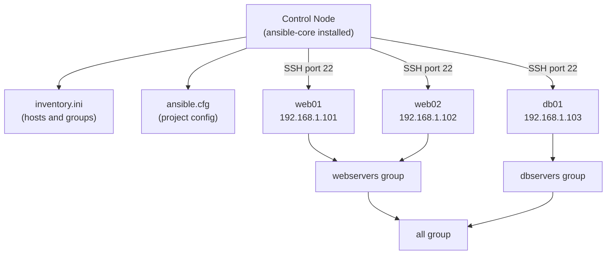

[↑ Back to TOC](#toc)

# Ansible Setup and Inventory
[](../LICENSE.md)
[](https://access.redhat.com/products/red-hat-enterprise-linux)
[](https://www.redhat.com)

Ansible is an agentless automation tool that connects to managed nodes over
SSH (or WinRM for Windows) and runs tasks. No agent is installed on target hosts.

Agentless architecture has a practical advantage for operations: you do not
need to first provision an agent before you can manage a host. Any RHEL host
that has SSH and Python available (which is every default RHEL installation)
is immediately manageable. This also means there is no agent version to keep
in sync across hundreds of nodes, no agent process consuming memory, and no
inbound network port to open on managed nodes — the control node initiates
all connections outward over SSH.

Ansible's execution model is **push**: the control node connects to managed
nodes, copies a small Python module to a temp directory, executes it, records
the result, and deletes the temp file. The managed node never calls home.
Contrast this with pull-based tools (Puppet, Chef) where agents poll a central
server for configuration catalogs. Push is simpler to reason about but
requires the control node to have network reach to all managed nodes.

This chapter covers installation, SSH credential setup, inventory files, and
the `ansible.cfg` configuration file — the three prerequisites before you
can run a single playbook.

---
<a name="toc"></a>

## Table of contents

- [Architecture](#architecture)
- [Architecture diagram](#architecture-diagram)
- [Install Ansible on RHEL 10](#install-ansible-on-rhel-10)
- [SSH key setup (required)](#ssh-key-setup-required)
- [Inventory file](#inventory-file)
  - [INI format](#ini-format)
  - [YAML format (modern)](#yaml-format-modern)
- [ansible.cfg](#ansiblecfg)
- [Ad-hoc commands](#ad-hoc-commands)
- [Ansible modules (essential)](#ansible-modules-essential)
- [Common mistakes and how to diagnose them](#common-mistakes-and-how-to-diagnose-them)


## Architecture

```text
Control node (your workstation or jump host)
    │
    │  SSH
    │
    ├── managed node: web01
    ├── managed node: web02
    └── managed node: db01
```

| Term | Meaning |
|---|---|
| **Control node** | Where Ansible is installed and run from |
| **Managed node** | Host that Ansible configures |
| **Inventory** | List of managed nodes (hosts and groups) |
| **Playbook** | YAML file describing what to do |
| **Module** | A built-in task type (e.g., `dnf`, `copy`, `service`) |
| **Role** | A reusable, structured collection of tasks |


[↑ Back to TOC](#toc)

---

## Architecture diagram



The control node reads the inventory to discover which hosts belong to which
groups, then opens an SSH connection to each target host to push and execute
modules.

[↑ Back to TOC](#toc)

---

## Install Ansible on RHEL 10

```bash
# Enable the Ansible module stream
sudo dnf install -y ansible-core

# Verify
ansible --version
```

`ansible-core` provides the `ansible`, `ansible-playbook`, `ansible-galaxy`,
and `ansible-vault` binaries. For RHCE, `ansible-core` is sufficient. If you
need community modules or RHEL System Roles, install additional collections
separately (see the Roles chapter).

```bash
# Check the installed collections
ansible-galaxy collection list

# Install the posix collection (needed for firewalld, seboolean)
ansible-galaxy collection install ansible.posix

# Install community.general (needed for seport, selinux_permissive, etc.)
ansible-galaxy collection install community.general
```

[↑ Back to TOC](#toc)

---

## SSH key setup (required)

Ansible connects via SSH. Copy your SSH key to managed nodes first:

```bash
# Generate key if needed
ssh-keygen -t ed25519 -C "ansible-control"

# Copy to managed nodes
ssh-copy-id rhel@192.168.1.101
ssh-copy-id rhel@192.168.1.102
```

Verify connectivity before running any playbook:

```bash
# Manual SSH test
ssh rhel@192.168.1.101 "hostname"

# Ansible connectivity test
ansible all -m ansible.builtin.ping -i inventory.ini
```

If you manage many hosts, automate key distribution with a bootstrap script:

```bash
#!/usr/bin/env bash
set -euo pipefail

HOSTS=(192.168.1.101 192.168.1.102 192.168.1.103)
USER="rhel"

for HOST in "${HOSTS[@]}"; do
  echo "Copying key to ${HOST}..."
  ssh-copy-id -i ~/.ssh/id_ed25519.pub "${USER}@${HOST}"
done
echo "Done."
```

> **Exam tip:** In the RHCE exam environment, SSH keys are typically
> pre-configured. Run `ansible all -m ping` immediately to confirm all
> managed nodes respond before attempting any playbook tasks.

[↑ Back to TOC](#toc)

---

## Inventory file

The inventory lists your managed nodes. Default location: `/etc/ansible/hosts`.
For learning, create a local `inventory.ini` file.

### INI format

```ini
# inventory.ini

[webservers]
web01 ansible_host=192.168.1.101
web02 ansible_host=192.168.1.102

[dbservers]
db01 ansible_host=192.168.1.103

[all:vars]
ansible_user=rhel
ansible_become=true
ansible_become_method=sudo
```

Groups can contain other groups using the `:children` suffix:

```ini
[production:children]
webservers
dbservers

[production:vars]
env=production
```

### YAML format (modern)

```yaml
# inventory.yaml
all:
  vars:
    ansible_user: rhel
    ansible_become: true
  children:
    webservers:
      hosts:
        web01:
          ansible_host: 192.168.1.101
        web02:
          ansible_host: 192.168.1.102
    dbservers:
      hosts:
        db01:
          ansible_host: 192.168.1.103
```

Use `ansible-inventory` to inspect and validate your inventory:

```bash
# List all hosts in the inventory
ansible-inventory -i inventory.ini --list

# Show the inventory as a graph
ansible-inventory -i inventory.ini --graph

# Show variables for a specific host
ansible-inventory -i inventory.ini --host web01
```

[↑ Back to TOC](#toc)

---

## ansible.cfg

Project-level configuration (takes priority over global `/etc/ansible/ansible.cfg`):

```ini
# ansible.cfg  (in your project directory)
[defaults]
inventory = inventory.ini
remote_user = rhel
host_key_checking = False
stdout_callback = yaml

[privilege_escalation]
become = True
become_method = sudo
become_user = root
```

Ansible looks for `ansible.cfg` in this order (first match wins):

1. Path in `ANSIBLE_CONFIG` environment variable
2. `./ansible.cfg` (current directory)
3. `~/.ansible.cfg` (user home directory)
4. `/etc/ansible/ansible.cfg` (global)

Always use a project-level `ansible.cfg` committed to Git so that every
engineer who clones the repository uses the same settings.

Common `ansible.cfg` options:

| Option | Section | Effect |
|---|---|---|
| `inventory` | `[defaults]` | Default inventory file path |
| `remote_user` | `[defaults]` | SSH username on managed nodes |
| `host_key_checking` | `[defaults]` | Set `False` in labs; keep `True` in production |
| `stdout_callback` | `[defaults]` | `yaml` gives readable output; `json` for machine parsing |
| `forks` | `[defaults]` | Parallel connections (default: 5) |
| `become` | `[privilege_escalation]` | Default to sudo for all plays |
| `become_method` | `[privilege_escalation]` | `sudo` (default) or `su` |

[↑ Back to TOC](#toc)

---

## Ad-hoc commands

Ad-hoc commands run a single module without a playbook:

```bash
# Ping all hosts
ansible all -m ansible.builtin.ping

# Ping a specific group
ansible webservers -m ansible.builtin.ping

# Run a command on all hosts
ansible all -m ansible.builtin.command -a "uptime"

# Install a package
ansible webservers -m ansible.builtin.dnf -a "name=vim state=present"

# Gather facts about a host
ansible web01 -m ansible.builtin.setup

# Copy a file
ansible all -m ansible.builtin.copy -a "src=/etc/hosts dest=/tmp/hosts_copy"

# Check disk usage on all hosts
ansible all -m ansible.builtin.command -a "df -h /"

# Restart a service
ansible webservers -m ansible.builtin.service -a "name=httpd state=restarted"
```

Ad-hoc commands are useful for quick checks and one-off tasks, but should not
replace playbooks for anything that needs to be repeatable or audited.

[↑ Back to TOC](#toc)

---

## Ansible modules (essential)

Use fully-qualified collection names (FQCN) in all playbooks and ad-hoc
commands. Short names still work but produce deprecation warnings and break
when multiple collections provide the same short name.

| Module (FQCN) | What it does |
|---|---|
| `ansible.builtin.ping` | Test connectivity |
| `ansible.builtin.command` | Run a command (no shell features) |
| `ansible.builtin.shell` | Run a command with shell features |
| `ansible.builtin.dnf` | Manage packages |
| `ansible.builtin.service` | Manage systemd services |
| `ansible.builtin.copy` | Copy files to managed nodes |
| `ansible.builtin.template` | Render Jinja2 templates |
| `ansible.builtin.file` | Manage file/dir attributes |
| `ansible.builtin.user` | Manage users |
| `ansible.builtin.group` | Manage groups |
| `ansible.posix.firewalld` | Manage firewalld rules |
| `ansible.posix.seboolean` | Manage SELinux booleans |
| `community.general.seport` | Manage SELinux port labels |
| `ansible.builtin.lineinfile` | Manage single lines in config files |
| `ansible.builtin.blockinfile` | Manage multi-line blocks in config files |
| `ansible.builtin.reboot` | Reboot and wait for host to come back |
| `ansible.builtin.setup` | Gather host facts |

[↑ Back to TOC](#toc)

---

## Common mistakes and how to diagnose them

| Mistake | Symptom | Fix |
|---|---|---|
| `host_key_checking = False` left in production `ansible.cfg` | Man-in-the-middle attacks go undetected | Only disable in lab environments; use known_hosts management in production |
| Short module names (`dnf` not `ansible.builtin.dnf`) | Deprecation warnings; ambiguous if multiple collections are installed | Always use FQCN in playbooks |
| No `ansible.cfg` in project directory | Ansible uses global config or defaults; different engineers get different behaviour | Always create a project-level `ansible.cfg` and commit it to Git |
| Inventory not validated after editing | Playbook targets wrong hosts or no hosts | Run `ansible-inventory --graph` after any inventory change |
| `ansible_become=true` missing for tasks needing root | `Permission denied` errors even with correct SSH access | Add `become: true` at the play or task level, or set it in `ansible.cfg` |
| SSH key not copied before running playbooks | `UNREACHABLE! Authentication failed` | Run `ssh-copy-id` to all managed nodes before first playbook execution |

[↑ Back to TOC](#toc)

---

## Further reading

| Resource | Notes |
|---|---|
| [Ansible — How to build your inventory](https://docs.ansible.com/ansible/latest/inventory_guide/index.html) | Static and dynamic inventory reference |
| [`ansible.cfg` reference](https://docs.ansible.com/ansible/latest/reference_appendices/config.html) | All configuration file options |
| [Ansible — Connection methods](https://docs.ansible.com/ansible/latest/plugins/connection.html) | SSH, local, and other connection plugins |

---


[↑ Back to TOC](#toc)

## Next step

→ [Ansible Playbooks](04-ansible-playbooks.md)

[↑ Back to TOC](#toc)

---

© 2026 UncleJS — Licensed under CC BY-NC-SA 4.0
