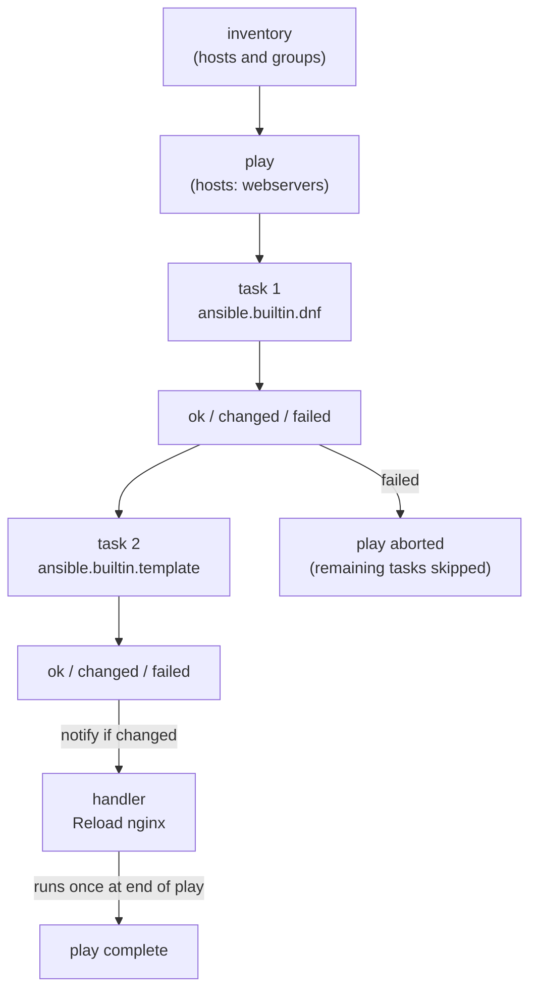

[↑ Back to TOC](#toc)

# Ansible Playbooks — Tasks and Handlers
[](../LICENSE.md)
[](https://access.redhat.com/products/red-hat-enterprise-linux)
[](https://www.redhat.com)

A **playbook** is a YAML file that describes the desired state of one or more
managed nodes. It is the core artifact of Ansible automation.

Playbooks are where the automation mindset you developed in chapter one becomes
executable code. Each play maps a group of hosts to a sequence of tasks. Each
task invokes a module with parameters. Ansible tracks whether each task
produced a change, and handlers use that information to trigger follow-on
actions (like restarting a service) only when genuinely needed.

Understanding the execution flow is essential for debugging. Ansible processes
plays in order from top to bottom. Within a play, tasks run sequentially on
all targeted hosts before the next task begins — unless you use `async` or
`strategy: free`. Handlers wait until all tasks in the play complete, then
run once per unique notification regardless of how many tasks triggered them.

This chapter covers the mechanics you need to write playbooks for the RHCE
exam: structure, common task patterns, handlers, check mode, verbosity flags,
host limiting, and tags. The worked example at the end puts them together in
a realistic deployment scenario.

---
<a name="toc"></a>

## Table of contents

- [Playbook structure](#playbook-structure)
- [Play execution flow diagram](#play-execution-flow-diagram)
- [A minimal working playbook](#a-minimal-working-playbook)
- [Common task patterns](#common-task-patterns)
  - [Package management](#package-management)
  - [Service management](#service-management)
  - [File management](#file-management)
  - [User management](#user-management)
- [Handlers](#handlers)
- [Blocks and error handling](#blocks-and-error-handling)
- [Loops in tasks](#loops-in-tasks)
- [Conditionals in tasks](#conditionals-in-tasks)
- [Check mode (dry run)](#check-mode-dry-run)
- [Verbose output](#verbose-output)
- [Limit to specific hosts](#limit-to-specific-hosts)
- [Tags](#tags)
- [Worked example](#worked-example)
- [Common mistakes and how to diagnose them](#common-mistakes-and-how-to-diagnose-them)


## Playbook structure

```yaml
---
- name: Describe what this play does          # Play name
  hosts: webservers                           # Target inventory group
  become: true                                # Use sudo

  tasks:
    - name: Describe what this task does      # Task name
      module_name:                            # Module
        option1: value1
        option2: value2
```

Every task should have a `name`. It appears in output and helps with debugging.

---

## Play execution flow diagram



[↑ Back to TOC](#toc)

---

## A minimal working playbook

```yaml
---
- name: Ensure vim is installed on all hosts
  hosts: all
  become: true

  tasks:
    - name: Install vim
      ansible.builtin.dnf:
        name: vim
        state: present
```

Run it:

```bash
ansible-playbook -i inventory.ini install-vim.yml
```

---

## Common task patterns

### Package management

```yaml
- name: Install multiple packages
  ansible.builtin.dnf:
    name:
      - vim
      - git
      - curl
    state: present

- name: Remove a package
  ansible.builtin.dnf:
    name: telnet
    state: absent

- name: Update all packages
  ansible.builtin.dnf:
    name: "*"
    state: latest
```

### Service management

```yaml
- name: Ensure httpd is running and enabled
  ansible.builtin.service:
    name: httpd
    state: started
    enabled: true

- name: Restart httpd
  ansible.builtin.service:
    name: httpd
    state: restarted
```

### File management

```yaml
- name: Create a directory
  ansible.builtin.file:
    path: /etc/myapp
    state: directory
    owner: root
    group: root
    mode: '0755'

- name: Copy a file
  ansible.builtin.copy:
    src: files/myapp.conf
    dest: /etc/myapp/myapp.conf
    owner: root
    group: root
    mode: '0644'

- name: Create a symlink
  ansible.builtin.file:
    src: /etc/myapp/myapp.conf
    dest: /etc/myapp.conf
    state: link
```

### User management

```yaml
- name: Create application user
  ansible.builtin.user:
    name: appuser
    groups: wheel
    shell: /bin/bash
    create_home: true
    state: present
```


[↑ Back to TOC](#toc)

---

## Handlers

Handlers run **once at the end of the play, only if notified**. They're used
for actions that should only happen when something changes (e.g., restart a
service only if its config was modified).

```yaml
---
- name: Configure sshd
  hosts: all
  become: true

  tasks:
    - name: Set SSH LoginGraceTime
      ansible.builtin.lineinfile:
        path: /etc/ssh/sshd_config
        regexp: '^LoginGraceTime'
        line: 'LoginGraceTime 30'
      notify: Restart sshd            # triggers the handler

  handlers:
    - name: Restart sshd
      ansible.builtin.service:
        name: sshd
        state: restarted
```

Key points:
- Handlers run **after all tasks** in the play complete
- A handler is only triggered if its notifying task reported `changed`
- Multiple tasks can notify the same handler — it still runs only once
- Use `ansible.builtin.meta: flush_handlers` to force handlers to run
  mid-play before all tasks complete

> **Exam tip:** Use `ansible-playbook --syntax-check` before running against
> production. It catches YAML indent errors instantly.

---

## Blocks and error handling

Blocks group tasks and allow structured error handling similar to try/catch:

```yaml
- name: Install and configure app
  block:
    - name: Install packages
      ansible.builtin.dnf:
        name: myapp
        state: present

    - name: Deploy config
      ansible.builtin.template:
        src: templates/myapp.conf.j2
        dest: /etc/myapp/myapp.conf

  rescue:
    - name: Log installation failure
      ansible.builtin.debug:
        msg: "Package install or config deploy failed on {{ inventory_hostname }}"

  always:
    - name: Ensure log directory exists
      ansible.builtin.file:
        path: /var/log/myapp
        state: directory
```

- `block`: the tasks to attempt
- `rescue`: runs if any task in the block fails (like `catch`)
- `always`: runs regardless of success or failure (like `finally`)

---

## Loops in tasks

```yaml
# Loop over a list
- name: Create multiple users
  ansible.builtin.user:
    name: "{{ item }}"
    state: present
  loop:
    - alice
    - bob
    - carol

# Loop over a list of dicts
- name: Create users with shells
  ansible.builtin.user:
    name: "{{ item.name }}"
    shell: "{{ item.shell }}"
    state: present
  loop:
    - { name: alice, shell: /bin/bash }
    - { name: bob,   shell: /sbin/nologin }

# Loop with index
- name: Print items with index
  ansible.builtin.debug:
    msg: "Item {{ index }}: {{ item }}"
  loop: "{{ ['a', 'b', 'c'] }}"
  loop_control:
    index_var: index
```

[↑ Back to TOC](#toc)

---

## Conditionals in tasks

```yaml
# Run task only on RHEL systems
- name: Install RHEL-specific package
  ansible.builtin.dnf:
    name: rhel-system-roles
    state: present
  when: ansible_distribution == "RedHat"

# Multiple conditions (AND)
- name: Restart only if running and config changed
  ansible.builtin.service:
    name: httpd
    state: restarted
  when:
    - httpd_config.changed
    - ansible_facts.services['httpd.service'].state == 'running'

# Condition on registered variable
- name: Check if config file exists
  ansible.builtin.stat:
    path: /etc/myapp/myapp.conf
  register: config_stat

- name: Deploy config only if missing
  ansible.builtin.template:
    src: templates/myapp.conf.j2
    dest: /etc/myapp/myapp.conf
  when: not config_stat.stat.exists
```

[↑ Back to TOC](#toc)

---

## Check mode (dry run)

```bash
ansible-playbook -i inventory.ini site.yml --check
```

Simulates what would change without making any changes.

Some tasks cannot be fully simulated in check mode (e.g., tasks that depend on
the output of a previous task that was skipped). Use `--diff` alongside
`--check` to see the actual text changes in files:

```bash
ansible-playbook -i inventory.ini site.yml --check --diff
```


[↑ Back to TOC](#toc)

---

## Verbose output

```bash
ansible-playbook -i inventory.ini site.yml -v    # basic
ansible-playbook -i inventory.ini site.yml -vvv  # very verbose (shows SSH details)
```

Verbosity levels:

| Flag | Shows |
|---|---|
| `-v` | Task results in detail |
| `-vv` | Task results + file diffs |
| `-vvv` | SSH connection details |
| `-vvvv` | Connection plugin details (rarely needed) |


[↑ Back to TOC](#toc)

---

## Limit to specific hosts

```bash
# Run playbook against one host only
ansible-playbook -i inventory.ini site.yml --limit web01

# Run against a group
ansible-playbook -i inventory.ini site.yml --limit webservers

# Combine host patterns
ansible-playbook -i inventory.ini site.yml --limit "webservers:!web02"
```


[↑ Back to TOC](#toc)

---

## Tags

Tags let you run only specific tasks:

```yaml
- name: Install packages
  ansible.builtin.dnf:
    name: nginx
    state: present
  tags:
    - packages
    - nginx
```

```bash
# Run only tagged tasks
ansible-playbook site.yml --tags packages

# Skip tagged tasks
ansible-playbook site.yml --skip-tags packages

# List all tags defined in a playbook
ansible-playbook site.yml --list-tags
```


[↑ Back to TOC](#toc)

---

## Worked example

### Deploying a MariaDB server with a hardened configuration

This example demonstrates a complete, production-realistic playbook that
installs MariaDB, deploys a hardened configuration, manages firewall and
SELinux, and verifies the service is healthy after deployment.

**Project structure:**

```text
mariadb-deploy/
  ansible.cfg
  inventory.ini
  site.yml
  templates/
    mariadb-server.cnf.j2
```

**`templates/mariadb-server.cnf.j2`**

```jinja2
# /etc/my.cnf.d/mariadb-server.cnf
# Managed by Ansible — do not edit by hand
# Generated: {{ ansible_date_time.iso8601 }} on {{ inventory_hostname }}

[mysqld]
bind-address        = {{ db_bind_address | default('127.0.0.1') }}
port                = {{ db_port | default(3306) }}
datadir             = /var/lib/mysql
socket              = /var/lib/mysql/mysql.sock
log-error           = /var/log/mariadb/mariadb.log
pid-file            = /run/mariadb/mariadb.pid

# Security hardening
local-infile        = 0
symbolic-links      = 0
max_connections     = {{ db_max_connections | default(150) }}

# InnoDB tuning
innodb_buffer_pool_size = {{ db_innodb_buffer | default('128M') }}
```

**`site.yml`**

```yaml
---
- name: Deploy hardened MariaDB server
  hosts: dbservers
  become: true

  vars:
    db_port: 3306
    db_bind_address: "0.0.0.0"
    db_max_connections: 200
    db_innodb_buffer: "256M"

  pre_tasks:
    - name: Verify OS is RHEL 10
      ansible.builtin.assert:
        that:
          - ansible_distribution == "RedHat"
          - ansible_distribution_major_version | int >= 10
        fail_msg: "This playbook requires RHEL 10 or later"

  tasks:
    - name: Install MariaDB server and client
      ansible.builtin.dnf:
        name:
          - mariadb-server
          - mariadb
          - python3-PyMySQL
        state: present

    - name: Ensure MariaDB log directory exists
      ansible.builtin.file:
        path: /var/log/mariadb
        state: directory
        owner: mysql
        group: mysql
        mode: '0750'

    - name: Deploy hardened MariaDB config
      ansible.builtin.template:
        src: templates/mariadb-server.cnf.j2
        dest: /etc/my.cnf.d/mariadb-server.cnf
        owner: root
        group: root
        mode: '0644'
      notify: Restart MariaDB

    - name: Start and enable MariaDB
      ansible.builtin.service:
        name: mariadb
        state: started
        enabled: true

    - name: Allow MariaDB port through firewalld
      ansible.posix.firewalld:
        service: mysql
        state: enabled
        permanent: true
        immediate: true
      when: db_bind_address != "127.0.0.1"

    - name: Set SELinux port label for non-standard port
      community.general.seport:
        ports: "{{ db_port }}"
        proto: tcp
        setype: mysqld_port_t
        state: present
      when: db_port != 3306

    - name: Verify MariaDB is listening
      ansible.builtin.command: ss -tlnp
      register: socket_check
      changed_when: false

    - name: Assert MariaDB port is open
      ansible.builtin.assert:
        that: "'{{ db_port }}' in socket_check.stdout"
        fail_msg: "MariaDB is not listening on port {{ db_port }}"

  handlers:
    - name: Restart MariaDB
      ansible.builtin.service:
        name: mariadb
        state: restarted

  post_tasks:
    - name: Report deployment complete
      ansible.builtin.debug:
        msg: >
          MariaDB deployed on {{ inventory_hostname }}
          (port {{ db_port }}, bind {{ db_bind_address }})
```

Run sequence:

```bash
# Validate YAML first
ansible-playbook site.yml --syntax-check

# Dry run to preview changes
ansible-playbook -i inventory.ini site.yml --check --diff

# Apply
ansible-playbook -i inventory.ini site.yml

# Verify
ansible -i inventory.ini dbservers -m ansible.builtin.command \
  -a "systemctl is-active mariadb"
```

[↑ Back to TOC](#toc)

---

## Common mistakes and how to diagnose them

| Mistake | Symptom | Fix |
|---|---|---|
| YAML indentation error | `ERROR! Syntax Error while loading YAML` | Run `--syntax-check`; use a YAML linter (yamllint) |
| Handler name mismatch | Handler never runs even when task shows `changed` | The `notify:` value must match the handler `name:` exactly (case-sensitive) |
| Handler runs every time | Unexpected service restarts on every playbook run | Ensure the notifying task is truly idempotent and only reports `changed` when something actually changes |
| `when` condition always false | Task is always skipped | Use `ansible -m setup host` to inspect the exact fact values; `ansible_distribution` is not `rhel` — it's `RedHat` |
| Loop variable shadowing | Wrong data used inside loop | Use `loop_control: loop_var: myitem` to rename `item` and avoid conflicts with nested loops |
| Missing `changed_when: false` on `command`/`shell` | Task always reports `changed` even for read-only commands | Set `changed_when: false` on any `command` task that only queries state |

[↑ Back to TOC](#toc)

---

## Further reading

| Resource | Notes |
|---|---|
| [Ansible — Playbooks guide](https://docs.ansible.com/ansible/latest/playbook_guide/index.html) | Official playbook reference including conditionals, loops, blocks |
| [Ansible module index](https://docs.ansible.com/ansible/latest/collections/index_module.html) | Full module reference — `ansible.builtin.*` is the core set |
| [YAML specification](https://yaml.org/spec/1.2.2/) | Authoritative YAML syntax reference |

---


[↑ Back to TOC](#toc)

## Next step

→ [Variables, Templates, and Files](05-ansible-vars-templates.md)

[↑ Back to TOC](#toc)

---

© 2026 UncleJS — Licensed under CC BY-NC-SA 4.0
