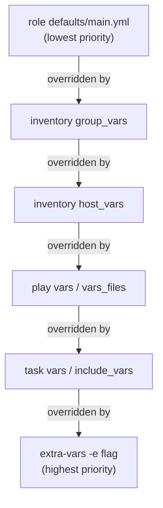

[↑ Back to TOC](#toc)

# Variables, Templates, and Files
[](../LICENSE.md)
[](https://access.redhat.com/products/red-hat-enterprise-linux)
[](https://www.redhat.com)

Variables and templates let you write reusable playbooks that work across
different environments (dev, staging, prod) without changing the code.

A playbook that hardcodes IP addresses, ports, and paths is a one-time script.
A playbook that references variables is a reusable building block. The same
role can configure a development server listening on port 8080 with 256 MB of
memory and a production server on port 443 with 8 GB — no code changes
required, only different variable files.

Templates take this further. Instead of copying a static config file and
modifying it with `lineinfile`, a Jinja2 template lets you generate the
entire file from variables. The result is a config that is fully described by
your inventory and variable files, diffable in Git, and guaranteed to be
consistent across every host in a group.

The hardest part of Ansible variables is **precedence**. Ansible has 22 levels
of variable precedence. You do not need to memorise all 22, but you must know
the common tiers: role defaults are overridden by inventory variables, which
are overridden by play vars, which are overridden by `extra-vars`. Getting
this wrong produces baffling behaviour where changing a variable seems to have
no effect because a higher-precedence definition is winning silently.

---
<a name="toc"></a>

## Table of contents

- [Defining variables](#defining-variables)
  - [In the playbook (inline)](#in-the-playbook-inline)
  - [In a vars file](#in-a-vars-file)
  - [In the inventory (host/group vars)](#in-the-inventory-hostgroup-vars)
- [Variable precedence (simplified, lowest to highest)](#variable-precedence-simplified-lowest-to-highest)
- [Variable precedence diagram](#variable-precedence-diagram)
- [Variable usage in tasks](#variable-usage-in-tasks)
- [Jinja2 templates](#jinja2-templates)
  - [Jinja2 basics](#jinja2-basics)
- [The `lineinfile` module](#the-lineinfile-module)
- [The `blockinfile` module](#the-blockinfile-module)
- [Ansible Vault (secrets)](#ansible-vault-secrets)
- [Registered variables and facts](#registered-variables-and-facts)
- [Worked example](#worked-example)
- [Common mistakes and how to diagnose them](#common-mistakes-and-how-to-diagnose-them)


## Defining variables

### In the playbook (inline)

```yaml
---
- name: Deploy web app
  hosts: webservers
  become: true
  vars:
    app_port: 8080
    app_user: webapp
    app_dir: /srv/webapp

  tasks:
    - name: Create app directory
      ansible.builtin.file:
        path: "{{ app_dir }}"
        state: directory
        owner: "{{ app_user }}"
```

### In a vars file

```yaml
# vars/main.yml
app_port: 8080
app_user: webapp
app_dir: /srv/webapp
db_host: db01.lab.local
```

```yaml
- name: Deploy web app
  hosts: webservers
  vars_files:
    - vars/main.yml
```

### In the inventory (host/group vars)

```ini
# inventory.ini
[webservers]
web01 ansible_host=192.168.1.101 app_port=8080
web02 ansible_host=192.168.1.102 app_port=8081

[webservers:vars]
app_user=webapp
```

Or as files:

```text
inventory/
  group_vars/
    webservers.yml     # applies to all webservers
    all.yml            # applies to all hosts
  host_vars/
    web01.yml          # applies to web01 only
```

Example `group_vars/webservers.yml`:

```yaml
---
app_port: 8080
app_user: webapp
app_dir: /srv/webapp
nginx_worker_processes: auto
nginx_keepalive_timeout: 65
```

Example `host_vars/web01.yml`:

```yaml
---
# web01 is the primary; give it more worker connections
nginx_worker_connections: 2048
```


[↑ Back to TOC](#toc)

---

## Variable precedence (simplified, lowest to highest)

```text
role defaults → inventory group_vars → inventory host_vars
  → playbook vars → extra vars (-e flag)
```

Extra vars (`-e`) always win:

```bash
ansible-playbook site.yml -e "app_port=9090"
```

> **Exam tip:** Variables defined in `extra-vars` (`-e`) override everything
> including `host_vars`. Use this for emergency overrides only — for example,
> to temporarily redirect traffic to a backup host without changing the
> inventory.

[↑ Back to TOC](#toc)

---

## Variable precedence diagram



When debugging a variable that seems to have the wrong value, work from the
bottom up: check if `extra-vars` is being passed on the command line, then
check task vars, then play vars, and so on down to role defaults.

[↑ Back to TOC](#toc)

---

## Variable usage in tasks

```yaml
- name: Template a config file
  ansible.builtin.template:
    src: templates/nginx.conf.j2
    dest: /etc/nginx/nginx.conf

- name: Create a user
  ansible.builtin.user:
    name: "{{ app_user }}"
    home: "{{ app_dir }}"
```

Always quote variables that are the entire YAML value to avoid type coercion:
```yaml
path: "{{ app_dir }}"    # correct
path: {{ app_dir }}      # incorrect — YAML parse error
```

Variable substitution in strings (not the entire value) does not need quotes
around the whole string, but you should still quote the string:

```yaml
msg: "Deploying to {{ inventory_hostname }} on port {{ app_port }}"
```

[↑ Back to TOC](#toc)

---

## Jinja2 templates

Templates use Jinja2 syntax and are rendered on the managed node.

```text
templates/
  nginx.conf.j2
```

```jinja2
# templates/nginx.conf.j2
worker_processes auto;

events {
    worker_connections 1024;
}

http {
    server {
        listen {{ app_port }};
        server_name {{ inventory_hostname }};

        root {{ app_dir }};

        access_log /var/log/nginx/{{ inventory_hostname }}_access.log;
    }
}
```

Deploy the template:

```yaml
- name: Deploy nginx config
  ansible.builtin.template:
    src: templates/nginx.conf.j2
    dest: /etc/nginx/nginx.conf
    owner: root
    group: root
    mode: '0644'
  notify: Reload nginx
```

### Jinja2 basics

```jinja2
{# Comment #}
{{ variable }}
{{ variable | default("fallback") }}
{{ variable | upper }}
{{ variable | lower }}
{{ variable | int }}
{{ list_variable | join(', ') }}


ssl on;



server {{ host }};

```

Common Jinja2 filters useful in RHEL configurations:

| Filter | Example | Result |
|---|---|---|
| `default` | `{{ port \| default(80) }}` | `80` if `port` undefined |
| `upper` / `lower` | `{{ env \| upper }}` | `PRODUCTION` |
| `int` | `{{ "8080" \| int }}` | `8080` (integer) |
| `bool` | `{{ "true" \| bool }}` | `True` |
| `join` | `{{ list \| join(',') }}` | `a,b,c` |
| `length` | `{{ list \| length }}` | count of items |
| `regex_replace` | `{{ s \| regex_replace('old','new') }}` | string substitution |


[↑ Back to TOC](#toc)

---

## The `lineinfile` module

Useful for managing single lines in config files:

```yaml
- name: Set MaxSessions in sshd_config
  ansible.builtin.lineinfile:
    path: /etc/ssh/sshd_config
    regexp: '^#?MaxSessions'
    line: 'MaxSessions 10'
    state: present
  notify: Restart sshd
```

`regexp` matches the existing line to replace. If no line matches, the new
`line` is appended. Use `validate` to test the config before it is written:

```yaml
- name: Disable root SSH login
  ansible.builtin.lineinfile:
    path: /etc/ssh/sshd_config
    regexp: '^#?PermitRootLogin'
    line: 'PermitRootLogin no'
    validate: /usr/sbin/sshd -t -f %s
  notify: Restart sshd
```


[↑ Back to TOC](#toc)

---

## The `blockinfile` module

Manage a multi-line block:

```yaml
- name: Add hosts entries
  ansible.builtin.blockinfile:
    path: /etc/hosts
    block: |
      192.168.1.101 web01 web01.lab.local
      192.168.1.102 web02 web02.lab.local
    marker: "# {mark} ANSIBLE MANAGED BLOCK"
```

The `marker` wraps the block with `# BEGIN ANSIBLE MANAGED BLOCK` and
`# END ANSIBLE MANAGED BLOCK` comments, so Ansible knows exactly which lines
it manages and can update or remove them on subsequent runs.


[↑ Back to TOC](#toc)

---

## Ansible Vault (secrets)

Never store passwords in plain-text vars files:

```bash
# Encrypt a vars file
ansible-vault encrypt vars/secrets.yml

# View an encrypted file
ansible-vault view vars/secrets.yml

# Edit an encrypted file
ansible-vault edit vars/secrets.yml

# Run playbook with vault
ansible-playbook site.yml --ask-vault-pass

# Or use a vault password file
ansible-playbook site.yml --vault-password-file ~/.vault_pass
```

Encrypt only the secret value (inline), leaving the rest of the file readable:

```bash
ansible-vault encrypt_string 'supersecretpassword' --name 'db_password'
```

This outputs a `!vault |` block you can paste directly into a vars file:

```yaml
# vars/secrets.yml
db_password: !vault |
          $ANSIBLE_VAULT;1.1;AES256
          3131303937383066...
```


[↑ Back to TOC](#toc)

---

## Registered variables and facts

Use `register` to capture the output of a task for use in later tasks:

```yaml
- name: Check if app config exists
  ansible.builtin.stat:
    path: /etc/myapp/myapp.conf
  register: config_file

- name: Deploy default config if missing
  ansible.builtin.template:
    src: templates/myapp.conf.j2
    dest: /etc/myapp/myapp.conf
  when: not config_file.stat.exists
```

Ansible **facts** are variables automatically gathered from managed nodes:

```bash
# View all facts for a host
ansible web01 -m ansible.builtin.setup

# Filter facts
ansible web01 -m ansible.builtin.setup -a "filter=ansible_distribution*"
```

Commonly used facts:

| Fact | Example value |
|---|---|
| `ansible_hostname` | `web01` |
| `ansible_fqdn` | `web01.lab.local` |
| `ansible_distribution` | `RedHat` |
| `ansible_distribution_major_version` | `10` |
| `ansible_default_ipv4.address` | `192.168.1.101` |
| `ansible_memtotal_mb` | `8192` |
| `ansible_processor_vcpus` | `4` |

[↑ Back to TOC](#toc)

---

## Worked example

### Per-environment configuration using group_vars and templates

A common production pattern: the same nginx role serves dev, staging, and
production, with environment-specific configuration driven purely by
`group_vars`.

**Inventory:**

```ini
# inventory.ini
[dev]
dev01 ansible_host=10.0.1.10

[staging]
stg01 ansible_host=10.0.2.10

[production]
prod01 ansible_host=10.0.3.10
prod02 ansible_host=10.0.3.11
```

**`group_vars/dev.yml`:**

```yaml
---
nginx_port: 8080
nginx_worker_connections: 512
nginx_keepalive_timeout: 30
nginx_access_log: /var/log/nginx/dev_access.log
max_upload_size: "10m"
env_label: development
```

**`group_vars/production.yml`:**

```yaml
---
nginx_port: 443
nginx_worker_connections: 4096
nginx_keepalive_timeout: 65
nginx_access_log: /var/log/nginx/access.log
max_upload_size: "50m"
env_label: production
```

**`templates/nginx.conf.j2`:**

```jinja2
# nginx.conf — {{ env_label | upper }}
# Managed by Ansible — {{ inventory_hostname }}
# Generated: {{ ansible_date_time.iso8601 }}

worker_processes auto;

events {
    worker_connections {{ nginx_worker_connections }};
}

http {
    include       /etc/nginx/mime.types;
    default_type  application/octet-stream;

    keepalive_timeout {{ nginx_keepalive_timeout }};
    client_max_body_size {{ max_upload_size }};

    access_log {{ nginx_access_log }};


    # TLS configuration (production only)
    ssl_certificate     /etc/nginx/ssl/server.crt;
    ssl_certificate_key /etc/nginx/ssl/server.key;
    ssl_protocols       TLSv1.2 TLSv1.3;
    ssl_ciphers         HIGH:!aNULL:!MD5;


    server {
        listen {{ nginx_port }} ssl;
        server_name {{ inventory_hostname }};
        root /var/www/html;

        location / {
            index index.html;
        }
    }
}
```

The same template, same role, same playbook — different `group_vars` files
produce a development config on port 8080 and a hardened TLS config on
port 443 in production.

[↑ Back to TOC](#toc)

---

## Common mistakes and how to diagnose them

| Mistake | Symptom | Fix |
|---|---|---|
| Unquoted `{{ var }}` as sole YAML value | `ERROR! Syntax Error while loading YAML` | Quote: `path: "{{ var }}"` |
| Variable undefined error | `AnsibleUndefinedVariable: 'varname' is undefined` | Check spelling; add `\| default('value')` for optional vars; verify the vars file is included |
| Wrong `group_vars` directory name | Group variables silently not loaded | Directory must match the group name exactly; use `ansible-inventory --host web01` to see what vars are loaded |
| Vault password not provided | `Attempting to decrypt but no vault secrets found` | Pass `--ask-vault-pass` or `--vault-password-file` |
| `lineinfile` adds duplicate lines | Line appears multiple times in config file | Ensure `regexp` pattern matches the existing line format; test with `--check --diff` first |
| Template not re-deployed after variable change | Old config persists on host | Templates use MD5 checksums; if the rendered output changes, the task shows `changed`. Confirm with `--diff` |

[↑ Back to TOC](#toc)

---

## Further reading

| Resource | Notes |
|---|---|
| [Ansible — Variable precedence](https://docs.ansible.com/ansible/latest/playbook_guide/playbooks_variables.html#variable-precedence-where-should-i-put-a-variable) | The full 22-level precedence table |
| [Jinja2 template documentation](https://jinja.palletsprojects.com/en/3.1.x/templates/) | Complete filter, test, and control structure reference |
| [Ansible — Using encrypted variables with Vault](https://docs.ansible.com/ansible/latest/vault_guide/index.html) | Storing secrets safely in playbooks |

---


[↑ Back to TOC](#toc)

## Next step

→ [Roles and Collections](06-ansible-roles.md)

[↑ Back to TOC](#toc)

---

© 2026 UncleJS — Licensed under CC BY-NC-SA 4.0
