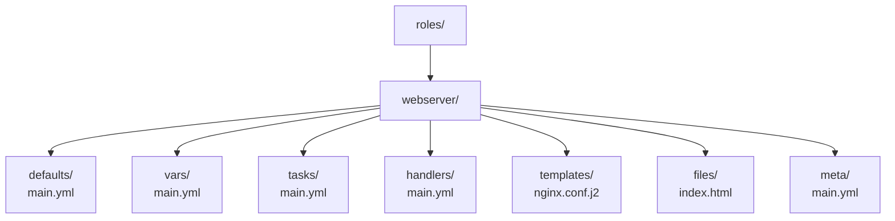

[↑ Back to TOC](#toc)

# Roles and Collections
[](../LICENSE.md)
[](https://access.redhat.com/products/red-hat-enterprise-linux)
[](https://www.redhat.com)

Roles make playbooks reusable and shareable by organising tasks, variables,
templates, and files into a standard directory structure.

A single-file playbook that deploys nginx, configures firewalld, sets SELinux
contexts, and creates users becomes difficult to maintain as it grows. When
you need the same nginx setup in three different projects, you copy-paste it —
and then have three versions that diverge over time. Roles solve this by
packaging all the related content for a single concern (installing and
configuring nginx) into one reusable unit with a defined interface (its
default variables).

The **role interface** is the `defaults/main.yml` file. Variables in
`defaults/` have the lowest priority of any variable source — any caller can
override them. This design lets you write a role that works out of the box
with sensible defaults, while still being fully customisable for each
environment. A caller who wants nginx on port 443 passes `nginx_port: 443`;
a caller who wants port 8080 passes that instead. The role code does not
change.

Collections extend roles to the package level. A collection bundles modules,
plugins, roles, and playbooks into a versioned, distributable artifact. RHEL
System Roles ship as a collection and provide Red Hat-certified automation for
common administrative tasks — use them in the RHCE exam wherever available
rather than writing your own implementation.

---
<a name="toc"></a>

## Table of contents

- [Role directory structure](#role-directory-structure)
- [Role directory diagram](#role-directory-diagram)
- [Create a role scaffold](#create-a-role-scaffold)
- [Example role: webserver](#example-role-webserver)
- [Use a role in a playbook](#use-a-role-in-a-playbook)
- [Ansible Collections](#ansible-collections)
  - [Install a collection](#install-a-collection)
  - [RHEL System Roles](#rhel-system-roles)
- [`requirements.yml` — declare dependencies](#requirementsyml-declare-dependencies)
- [Worked example](#worked-example)
- [Common mistakes and how to diagnose them](#common-mistakes-and-how-to-diagnose-them)


## Role directory structure

```text
roles/
  webserver/
    defaults/
      main.yml        # Default variable values (lowest priority)
    vars/
      main.yml        # Role variables (higher priority than defaults)
    tasks/
      main.yml        # Main list of tasks
    handlers/
      main.yml        # Handlers used by this role
    templates/
      nginx.conf.j2   # Jinja2 templates
    files/
      index.html      # Static files to copy
    meta/
      main.yml        # Role metadata and dependencies
    README.md
```


[↑ Back to TOC](#toc)

---

## Role directory diagram



> **Exam tip:** `ansible-galaxy role init roles/webserver` creates the full
> skeleton automatically. You never need to create the directory structure
> manually — save time in the exam by running this first.

[↑ Back to TOC](#toc)

---

## Create a role scaffold

```bash
ansible-galaxy role init roles/webserver
```

This creates all subdirectories and stub `main.yml` files. Delete any
subdirectories you don't need to keep the role clean.

```bash
# Verify the structure
find roles/webserver -type f | sort
```


[↑ Back to TOC](#toc)

---

## Example role: webserver

**`roles/webserver/defaults/main.yml`**

```yaml
---
webserver_port: 80
webserver_root: /var/www/html
webserver_user: root
```

**`roles/webserver/tasks/main.yml`**

```yaml
---
- name: Install nginx
  ansible.builtin.dnf:
    name: nginx
    state: present

- name: Create web root
  ansible.builtin.file:
    path: "{{ webserver_root }}"
    state: directory
    mode: '0755'

- name: Deploy nginx config
  ansible.builtin.template:
    src: nginx.conf.j2
    dest: /etc/nginx/nginx.conf
    mode: '0644'
  notify: Reload nginx

- name: Open firewall for http
  ansible.posix.firewalld:
    service: http
    state: enabled
    permanent: true
    immediate: true

- name: Ensure nginx is started and enabled
  ansible.builtin.service:
    name: nginx
    state: started
    enabled: true
```

**`roles/webserver/handlers/main.yml`**

```yaml
---
- name: Reload nginx
  ansible.builtin.service:
    name: nginx
    state: reloaded
```

---

## Use a role in a playbook

```yaml
---
- name: Configure web servers
  hosts: webservers
  become: true
  roles:
    - webserver

- name: Configure web servers with custom port
  hosts: webservers
  become: true
  roles:
    - role: webserver
      vars:
        webserver_port: 8080
```

You can also use the `include_role` and `import_role` tasks for more dynamic
inclusion:

```yaml
- name: Apply webserver role to specific hosts
  hosts: all
  become: true
  tasks:
    - name: Include webserver role on web-tagged hosts
      ansible.builtin.include_role:
        name: webserver
      when: "'web' in group_names"
```

Difference between `roles:` list and `include_role`/`import_role`:

| Method | Execution | Use when |
|---|---|---|
| `roles:` | Static, parsed at playbook load | Standard role application |
| `import_role` | Static, parsed at playbook load | Role inside a task list, with tags propagating |
| `include_role` | Dynamic, evaluated at runtime | Role conditionally included based on variables or facts |

---

## Ansible Collections

Collections bundle modules, roles, plugins, and playbooks. The key built-in
collections for RHEL:

| Collection | Provides |
|---|---|
| `ansible.builtin` | Core modules (dnf, service, file, copy, etc.) |
| `ansible.posix` | firewalld, sysctl, at, cron |
| `community.general` | Wide variety of extras |
| `redhat.rhel_system_roles` | RHEL System Roles (timesync, selinux, etc.) |

### Install a collection

```bash
ansible-galaxy collection install ansible.posix
ansible-galaxy collection install redhat.rhel_system_roles

# List installed collections
ansible-galaxy collection list

# Show collection contents
ansible-galaxy collection list ansible.posix
```

### RHEL System Roles

RHEL ships pre-certified roles for common administration tasks:

```bash
sudo dnf install -y rhel-system-roles
```

Available roles:

| Role | Task |
|---|---|
| `timesync` | Configure chrony/NTP |
| `selinux` | Configure SELinux mode and booleans |
| `network` | Configure networking |
| `firewall` | Configure firewalld |
| `storage` | Configure LVM and filesystems |
| `certificate` | Manage TLS certificates |

Example usage:

```yaml
---
- name: Sync time with NTP
  hosts: all
  become: true
  vars:
    timesync_ntp_servers:
      - hostname: pool.ntp.org
        iburst: true

  roles:
    - redhat.rhel_system_roles.timesync
```

---

## `requirements.yml` — declare dependencies

```yaml
# requirements.yml
collections:
  - name: ansible.posix
  - name: community.general

roles:
  - name: geerlingguy.nginx
    src: https://github.com/geerlingguy/ansible-role-nginx
```

Install all at once:

```bash
ansible-galaxy install -r requirements.yml
ansible-galaxy collection install -r requirements.yml
```

Commit `requirements.yml` to Git so that any engineer who clones the project
can reproduce the exact collection and role versions.

For version-pinned dependencies:

```yaml
collections:
  - name: ansible.posix
    version: ">=1.5.0"
  - name: community.general
    version: "==8.1.0"
```


[↑ Back to TOC](#toc)

---

## Worked example

### Building a reusable nginx role with TLS support

This worked example shows a production-quality nginx role that supports both
plain HTTP and TLS, with the TLS configuration enabled by a boolean variable.

**`roles/nginx_tls/defaults/main.yml`**

```yaml
---
nginx_port: 80
nginx_root: /var/www/html
nginx_user: nginx
nginx_worker_connections: 1024
nginx_keepalive_timeout: 65

# TLS configuration
nginx_tls_enabled: false
nginx_tls_port: 443
nginx_tls_cert: /etc/nginx/ssl/server.crt
nginx_tls_key: /etc/nginx/ssl/server.key
```

**`roles/nginx_tls/tasks/main.yml`**

```yaml
---
- name: Install nginx
  ansible.builtin.dnf:
    name: nginx
    state: present
  tags: packages

- name: Create SSL directory
  ansible.builtin.file:
    path: /etc/nginx/ssl
    state: directory
    owner: root
    group: root
    mode: '0700'
  when: nginx_tls_enabled | bool

- name: Generate self-signed TLS certificate (dev/lab only)
  ansible.builtin.command:
    cmd: >
      openssl req -x509 -nodes -days 365
      -newkey rsa:2048
      -keyout {{ nginx_tls_key }}
      -out {{ nginx_tls_cert }}
      -subj "/CN={{ inventory_hostname }}"
    creates: "{{ nginx_tls_cert }}"
  when: nginx_tls_enabled | bool
  notify: Reload nginx

- name: Create web root directory
  ansible.builtin.file:
    path: "{{ nginx_root }}"
    state: directory
    owner: "{{ nginx_user }}"
    group: "{{ nginx_user }}"
    mode: '0755'
    setype: httpd_sys_content_t

- name: Deploy nginx configuration
  ansible.builtin.template:
    src: nginx.conf.j2
    dest: /etc/nginx/nginx.conf
    owner: root
    group: root
    mode: '0644'
    validate: nginx -t -c %s
  notify: Reload nginx

- name: Allow HTTP in SELinux for non-standard port
  community.general.seport:
    ports: "{{ nginx_port }}"
    proto: tcp
    setype: http_port_t
    state: present
  when: nginx_port not in [80, 443]

- name: Allow HTTPS in SELinux for non-standard TLS port
  community.general.seport:
    ports: "{{ nginx_tls_port }}"
    proto: tcp
    setype: http_port_t
    state: present
  when:
    - nginx_tls_enabled | bool
    - nginx_tls_port not in [80, 443]

- name: Open HTTP port in firewalld
  ansible.posix.firewalld:
    port: "{{ nginx_port }}/tcp"
    state: enabled
    permanent: true
    immediate: true

- name: Open HTTPS port in firewalld
  ansible.posix.firewalld:
    port: "{{ nginx_tls_port }}/tcp"
    state: enabled
    permanent: true
    immediate: true
  when: nginx_tls_enabled | bool

- name: Start and enable nginx
  ansible.builtin.service:
    name: nginx
    state: started
    enabled: true
  tags: service
```

**`roles/nginx_tls/templates/nginx.conf.j2`**

```jinja2
# nginx.conf — managed by Ansible
# Host: {{ inventory_hostname }}

worker_processes auto;

events {
    worker_connections {{ nginx_worker_connections }};
}

http {
    include       /etc/nginx/mime.types;
    default_type  application/octet-stream;
    sendfile      on;
    keepalive_timeout {{ nginx_keepalive_timeout }};

    server {
        listen {{ nginx_port }};
        server_name {{ inventory_hostname }};
        root {{ nginx_root }};
        index index.html;


        # Redirect HTTP to HTTPS
        return 301 https://$host$request_uri;
    }

    server {
        listen {{ nginx_tls_port }} ssl;
        server_name {{ inventory_hostname }};
        root {{ nginx_root }};
        index index.html;

        ssl_certificate     {{ nginx_tls_cert }};
        ssl_certificate_key {{ nginx_tls_key }};
        ssl_protocols       TLSv1.2 TLSv1.3;
        ssl_ciphers         HIGH:!aNULL:!MD5;

    }
}
```

**Using the role — HTTP mode (dev):**

```yaml
---
- name: Deploy web server (dev)
  hosts: dev
  become: true
  roles:
    - role: nginx_tls
      vars:
        nginx_port: 8080
        nginx_tls_enabled: false
```

**Using the role — TLS mode (production):**

```yaml
---
- name: Deploy web server (production)
  hosts: production
  become: true
  roles:
    - role: nginx_tls
      vars:
        nginx_port: 80
        nginx_tls_enabled: true
        nginx_tls_port: 443
        nginx_tls_cert: /etc/nginx/ssl/prod.crt
        nginx_tls_key: /etc/nginx/ssl/prod.key
```

The same role, two completely different configurations — no code duplication.

[↑ Back to TOC](#toc)

---

## Common mistakes and how to diagnose them

| Mistake | Symptom | Fix |
|---|---|---|
| Role directory name doesn't match `roles:` entry | `ERROR! the role 'webserver' was not found` | Name in playbook must exactly match the directory under `roles/` |
| Modifying `defaults/main.yml` to set site-specific values | Role is no longer reusable; values get overwritten on next `git pull` | Put environment-specific values in `group_vars/` or the playbook's `vars:` block |
| Handler in role not triggering | Service not restarted after config change | Handler must be defined in `roles/<name>/handlers/main.yml`; confirm task is reporting `changed` |
| Collection module not found | `ERROR! couldn't resolve module/action 'ansible.posix.firewalld'` | Run `ansible-galaxy collection install ansible.posix` and verify with `ansible-galaxy collection list` |
| `include_role` with tags not applying tags to role tasks | Tagged tasks inside the role are not skipped | Use `import_role` instead of `include_role` when you need tag inheritance |
| Missing `meta/main.yml` dependencies | Role runs but required role is absent | Declare role dependencies in `meta/main.yml` under the `dependencies:` key |

[↑ Back to TOC](#toc)

---

## Further reading

| Resource | Notes |
|---|---|
| [Ansible — Roles guide](https://docs.ansible.com/ansible/latest/playbook_guide/playbooks_reuse_roles.html) | Official role structure, `defaults/`, `meta/`, `handlers/` explained |
| [Ansible Galaxy](https://galaxy.ansible.com/) | Community roles and certified collections |
| [Red Hat Certified Content Collections](https://console.redhat.com/ansible/automation-hub) | Production-grade Red Hat collections for RHEL management |
| [Ansible — Collections guide](https://docs.ansible.com/ansible/latest/collections_guide/index.html) | Installing, using, and creating collections |

---


[↑ Back to TOC](#toc)

## Next step

→ [Deploy a Service with Ansible](07-ansible-service-deploy.md)

[↑ Back to TOC](#toc)

---

© 2026 UncleJS — Licensed under CC BY-NC-SA 4.0
