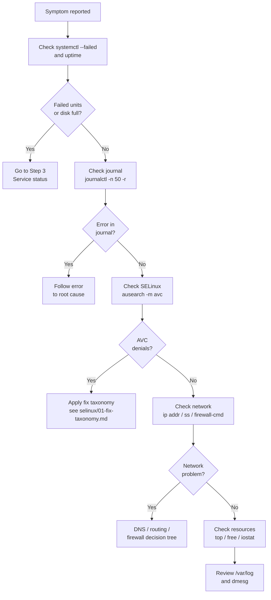

[↑ Back to TOC](#toc)

# Troubleshooting Playbook — First 10 Minutes
[](../LICENSE.md)
[](https://access.redhat.com/products/red-hat-enterprise-linux)
[](https://www.redhat.com)

When something breaks on a RHEL host, this playbook gives you a repeatable,
ordered approach that finds the majority of problems efficiently.

Effective troubleshooting at the RHCA level is not about memorising every
possible error — it is about having a disciplined methodology that you execute
consistently, even under pressure. This playbook encodes that methodology into
a deterministic checklist. Each step produces evidence; that evidence drives
the next step. You are running a diagnostic loop, not guessing.

The mental model is a triage funnel: start broad (is the host alive?), then
narrow to the broken layer (service → security → network → resources → logs).
Every layer can independently cause a symptom like "service unreachable", and
they interact — a full disk can cause a service to fail, which an AVC denial
can look like. The funnel prevents you from jumping to SELinux when the real
problem is a 100 % full `/var` partition.

Getting this wrong in production means extended outages, incorrect fixes applied
under pressure, and changes that mask rather than resolve the root cause. In the
exam environment, following an ad-hoc approach instead of a structured playbook
wastes time and produces errors that are hard to detect before time runs out.

---
<a name="toc"></a>

## Table of contents

- [The mindset](#the-mindset)
- [Triage flow diagram](#triage-flow-diagram)
- [The First 10 Minutes Checklist](#the-first-10-minutes-checklist)
  - [0 — What is the reported symptom?](#0-what-is-the-reported-symptom)
  - [1 — System health (30 seconds)](#1-system-health-30-seconds)
  - [2 — Recent changes (1 minute)](#2-recent-changes-1-minute)
  - [3 — Service status (2 minutes)](#3-service-status-2-minutes)
  - [4 — SELinux check (1 minute)](#4-selinux-check-1-minute)
  - [5 — Network connectivity (2 minutes)](#5-network-connectivity-2-minutes)
  - [6 — The "DNS vs routing vs firewall" decision tree](#6-the-dns-vs-routing-vs-firewall-decision-tree)
  - [7 — Resource exhaustion (1 minute)](#7-resource-exhaustion-1-minute)
  - [8 — Log files (catch-all)](#8-log-files-catch-all)
- [Worked example — diagnosing a 502 Bad Gateway](#worked-example-diagnosing-a-502-bad-gateway)
- [Common mistakes and how to diagnose them](#common-mistakes-and-how-to-diagnose-them)
- [Escalation checklist](#escalation-checklist)


## The mindset

> Observe before you change. Gather evidence, form a hypothesis, test one
> thing at a time, and document what you tried.

Changing random settings hoping something fixes it wastes time and can
make the problem worse.


[↑ Back to TOC](#toc)

---

## Triage flow diagram




[↑ Back to TOC](#toc)

---

## The First 10 Minutes Checklist

### 0 — What is the reported symptom?

- What exactly is broken? (service unreachable / command fails / system slow)
- When did it start?
- What changed recently? (update, config edit, deploy, cron job)


[↑ Back to TOC](#toc)

---

### 1 — System health (30 seconds)

```bash
# System load and uptime
uptime

# Memory pressure
free -m

# Disk space (full disk breaks many things silently)
df -h

# Inode exhaustion (disk "full" but df shows space)
df -ih

# Failed systemd units
systemctl --failed
```

If disk is full → find and clean large files first.
If a unit failed → jump to Step 3.


[↑ Back to TOC](#toc)

---

### 2 — Recent changes (1 minute)

```bash
# Last 50 messages across all services
journalctl -n 50 -r

# Since last hour
journalctl --since "1 hour ago"

# Package changes
sudo dnf history | head -20

# Recently modified files in /etc
find /etc -mtime -1 -type f 2>/dev/null | sort
```


[↑ Back to TOC](#toc)

---

### 3 — Service status (2 minutes)

```bash
# Is the service running?
sudo systemctl status <service-name>

# Detailed logs
journalctl -u <service-name> -n 100

# Did it fail to start?
journalctl -u <service-name> -b | grep -i "failed\|error\|denied"
```

Common causes of service failures:

| Error in log | Likely cause |
|---|---|
| `Permission denied` | File/dir permissions or SELinux |
| `avc: denied` | SELinux AVC denial |
| `Address already in use` | Port conflict |
| `No such file or directory` | Missing binary, config, or data file |
| `Failed to bind` | Port blocked or SELinux port policy |


[↑ Back to TOC](#toc)

---

### 4 — SELinux check (1 minute)

```bash
# Current mode
getenforce

# Recent denials
sudo ausearch -m avc -ts recent

# Denials for specific process
sudo ausearch -m avc -c httpd -ts today
```

If you see AVC denials → see [SELinux Troubleshooting](../03-rhcsa/14-selinux-avc-basics.md).

> **⚠️ Do NOT set setenforce 0 as a fix**
> Use permissive mode for **diagnosis only**, immediately re-enable
> enforcing, and fix the root cause.
>


[↑ Back to TOC](#toc)

---

### 5 — Network connectivity (2 minutes)

```bash
# Is the interface up?
ip link show
ip addr show

# Can we reach the gateway?
ip route show
ping -c 2 $(ip route | awk '/default/{print $3}')

# DNS working?
ping -c 2 8.8.8.8          # IP (bypass DNS)
ping -c 2 access.redhat.com # needs DNS

# Is the service listening?
ss -tlnp | grep <port>

# Firewall blocking?
sudo firewall-cmd --list-all
```


[↑ Back to TOC](#toc)

---

### 6 — The "DNS vs routing vs firewall" decision tree

```text
Can ping 8.8.8.8?
  No  → routing/network problem → check ip route, gateway, interface
  Yes → Can ping access.redhat.com?
          No  → DNS problem → check resolvectl, /etc/resolv.conf
          Yes → Can curl http://service/?
                  No  → Is it listening? (ss -tlnp)
                          No  → service not running
                          Yes → firewall blocking? (firewall-cmd --list-all)
                                  Still blocked? → SELinux? (ausearch -m avc)
```


[↑ Back to TOC](#toc)

---

### 7 — Resource exhaustion (1 minute)

```bash
# CPU and memory hogs
top -b -n 1 | head -30

# Or htop if installed
htop

# I/O wait
iostat -x 1 3   # install: sudo dnf install -y sysstat

# Open file limits
ulimit -n
cat /proc/sys/fs/file-max
```


[↑ Back to TOC](#toc)

---

### 8 — Log files (catch-all)

```bash
# Everything since last boot
journalctl -b | grep -iE "error|fail|denied|refused" | tail -50

# Auth failures
sudo grep "Failed\|Invalid" /var/log/secure | tail -20

# Kernel ring buffer
dmesg | tail -30
dmesg | grep -iE "error|fail|oom"
```


[↑ Back to TOC](#toc)

---

## Worked example — diagnosing a 502 Bad Gateway

**Scenario:** Users report that `https://app.example.com` returns a 502 Bad
Gateway. The front-end nginx reverse proxy is running on `web01`; the backend
app server runs on `app01:8080`.

**Step 0 — clarify the symptom**

502 means nginx got a bad response (or no response) from the upstream. The
front-end itself is alive. The problem is nginx-to-backend communication.

**Step 1 — health check on web01**

```bash
uptime               # no unusual load
df -h                # /var at 34% — not a space problem
systemctl --failed   # no failed units
```

**Step 2 — recent changes**

```bash
sudo dnf history | head -5
# Shows: myapp-2.1.0-1 installed 20 minutes ago
```

A new app version was deployed 20 minutes ago — right when the 502s started.

**Step 3 — service status on app01**

```bash
ssh app01 "sudo systemctl status myapp.service"
# Output: Active: failed (Result: exit-code)

ssh app01 "journalctl -u myapp.service -n 50"
# Output: [ERROR] Failed to bind to port 8080: Address already in use
```

**Step 4 — SELinux check**

```bash
ssh app01 "sudo ausearch -m avc -ts recent"
# No AVC denials
```

Not a SELinux issue.

**Step 5 — port conflict investigation**

```bash
ssh app01 "ss -tlnp | grep 8080"
# tcp  LISTEN  0  128  0.0.0.0:8080  users:(("old-myapp",pid=4421,...))
```

The old version of `myapp` was not stopped before deploying the new one. Two
processes are competing for port 8080.

**Fix:**

```bash
ssh app01 "sudo systemctl stop myapp-old.service"
ssh app01 "sudo systemctl restart myapp.service"
ssh app01 "sudo systemctl status myapp.service"
# Active: active (running)
```

**Verify:**

```bash
curl -s -o /dev/null -w "%{http_code}" http://app01:8080/health
# 200
```

502s resolved.

> **Exam tip:** On the exam, 502/503 errors almost always trace to either a
> stopped backend service or a port binding conflict. Check `ss -tlnp` on the
> backend host before spending time on SELinux or firewall.


[↑ Back to TOC](#toc)

---

## Common mistakes and how to diagnose them

**1. Disabling SELinux instead of fixing the denial**

Symptom: Service starts after `setenforce 0` but stops working after reboot
(when enforcing is restored from `/etc/selinux/config`).
Fix: Use `ausearch -m avc | audit2why` to identify and apply the correct fix
(label, boolean, or port). Re-enable enforcing immediately.

**2. Checking only the current boot**

Symptom: You see no errors in `journalctl -b` but the problem started
yesterday. `journalctl -b` only shows the current boot.
Fix: Use `journalctl -b -1` (previous boot) or `journalctl --since yesterday`.

**3. Missing inode exhaustion**

Symptom: `df -h` shows free space but services fail with "No space left on
device". Writing new files fails even with apparent free space.
Fix: `df -ih` to check inode usage. Find the inode hog with
`find /var -xdev -printf '%h\n' | sort | uniq -c | sort -rn | head`.

**4. Concluding "firewall is blocking" without checking the service**

Symptom: `firewall-cmd --list-all` shows the port open, but connections are
refused. The firewall gets blamed but the service is not listening.
Fix: Always run `ss -tlnp | grep <port>` first. Firewall drops produce
timeouts; "connection refused" means the port is not open at all.

**5. Changing config files without reloading**

Symptom: Edit `/etc/httpd/conf/httpd.conf`, test the service — no change.
Fix: Always run `sudo systemctl reload httpd` (or `restart` if reload is not
supported). Verify the config was actually re-read with
`systemctl status httpd` looking at the "loaded" line.

**6. Not taking a baseline before making changes**

Symptom: After multiple changes it is unclear which one (if any) fixed the
issue — or which one introduced a regression.
Fix: Always capture `systemctl status`, `journalctl -n 50`, and
`ausearch -m avc` output *before* making any change. Save to `/tmp/before.txt`.


[↑ Back to TOC](#toc)

---

## Escalation checklist

Before escalating, document:

1. The exact error message
2. Steps you already tried
3. Output of: `journalctl -u <service> -n 100`
4. Output of: `systemctl status <service>`
5. Output of: `ausearch -m avc -ts recent`
6. Output of: `df -h`, `free -m`, `ip addr`, `firewall-cmd --list-all`


[↑ Back to TOC](#toc)

---

## Further reading

| Resource | Notes |
|---|---|
| [USE Method (Brendan Gregg)](https://www.brendangregg.com/usemethod.html) | Utilisation, Saturation, Errors — systematic performance and fault methodology |
| [Linux Performance Analysis in 60 seconds](https://netflixtechblog.com/linux-performance-analysis-in-60-000-milliseconds-accc10403c55) | Netflix blog post; the canonical "first 60s" checklist |
| [Red Hat SRE Practices](https://www.redhat.com/en/blog/introduction-to-sre-practices) | Site reliability engineering concepts from Red Hat |

---


[↑ Back to TOC](#toc)

## Next step

→ [Advanced systemd](02-systemd-advanced.md)

[↑ Back to TOC](#toc)

---

© 2026 UncleJS — Licensed under CC BY-NC-SA 4.0
