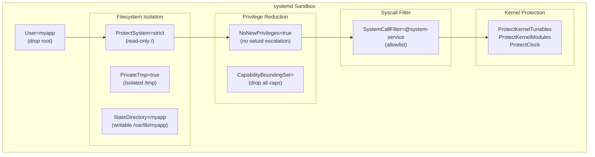

[↑ Back to TOC](#toc)

# systemd Hardening Knobs — Service Sandboxing
[](../LICENSE.md)
[](https://access.redhat.com/products/red-hat-enterprise-linux)
[](https://www.redhat.com)

systemd provides service-level sandboxing directives that limit what a service
can do — without SELinux and without containers. These are defence-in-depth
controls that reduce the blast radius if a service is compromised.

At the RHCA level you are expected to understand and apply systemd sandboxing
as a deliberate security layer — not as a last resort. Think of each hardening
directive as a wall around the service: `PrivateTmp` gives the service its own
isolated `/tmp`; `ProtectSystem=strict` makes the entire filesystem read-only
from the service's perspective; `NoNewPrivileges` closes the setuid escalation
path; `CapabilityBoundingSet` reduces Linux capabilities to the minimum
required. Stacking these directives is like building nested blast walls — even
if one is bypassed, the others limit what the attacker can reach.

The mental model: treat a systemd unit file as a miniature AppArmor profile
combined with a capability set. Each directive answers one question: "Can this
service affect X?" The answer should be "no" for everything the service does
not legitimately need.

The consequence of getting this wrong is a service with root-equivalent power
running network-accessible code. A compromised nginx or API server with no
sandboxing can read `/etc/shadow`, load kernel modules, modify system time, and
write to any path on the system. With proper sandboxing, a compromised process
is contained to its designated directories and syscall surface.

---
<a name="toc"></a>

## Table of contents

- [Why sandbox services?](#why-sandbox-services)
- [Sandboxing layers diagram](#sandboxing-layers-diagram)
- [Key hardening directives](#key-hardening-directives)
  - [User and group](#user-and-group)
  - [Filesystem restrictions](#filesystem-restrictions)
  - [Private /tmp](#private-tmp)
  - [Network restrictions](#network-restrictions)
  - [Capabilities](#capabilities)
  - [Prevent privilege escalation](#prevent-privilege-escalation)
  - [System call filtering](#system-call-filtering)
  - [Protect kernel and host configuration](#protect-kernel-and-host-configuration)
- [Full example: hardened web service](#full-example-hardened-web-service)
- [Verify restrictions with systemd-analyze security](#verify-restrictions-with-systemd-analyze-security)
- [Worked example — hardening an nginx unit step by step](#worked-example-hardening-an-nginx-unit-step-by-step)
- [Common mistakes and how to diagnose them](#common-mistakes-and-how-to-diagnose-them)


## Why sandbox services?

Even with SELinux enforcing, reducing a service's capabilities at the systemd
level provides an additional layer:

- Limits filesystem visibility
- Prevents privilege escalation
- Restricts system call surface
- Limits network access

systemd sandboxing and SELinux are complementary, not redundant. SELinux
controls access based on type labels; systemd sandboxing restricts what
namespaces, capabilities, and syscalls are available to the process at all.
A misconfigured SELinux policy may still allow unexpected access; a systemd
sandbox with `ProtectSystem=strict` blocks write access to the system
filesystem regardless of label.


[↑ Back to TOC](#toc)

---

## Sandboxing layers diagram




[↑ Back to TOC](#toc)

---

## Key hardening directives

### User and group

```ini
[Service]
User=myapp
Group=myapp
```

Run the service as a dedicated unprivileged user, not root.

Create the system account if it does not exist:

```bash
sudo useradd -r -s /sbin/nologin -d /var/lib/myapp myapp
```

The `-r` flag creates a system account (UID < 1000) with no home directory
creation. `-s /sbin/nologin` prevents interactive login.


[↑ Back to TOC](#toc)

---

### Filesystem restrictions

```ini
[Service]
# Protect the entire filesystem as read-only
ProtectSystem=strict

# Make /home and /root inaccessible
ProtectHome=true

# Writable runtime directory (auto-created as /run/myapp)
RuntimeDirectory=myapp
RuntimeDirectoryMode=0750

# Writable state directory (persistent, /var/lib/myapp)
StateDirectory=myapp

# Writable log directory (/var/log/myapp)
LogsDirectory=myapp

# Writable cache (/var/cache/myapp)
CacheDirectory=myapp
```

With `ProtectSystem=strict` and the above directories, the service can only
write to its designated directories.

If the service writes to paths not covered by the auto-created directories,
add them explicitly:

```ini
[Service]
ReadWritePaths=/srv/data/myapp
```

> **Exam tip:** `ProtectSystem=strict` makes the entire filesystem read-only
> for the unit. Add `ReadWritePaths=` for any path the service must write to
> that is not covered by `StateDirectory=`, `LogsDirectory=`, or
> `RuntimeDirectory=`.


[↑ Back to TOC](#toc)

---

### Private /tmp

```ini
[Service]
PrivateTmp=true
```

The service gets its own private `/tmp`. Files there are invisible to other
services and cleaned up when the service stops.

This also prevents symlink attacks where a malicious process in `/tmp`
redirects file operations targeting other services.


[↑ Back to TOC](#toc)

---

### Network restrictions

```ini
[Service]
# No network access at all
PrivateNetwork=true

# Or restrict to specific address families
RestrictAddressFamilies=AF_INET AF_INET6

# Block all socket creation
RestrictAddressFamilies=none
```

Use `PrivateNetwork=true` for services that have no legitimate reason to
make network connections (e.g., a local log processor or a file converter).

For services that only need IPv4, set `RestrictAddressFamilies=AF_INET` to
prevent IPv6 socket creation entirely.


[↑ Back to TOC](#toc)

---

### Capabilities

Linux capabilities break root's all-or-nothing model into granular
permissions. Drop all capabilities and add only what's needed:

```ini
[Service]
# Drop all capabilities
CapabilityBoundingSet=

# If the service needs to bind to port < 1024:
CapabilityBoundingSet=CAP_NET_BIND_SERVICE
AmbientCapabilities=CAP_NET_BIND_SERVICE
```

Common capabilities and when they are needed:

| Capability | When needed |
|---|---|
| `CAP_NET_BIND_SERVICE` | Bind to ports < 1024 as a non-root user |
| `CAP_NET_ADMIN` | Network interface configuration |
| `CAP_SYS_PTRACE` | Debug/trace processes |
| `CAP_DAC_OVERRIDE` | Bypass file permission checks |
| `CAP_SETUID` / `CAP_SETGID` | Change UID/GID |

Avoid `CAP_SYS_ADMIN` — it is nearly equivalent to root.


[↑ Back to TOC](#toc)

---

### Prevent privilege escalation

```ini
[Service]
NoNewPrivileges=true
```

Prevents `setuid` binaries and `execve` privilege escalation within the service.

This is one of the cheapest and most effective directives. It should be set
on every service that does not explicitly need to change its privilege level.


[↑ Back to TOC](#toc)

---

### System call filtering

```ini
[Service]
# Allow only typical server syscalls
SystemCallFilter=@system-service
SystemCallErrorNumber=EPERM

# Strict syscall sets:
SystemCallFilter=@basic-io @file-system @network-io @process
```

Syscall groups (`@system-service`, `@basic-io`, etc.) are pre-defined sets.
View available groups:

```bash
systemd-analyze syscall-filter
```

`SystemCallErrorNumber=EPERM` returns "Operation not permitted" on blocked
syscalls rather than killing the process. Use `SIGSYS` to crash on violation
(more secure but may hide bugs):

```ini
SystemCallErrorNumber=SIGSYS
```

The `@system-service` set is a good default for most server processes. It
includes file I/O, network, process management, and common IPC but blocks
dangerous calls like `ptrace`, `reboot`, and kernel module loading.


[↑ Back to TOC](#toc)

---

### Protect kernel and host configuration

```ini
[Service]
ProtectKernelTunables=true    # /proc/sys, /sys read-only
ProtectKernelModules=true     # cannot load/unload kernel modules
ProtectKernelLogs=true        # cannot read kernel ring buffer
ProtectControlGroups=true     # cgroup filesystem read-only
ProtectClock=true             # cannot set system clock
ProtectHostname=true          # cannot change hostname
```


[↑ Back to TOC](#toc)

---

## Full example: hardened web service

```ini
[Unit]
Description=Hardened Web Service
After=network-online.target
Wants=network-online.target

[Service]
Type=simple
User=webapp
Group=webapp
ExecStart=/usr/local/bin/webapp --port 8080

# Filesystem
ProtectSystem=strict
ProtectHome=true
PrivateTmp=true
StateDirectory=webapp
LogsDirectory=webapp

# Privileges
NoNewPrivileges=true
CapabilityBoundingSet=CAP_NET_BIND_SERVICE
AmbientCapabilities=CAP_NET_BIND_SERVICE

# Syscalls
SystemCallFilter=@system-service
SystemCallErrorNumber=EPERM

# Kernel
ProtectKernelTunables=true
ProtectKernelModules=true
ProtectControlGroups=true
ProtectClock=true
ProtectHostname=true

# Network
RestrictAddressFamilies=AF_INET AF_INET6

Restart=on-failure
RestartSec=5s

[Install]
WantedBy=multi-user.target
```


[↑ Back to TOC](#toc)

---

## Verify restrictions with systemd-analyze security

```bash
# Score a service (lower = more secure)
systemd-analyze security sshd.service
systemd-analyze security myapp.service
```

This gives a security score and a list of hardening improvements available.

The score is 0–10 (0 = most secure). An unhardened service running as root
typically scores 9.6. A well-hardened service should score below 4.

```bash
# Example output for an unhardened service
NAME          DESCRIPTION                              EXPOSURE
User=         Service runs as root user                0.4
PrivateTmp=   Service has access to system /tmp        0.1
ProtectHome=  Service has full access to home dirs     0.1
...
→ Overall exposure level for myapp.service: 9.6 UNSAFE
```

Work through the list from highest exposure to lowest, adding directives
until the service's required functionality is preserved and the score is
acceptable.


[↑ Back to TOC](#toc)

---

## Worked example — hardening an nginx unit step by step

**Scenario:** nginx is installed from the RHEL AppStream repo. The default
unit runs as root, has unrestricted filesystem access, and scores 9.2 on
`systemd-analyze security`. Harden it progressively using a drop-in.

**Baseline:**

```bash
systemd-analyze security nginx.service
# → 9.2 UNSAFE
```

**Step 1 — create a drop-in**

```bash
sudo systemctl edit nginx.service
```

**Step 2 — run as dedicated user**

nginx needs to start as root to bind port 80, then drops to `nginx` user
for worker processes. The master process must stay root. Instead, bind the
port capability:

```ini
[Service]
# nginx already drops to nginx user for workers;
# master process needs CAP_NET_BIND_SERVICE to bind :80/:443
CapabilityBoundingSet=CAP_NET_BIND_SERVICE CAP_SETUID CAP_SETGID
AmbientCapabilities=CAP_NET_BIND_SERVICE
NoNewPrivileges=true
```

**Step 3 — restrict filesystem**

```ini
[Service]
ProtectSystem=strict
ProtectHome=true
PrivateTmp=true
# nginx writes to /var/log/nginx and /run/nginx
LogsDirectory=nginx
RuntimeDirectory=nginx
# nginx serves content from /usr/share/nginx/html (already read-only under strict)
# If serving from /srv/www, add:
ReadWritePaths=/srv/www
```

**Step 4 — syscall filter**

```ini
[Service]
SystemCallFilter=@system-service
SystemCallErrorNumber=EPERM
```

**Step 5 — kernel protection**

```ini
[Service]
ProtectKernelTunables=true
ProtectKernelModules=true
ProtectControlGroups=true
ProtectClock=true
ProtectHostname=true
RestrictAddressFamilies=AF_INET AF_INET6 AF_UNIX
```

**Step 6 — reload and test**

```bash
sudo systemctl daemon-reload
sudo systemctl restart nginx.service
sudo systemctl status nginx.service
# Verify: Active: active (running)

curl -s -o /dev/null -w "%{http_code}" http://localhost/
# 200 or 403 — not a connection error

systemd-analyze security nginx.service
# → ~3.8 MEDIUM (significantly improved)
```

**Step 7 — check for regressions**

```bash
sudo ausearch -m avc -ts recent
# If nginx now has AVC denials, the systemd sandbox may be interacting with
# SELinux labels — resolve the labels, not the sandbox directives.
```

> **Exam tip:** When hardening breaks a service, add directives one at a
> time and restart between each addition. `ProtectSystem=strict` and
> `PrivateTmp=true` are the most commonly disruptive — add `ReadWritePaths=`
> for any path the service needs to write to.


[↑ Back to TOC](#toc)

---

## Common mistakes and how to diagnose them

**1. ProtectSystem=strict breaks service writes**

Symptom: Service fails with "Permission denied" writing to paths outside
its designated directories after adding `ProtectSystem=strict`.
Diagnosis: `journalctl -u <service> -n 30` shows the failing path.
Fix: Add `ReadWritePaths=/path/the/service/needs` to the drop-in.

**2. CapabilityBoundingSet= drops too many capabilities**

Symptom: Service fails at startup or when performing a specific operation
(e.g., changing ownership of files, binding a port).
Diagnosis: `journalctl -u <service>` shows "Operation not permitted".
Use `strace -e trace=process` to identify which syscall is failing.
Fix: Add the required capability (e.g., `CAP_CHOWN`, `CAP_NET_BIND_SERVICE`).

**3. SystemCallFilter blocks a legitimate syscall**

Symptom: Service crashes immediately or behaves incorrectly with
`SystemCallErrorNumber=SIGSYS`.
Diagnosis: `journalctl -k | grep "bad syscall"` or `strace` the process.
Fix: Add the missing syscall or syscall group to `SystemCallFilter=`.

**4. PrivateTmp breaks application expecting shared /tmp**

Symptom: Two cooperating processes (e.g., an app and its helper) cannot
communicate via Unix sockets or lock files in `/tmp`.
Diagnosis: One process creates a socket/file in `/tmp`; the other cannot
find it because they have separate private `/tmp` namespaces.
Fix: Use `RuntimeDirectory=` to create a shared `/run/myapp/` directory,
or use a named Unix socket in `/run/` instead of `/tmp/`.

**5. NoNewPrivileges blocks sudo or PAM inside the service**

Symptom: A service that calls `sudo` or uses PAM for authentication breaks
silently — PAM operations fail with no meaningful error.
Diagnosis: `NoNewPrivileges=true` prevents setuid on PAM helpers.
Fix: Restructure the service to not require privilege escalation at runtime.
If unavoidable, remove `NoNewPrivileges=true` and compensate with other
directives.

**6. systemd-analyze security score misleads**

Symptom: Service scores 2.0 ("SAFE") but a security review finds it still
has unrestricted write access to critical data paths.
Diagnosis: The scoring is heuristic — it rewards presence of directives,
not correctness of their values.
Fix: Review `ReadWritePaths=`, `StateDirectory=`, and `CapabilityBoundingSet=`
values manually. A low score is a good start, not a guarantee.


[↑ Back to TOC](#toc)

---

## Further reading

| Resource | Notes |
|---|---|
| [`systemd.exec` man page](https://www.freedesktop.org/software/systemd/man/latest/systemd.exec.html) | All sandboxing directives: `PrivateTmp`, `NoNewPrivileges`, `CapabilityBoundingSet`, etc. |
| [Lennart Poettering — Systemd service sandboxing](https://0pointer.net/blog/walkthrough-for-portable-services.html) | Deep dive on sandboxing rationale from systemd's author |
| [RHEL 10 — Securing services with systemd](https://access.redhat.com/documentation/en-us/red_hat_enterprise_linux/10/html/security_hardening/index) | RHEL hardening guide including systemd sandboxing |

---


[↑ Back to TOC](#toc)

## Next step

→ [Journald Retention and Forwarding](04-journald-retention.md)

[↑ Back to TOC](#toc)

---

© 2026 UncleJS — Licensed under CC BY-NC-SA 4.0
