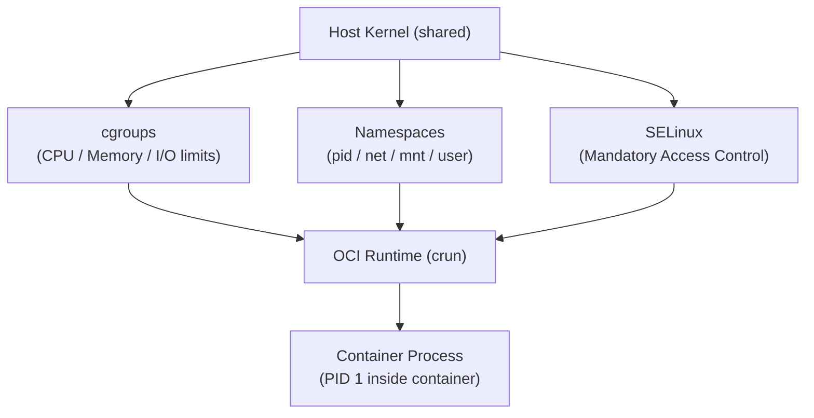

[↑ Back to TOC](#toc)

# Container Fundamentals — RHEL View
[](../../LICENSE.md)
[](https://access.redhat.com/products/red-hat-enterprise-linux)
[](https://www.redhat.com)

Containers on RHEL use **Podman** — an OCI-compatible, daemonless container
engine that is the Red Hat default. Unlike Docker, Podman does not require a
root daemon.

At RHCA level, understanding containers means understanding the kernel
primitives they are built from. A container is not a virtual machine — it
shares the host kernel. The isolation it provides comes entirely from three
Linux mechanisms: **cgroups** (resource limits), **namespaces** (visibility
isolation), and **SELinux** (mandatory access control). Podman orchestrates
these mechanisms on your behalf, but knowing the layers beneath helps you
diagnose problems that appear opaque otherwise.

The mental model: each container process lives inside a set of namespaces
that restrict what it can see (other processes via PID namespace, network
interfaces via net namespace, mounts via mnt namespace, user IDs via user
namespace). Cgroups sit alongside namespaces and cap the resources the process
group may consume. SELinux labels on the process and any files it touches
enforce a third, independent access control layer. All three can be the cause
of a "permission denied" — the diagnostic order matters.

Within the RHEL stack, Podman interacts with the OCI runtime (crun on RHEL 10),
the container storage library (overlay filesystem backed by
`~/.local/share/containers/storage/` for rootless), and the container network
stack (pasta on RHEL 10 for rootless). Understanding where each layer lives
lets you trace a failure to its source quickly.

---
<a name="toc"></a>

## Table of contents

- [Key concepts](#key-concepts)
- [Container isolation layers](#container-isolation-layers)
- [Podman vs Docker](#podman-vs-docker)
- [Install Podman on RHEL 10](#install-podman-on-rhel-10)
- [Basic workflow](#basic-workflow)
- [Image management](#image-management)
- [Registry configuration](#registry-configuration)
- [Rootless vs rootful](#rootless-vs-rootful)
- [Worked example](#worked-example)
- [Common mistakes and how to diagnose them](#common-mistakes-and-how-to-diagnose-them)


## Key concepts

| Term | Meaning |
|---|---|
| **OCI** | Open Container Initiative — standard for images and runtimes |
| **image** | Read-only template for a container (layers of filesystem changes) |
| **container** | Running instance of an image |
| **registry** | Server hosting images (quay.io, registry.access.redhat.com, docker.io) |
| **tag** | Version label for an image (e.g., `nginx:latest`, `nginx:1.25`) |
| **digest** | Immutable SHA-256 identifier for an image |
| **rootless** | Container running without root privileges (default on RHEL) |
| **cgroup** | Linux control group — limits CPU, memory, I/O for a process group |
| **namespace** | Linux kernel mechanism — restricts process visibility (PID, net, mnt, user) |
| **OCI runtime** | Low-level tool that creates namespaces and starts the container process (`crun`) |
| **pasta** | Userspace network stack for rootless containers on RHEL 10 (replaces slirp4netns) |


[↑ Back to TOC](#toc)

---

## Container isolation layers



- **cgroups** are enforced by the kernel regardless of what the process does.
- **Namespaces** restrict what the process can *see* — a process in a PID
  namespace cannot signal processes outside it.
- **SELinux** enforces what the process can *access* — files, sockets, devices
  — based on labels, not just ownership.

All three layers are independent. A container can bypass a cgroup limit only
if the kernel allows it (it does not). SELinux denials appear even when UNIX
permissions would allow access.


[↑ Back to TOC](#toc)

---

## Podman vs Docker

| Feature | Podman | Docker |
|---|---|---|
| Root daemon required | No | Yes (dockerd) |
| Rootless containers | Native | Requires configuration |
| systemd integration | Native (Quadlet `.container` files) | Via restart policies |
| SELinux integration | Native | Extra config required |
| Drop-in replacement | Nearly full CLI compatibility | — |
| RHEL support | Fully supported | Not in RHEL repos |
| OCI runtime | crun (RHEL default) | runc |
| Network stack (rootless) | pasta (RHEL 10) | slirp4netns or nftables |
| Image storage | overlay, per-user by default | overlay, system-wide |


[↑ Back to TOC](#toc)

---

## Install Podman on RHEL 10

```bash
sudo dnf install -y podman
podman --version

# Verify the storage driver and OCI runtime
podman info --format '{{.Host.OCIRuntime.Name}}'
podman info --format '{{.Store.GraphDriverName}}'
```

Expected: `crun` and `overlay`.


[↑ Back to TOC](#toc)

---

## Basic workflow

```bash
# Search for an image
podman search nginx

# Pull an image
podman pull docker.io/library/nginx:latest

# List local images
podman images

# Run a container
podman run -d --name webtest -p 8080:80 nginx:latest

# List running containers
podman ps

# List all containers (including stopped)
podman ps -a

# View logs
podman logs webtest

# Follow logs in real time
podman logs -f webtest

# Execute a command inside a running container
podman exec -it webtest bash

# Inspect full container metadata (JSON)
podman inspect webtest

# Show resource usage in real time
podman stats webtest

# Stop and remove
podman stop webtest
podman rm webtest

# Stop and remove in one step
podman rm -f webtest
```

> **Exam tip:** `podman images` and `podman ps -a` are the two status
> commands you will use most. Know both. `podman ps` without `-a` only shows
> running containers.


[↑ Back to TOC](#toc)

---

## Image management

```bash
# Pull from Red Hat's registry (preferred on RHEL)
podman pull registry.access.redhat.com/ubi9/ubi

# Inspect image layers and metadata
podman inspect nginx:latest

# Show image layer history
podman history nginx:latest

# Remove an image
podman rmi nginx:latest

# Remove all unused images
podman image prune

# Remove all images (including those used by stopped containers)
podman image prune -a

# Tag an image
podman tag nginx:latest myregistry.example.com/nginx:1.0

# Push a tagged image to a registry
podman push myregistry.example.com/nginx:1.0

# Save an image to a tarball (for offline transfer)
podman save -o nginx.tar nginx:latest

# Load an image from a tarball
podman load -i nginx.tar
```


[↑ Back to TOC](#toc)

---

## Registry configuration

RHEL configures trusted registries in `/etc/containers/registries.conf`:

```bash
cat /etc/containers/registries.conf
```

You can add unqualified search registries:

```toml
# /etc/containers/registries.conf.d/myregs.conf
[[registry]]
prefix = "myapp"
location = "myregistry.example.com"
```

To configure a registry that requires credentials:

```bash
# Login stores credentials in ~/.config/containers/auth.json (rootless)
podman login myregistry.example.com

# Logout
podman logout myregistry.example.com

# Use a specific credential file
podman pull --authfile /path/to/auth.json myregistry.example.com/myapp:latest
```

To configure an insecure (HTTP) registry for testing:

```toml
# /etc/containers/registries.conf.d/insecure.conf
[[registry]]
location = "mydev.example.com:5000"
insecure = true
```


[↑ Back to TOC](#toc)

---

## Rootless vs rootful

| Feature | Rootless | Rootful |
|---|---|---|
| Runs as | Your UID | root |
| Port binding < 1024 | Not allowed | Allowed |
| Host filesystem access | Mapped UIDs | Direct |
| SELinux considerations | User namespace mapping | Standard labels |
| Storage location | `~/.local/share/containers/` | `/var/lib/containers/` |
| Network stack | pasta (RHEL 10) | netavark + nftables |
| Suitable for | Most workloads | Privileged ops, port 80/443 |

**Use rootless by default.** Switch to rootful (`sudo podman`) only when
specifically required (e.g., port 80 binding, direct device access).

> **Exam tip:** On the RHCA exam, expect questions that require rootless
> containers with port redirects via `firewall-cmd`. Know the
> `--add-forward-port` firewalld syntax.


[↑ Back to TOC](#toc)

---

## Worked example

**Scenario:** Pull and run a MariaDB container, inspect its state, verify
the database is reachable, and clean up.

```bash
# 1. Pull the UBI-based MariaDB image from Red Hat's catalog
podman pull registry.access.redhat.com/rhel9/mariadb-105

# 2. Create a named volume for persistent data
podman volume create mariadb-data

# 3. Run the container
podman run -d \
  --name mariadb \
  -e MYSQL_ROOT_PASSWORD=rootpass \
  -e MYSQL_DATABASE=testdb \
  -e MYSQL_USER=appuser \
  -e MYSQL_PASSWORD=apppass \
  -v mariadb-data:/var/lib/mysql/data:Z \
  -p 3306:3306 \
  registry.access.redhat.com/rhel9/mariadb-105

# 4. Check the container started
podman ps
podman logs mariadb

# 5. Verify the database is responding
podman exec -it mariadb \
  mysql -u appuser -papppass testdb -e "SHOW DATABASES;"

# 6. Inspect the container (find IP, mounts, env)
podman inspect mariadb | python3 -m json.tool | less

# 7. Check resource usage
podman stats --no-stream mariadb

# 8. Stop and remove (data survives in the volume)
podman stop mariadb
podman rm mariadb

# 9. Restart with same volume — data persists
podman run -d \
  --name mariadb \
  -e MYSQL_ROOT_PASSWORD=rootpass \
  -v mariadb-data:/var/lib/mysql/data:Z \
  -p 3306:3306 \
  registry.access.redhat.com/rhel9/mariadb-105

# 10. Clean up everything
podman stop mariadb && podman rm mariadb
podman volume rm mariadb-data
```

Key observations from this scenario:
- Environment variables pass credentials at runtime — never bake them into
  the image. Use `podman secret` for production (see `04-secrets.md`).
- The `:Z` flag on the volume mount relabels the host path for SELinux.
- `podman inspect` is the authoritative source for a container's runtime
  configuration — IP address, mounts, environment, port mappings.


[↑ Back to TOC](#toc)

---

## Common mistakes and how to diagnose them

**1. Container exits immediately after `podman run -d`**

Symptom: `podman ps` shows nothing; `podman ps -a` shows the container with
`Exited (1)`.

Fix:
```bash
podman logs <container>   # read the error message from the process
podman inspect <container> --format '{{.State.ExitCode}}'
```
Common causes: missing environment variable, image entrypoint fails, missing
volume path.

---

**2. "permission denied" on a bind-mounted directory**

Symptom: container starts but cannot read/write its mounted data directory.

Fix:
```bash
ls -Z /path/to/host/dir   # check SELinux context
# If not container_file_t, add :Z to the volume mount and re-run
```

---

**3. Port already in use**

Symptom: `Error: address already in use` on `podman run`.

Fix:
```bash
ss -tlnp | grep :<port>   # find what is using the port
podman ps -a              # a stopped container with the same port binding?
```

---

**4. Image not found — wrong registry prefix**

Symptom: `Error: initializing source ... manifest unknown`.

Fix: Always qualify the registry:
```bash
podman pull docker.io/library/nginx:latest       # Docker Hub
podman pull quay.io/bitnami/nginx:latest         # Quay.io
podman pull registry.access.redhat.com/ubi9/ubi  # Red Hat
```
Unqualified names (`nginx:latest`) rely on `registries.conf` search order
and may resolve differently on different hosts.

---

**5. `podman exec` fails with "no such container"**

Symptom: you know the container name but `exec` fails.

Fix:
```bash
podman ps -a --format '{{.Names}}'   # list all container names
# Quadlet-managed containers are named systemd-<unit-name>
```

---

**6. Stale stopped containers consuming disk space**

Symptom: `podman system df` shows unexpectedly high container layer usage.

Fix:
```bash
podman container prune   # remove all stopped containers
podman image prune       # remove dangling images
podman system prune      # combined cleanup
```


[↑ Back to TOC](#toc)

---

## Further reading

| Resource | Notes |
|---|---|
| [Podman documentation](https://docs.podman.io/en/latest/) | Official Podman CLI reference |
| [RHEL 10 — Building, running, and managing containers](https://access.redhat.com/documentation/en-us/red_hat_enterprise_linux/10/html/building_running_and_managing_containers/index) | Official RHEL container guide |
| [OCI Image Specification](https://github.com/opencontainers/image-spec) | What a container image actually is |
| [Red Hat Container Catalog](https://catalog.redhat.com/software/containers/explore) | Certified UBI base images for RHEL |
| [crun — lightweight OCI runtime](https://github.com/containers/crun) | RHEL 10 default OCI runtime (replaces runc) |

---


[↑ Back to TOC](#toc)

## Next step

→ [Rootless Podman](02-rootless.md)

[↑ Back to TOC](#toc)

---

© 2026 UncleJS — Licensed under CC BY-NC-SA 4.0
