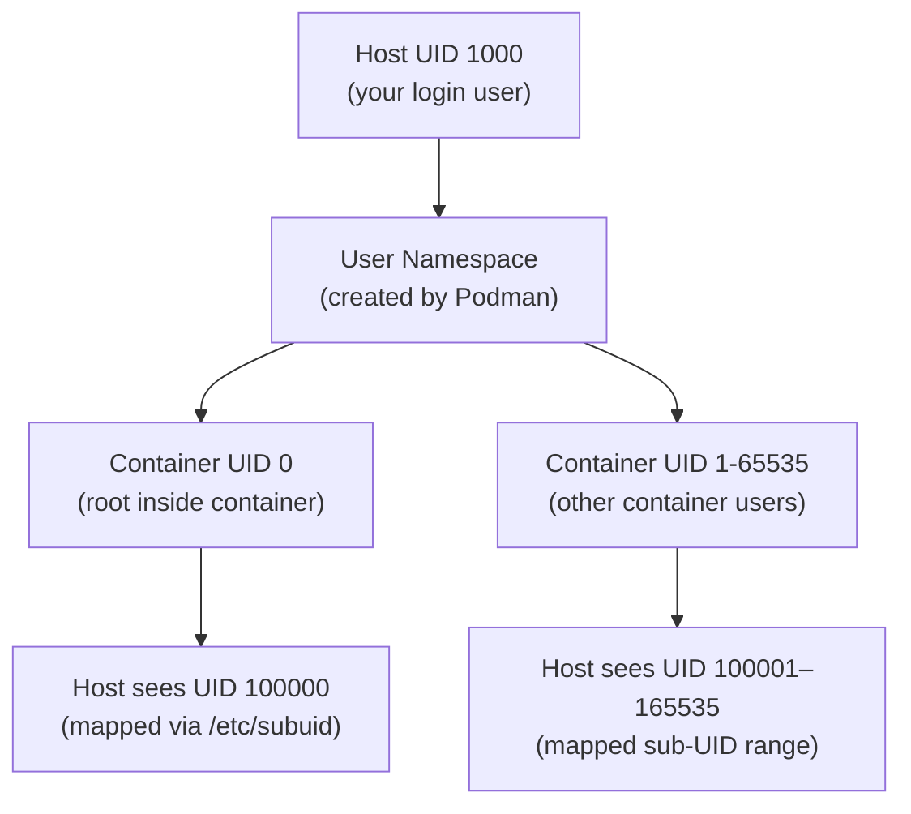

[↑ Back to TOC](#toc)

# Rootless Podman — Storage and Networking
[](../../LICENSE.md)
[](https://access.redhat.com/products/red-hat-enterprise-linux)
[](https://www.redhat.com)

Rootless containers are Podman's default and the correct way to run containers
on RHEL for most workloads.

At RHCA level, you need to understand *why* rootless works, not just *that* it
works. The mechanism is the Linux **user namespace**: the kernel maps your
unprivileged UID on the host to a synthetic UID 0 (root) inside the container.
Files and processes inside see themselves as root; the host kernel sees them as
your UID (typically 1000) or a range of sub-UIDs from `/etc/subuid`. No actual
root privilege is granted on the host.

This mapping has consequences you must understand for the exam: files created
inside the container as root appear on the host with a mapped UID (e.g.,
100000), not your UID. Volume mounts that work with rootful containers may fail
with rootless ones because the mapped UID does not own the host directory.
The `:U` mount option or explicit `chown` of the host directory by the sub-UID
are the fixes.

Rootless networking is handled by **pasta** on RHEL 10 (previously slirp4netns).
Pasta runs in userspace and implements a NAT-like forwarding path between the
container's network namespace and the host. It does not require any kernel
modules or capabilities beyond what a normal user has. The trade-off is that
the container cannot bind to ports below 1024 on the host and has slightly
higher latency than rootful networking. Use `firewall-cmd --add-forward-port`
to redirect host port 80 to the container's port 8080.

---
<a name="toc"></a>

## Table of contents

- [How rootless works](#how-rootless-works)
- [UID mapping diagram](#uid-mapping-diagram)
- [User namespace mapping in practice](#user-namespace-mapping-in-practice)
- [Rootless storage](#rootless-storage)
- [Rootless networking](#rootless-networking)
  - [Port redirect for port 80 → 8080](#port-redirect-for-port-80-8080)
- [Rootless networking: container-to-container](#rootless-networking-container-to-container)
- [Inspect networking](#inspect-networking)
- [Clean up rootless storage](#clean-up-rootless-storage)
- [Worked example](#worked-example)
- [Common mistakes and how to diagnose them](#common-mistakes-and-how-to-diagnose-them)


## How rootless works

Rootless containers use **user namespaces**: your UID is mapped to a range of
sub-UIDs inside the container, so root inside the container is not root on the
host.

```bash
# Check your sub-UID and sub-GID mappings
cat /etc/subuid | grep $(whoami)
cat /etc/subgid | grep $(whoami)
```

Expected: `rhel:100000:65536` — 65536 UIDs mapped starting at 100000.

If missing (fresh system):

```bash
sudo usermod --add-subuids 100000-165535 --add-subgids 100000-165535 $(whoami)
```

After adding sub-UIDs, reset the user namespace configuration:

```bash
podman system migrate
```


[↑ Back to TOC](#toc)

---

## UID mapping diagram



The host kernel enforces that process `100000` on the host has no elevated
privileges — it is just another unprivileged user. Inside the namespace it
appears as root.


[↑ Back to TOC](#toc)

---

## User namespace mapping in practice

Inside a rootless container:

```bash
podman run --rm alpine id
# uid=0(root) gid=0(root) — root INSIDE the container
```

On the host:

```bash
ps aux | grep "podman\|alpine"
# Process runs as YOUR UID — not root
```

Files created by root inside the container appear owned by a high UID on the host:

```bash
podman run --rm -v /tmp/test:/data:Z alpine sh -c "echo hello > /data/file"
ls -ln /tmp/test/file
# -rw-r--r-- 1 100000 100000 ...   (mapped UID on host)
```

To make a host directory writable by the container's UID 0, either:

```bash
# Option A: use :U to remap ownership to your UID
podman run -v ~/myapp/data:/data:Z,U myapp:latest

# Option B: chown the host directory to the first sub-UID
sudo chown 100000:100000 ~/myapp/data
```

> **Exam tip:** `loginctl enable-linger <user>` allows user services to
> survive logout. Without it, containers stop when you disconnect. This is
> required for rootless Quadlet services that must run 24/7.


[↑ Back to TOC](#toc)

---

## Rootless storage

Rootless containers store images and container data in:

```bash
~/.local/share/containers/storage/
```

```bash
# View storage usage
podman system df

# Inspect storage driver and paths
podman info | grep -A5 store

# Show all images with size
podman images --format "table {{.Repository}}:{{.Tag}}\t{{.Size}}"
```

RHEL defaults to the **overlay** storage driver using `~/.local/share/containers/`.

The overlay driver uses Linux's overlay filesystem to layer image content
without copying. Each container gets a writable layer on top of the read-only
image layers — creation is instant regardless of image size.

```bash
# View the actual overlay directories
ls ~/.local/share/containers/storage/overlay/

# Each subdirectory is a layer identified by its content hash
podman image inspect nginx:latest --format '{{range .RootFS.Layers}}{{.}}\n{{end}}'
```


[↑ Back to TOC](#toc)

---

## Rootless networking

Rootless containers use **pasta** (RHEL 10) or **slirp4netns** for network
namespacing, which provides NAT-like networking.

```bash
# Run container with port mapping
podman run -d --name web -p 8080:80 nginx:latest

# Test
curl http://localhost:8080/
```

> **Ports below 1024**
> Rootless containers cannot bind to ports below 1024 on the host.
> Use a port above 1024 (e.g., 8080) or set a redirect in firewalld.

### Port redirect for port 80 → 8080

```bash
sudo firewall-cmd --permanent \
  --add-forward-port=port=80:proto=tcp:toport=8080:toaddr=127.0.0.1
sudo firewall-cmd --reload

# Verify the rule
sudo firewall-cmd --list-forward-ports
```

This redirects all inbound traffic on port 80 to port 8080 on localhost,
where the rootless container listens.


[↑ Back to TOC](#toc)

---

## Rootless networking: container-to-container

Containers in the same **pod** or **network** can communicate:

```bash
# Create a custom network
podman network create mynet

# Run containers on it
podman run -d --name app --network mynet myapp:latest
podman run -d --name db --network mynet mariadb:latest

# Container 'app' can reach 'db' by hostname
podman exec app ping -c 2 db
```

DNS resolution between containers on the same network is handled by
Podman's embedded DNS (aardvark-dns). Each container is reachable by its
`--name` as a hostname within the network.

```bash
# Inspect the DNS resolver active in a container
podman exec app cat /etc/resolv.conf
```


[↑ Back to TOC](#toc)

---

## Inspect networking

```bash
# List networks
podman network ls

# Inspect a network (subnet, gateway, DNS)
podman network inspect mynet

# Show container IP
podman inspect web | grep IPAddress

# Show port mappings
podman port web

# Show all port mappings for all containers
podman ps --format "{{.Names}}\t{{.Ports}}"
```


[↑ Back to TOC](#toc)

---

## Clean up rootless storage

```bash
# Remove stopped containers
podman container prune

# Remove unused images
podman image prune

# Remove everything unused (containers, images, volumes, networks)
podman system prune

# Full reset (dangerous — removes everything)
podman system reset
```


[↑ Back to TOC](#toc)

---

## Worked example

**Scenario:** Run an Nginx web server as a non-root user on port 8080, with
a firewalld redirect so external clients reach it on port 80.

```bash
# 1. Confirm rootless pre-conditions
id          # note your UID (e.g., 1000)
cat /etc/subuid | grep $(whoami)
# Should show: student:100000:65536

# 2. Create content directory
mkdir -p ~/webroot
echo "<h1>Rootless Nginx on RHEL 10</h1>" > ~/webroot/index.html

# 3. Run container as your user (no sudo)
podman run -d \
  --name rootless-web \
  -p 8080:80 \
  -v ~/webroot:/usr/share/nginx/html:Z,ro \
  docker.io/library/nginx:stable-alpine

# 4. Verify container is running as your UID
podman ps
ps -ef | grep nginx | grep -v grep
# UID column shows your username, not root

# 5. Test locally
curl http://localhost:8080/

# 6. Add firewalld redirect for external access on port 80
sudo firewall-cmd --permanent \
  --add-forward-port=port=80:proto=tcp:toport=8080:toaddr=127.0.0.1
sudo firewall-cmd --reload

# 7. Test via port 80 (simulates external client on same host)
curl http://localhost/

# 8. Confirm no root-owned processes
ps -ef | grep nginx
# All nginx processes owned by your UID

# 9. Clean up
podman stop rootless-web && podman rm rootless-web
sudo firewall-cmd --permanent \
  --remove-forward-port=port=80:proto=tcp:toport=8080:toaddr=127.0.0.1
sudo firewall-cmd --reload
```


[↑ Back to TOC](#toc)

---

## Common mistakes and how to diagnose them

**1. Sub-UID not configured — rootless containers fail to start**

Symptom: `Error: OCI runtime error: ... newuidmap ... no subuid ranges`.

Fix:
```bash
grep $(whoami) /etc/subuid /etc/subgid
# If empty:
sudo usermod --add-subuids 100000-165535 --add-subgids 100000-165535 $(whoami)
podman system migrate
```

---

**2. Volume write fails — host directory owned by wrong UID**

Symptom: container process gets "permission denied" writing to a bind-mounted
directory even with `:Z`.

Fix:
```bash
# Option A: use :U to let Podman remap ownership
podman run -v ~/mydata:/data:Z,U myapp:latest

# Option B: find your first sub-UID and chown manually
awk -F: '/^student/{print $2}' /etc/subuid   # e.g., 100000
sudo chown -R 100000:100000 ~/mydata
```

---

**3. Port redirect not working — firewalld masquerade disabled**

Symptom: `--add-forward-port` added, but port 80 connections are refused.

Fix:
```bash
sudo firewall-cmd --list-all | grep masquerade
# If masquerade=no:
sudo firewall-cmd --permanent --add-masquerade
sudo firewall-cmd --reload
```

---

**4. `systemctl --user` fails — no D-Bus session**

Symptom: `Failed to connect to bus: No such file or directory` when running
`systemctl --user` via sudo or SSH without a proper session.

Fix: Log in as the actual user (not via `sudo -u`). Ensure `$XDG_RUNTIME_DIR`
is set:
```bash
export XDG_RUNTIME_DIR=/run/user/$(id -u)
systemctl --user status
```

---

**5. Rootless container cannot reach other containers on a custom network**

Symptom: `ping db` fails inside a container that should be on `mynet`.

Fix:
```bash
podman network inspect mynet   # confirm both containers are listed
podman inspect app | grep -A5 Networks
# Container may not have been started with --network mynet
```

---

**6. `pasta` not found — network fails on older RHEL installation**

Symptom: rootless container starts but has no network; Podman logs mention
pasta binary missing.

Fix:
```bash
sudo dnf install -y passt   # package name on RHEL 10
```


[↑ Back to TOC](#toc)

---

## Further reading

| Resource | Notes |
|---|---|
| [Podman — Rootless containers](https://github.com/containers/podman/blob/main/docs/tutorials/rootless_tutorial.md) | Official rootless setup and troubleshooting guide |
| [User namespaces (`user_namespaces` man page)](https://man7.org/linux/man-pages/man7/user_namespaces.7.html) | Kernel feature that makes rootless containers possible |
| [pasta — userspace network stack](https://passt.top/) | RHEL 10 default rootless networking (replaces slirp4netns) |
| [aardvark-dns](https://github.com/containers/aardvark-dns) | DNS server for container-to-container name resolution |

---


[↑ Back to TOC](#toc)

## Next step

→ [Volumes and Persistent Data](03-volumes.md)

[↑ Back to TOC](#toc)

---

© 2026 UncleJS — Licensed under CC BY-NC-SA 4.0
