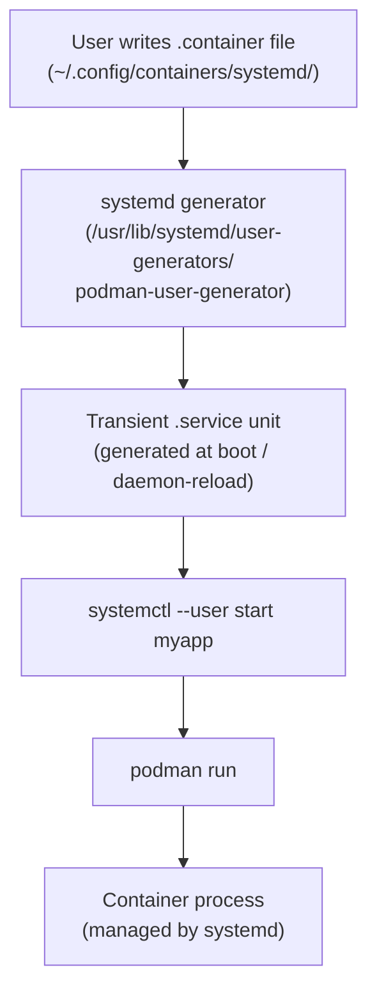

[↑ Back to TOC](#toc)

# systemd-Managed Containers
[](../../LICENSE.md)
[](https://access.redhat.com/products/red-hat-enterprise-linux)
[](https://www.redhat.com)

Running containers as systemd services gives you automatic start on boot,
restart on failure, journald logging, and integration with `systemctl`.

At RHCA level, the correct tool is **Quadlet** — a systemd generator built
into Podman 4.4+ and the default on RHEL 10. Quadlet lets you declare a
container's full configuration in a `.container` file using systemd-compatible
syntax. At startup, systemd's generator mechanism reads the file and generates
a transient `.service` unit — no shell scripting, no `podman generate systemd`,
no manual unit files to maintain. The old `podman generate systemd` workflow
still works but is deprecated for new deployments.

The mental model: Quadlet files are declarative infrastructure-as-code for
containers. The `.container` file is the deployment descriptor; systemd is
the process supervisor; Podman is the container runtime. Changes to the
`.container` file take effect after `systemctl --user daemon-reload` — the
same workflow as any other systemd unit modification.

Quadlet supports not just containers but also volumes, networks, pods, and
images — each with its own file type. This allows you to declare an entire
multi-container stack as a set of files that systemd manages as a unit.

For rootless user services to survive logout, **lingering** must be enabled.
Without it, systemd destroys the user's cgroup (and all containers in it)
when the last session ends. Enable linger once per user with
`loginctl enable-linger <user>` and it persists across reboots.

---
<a name="toc"></a>

## Table of contents

- [Two approaches](#two-approaches)
- [Quadlet architecture](#quadlet-architecture)
- [Approach 1: Quadlet (recommended for RHEL 10)](#approach-1-quadlet-recommended-for-rhel-10)
  - [Rootless container (user service)](#rootless-container-user-service)
  - [System-level rootful container](#system-level-rootful-container)
- [Quadlet file types](#quadlet-file-types)
  - [Manage a volume with Quadlet](#manage-a-volume-with-quadlet)
- [Approach 2: podman generate systemd](#approach-2-podman-generate-systemd)
- [Auto-update with Podman](#auto-update-with-podman)
- [Lingering (keep user services running after logout)](#lingering-keep-user-services-running-after-logout)
- [Worked example](#worked-example)
- [Common mistakes and how to diagnose them](#common-mistakes-and-how-to-diagnose-them)


## Two approaches

| Approach | How | Best for |
|---|---|---|
| **Quadlet** (RHEL 10 default) | Declare containers in `.container` unit files | New workloads — simpler, declarative |
| **podman generate systemd** | Generate unit file from a running container | Migrating existing containers |


[↑ Back to TOC](#toc)

---

## Quadlet architecture



The generator runs whenever `systemctl --user daemon-reload` is called or
at session start. It reads all `.container` files and produces equivalent
`.service` units in memory — they do not appear on disk.


[↑ Back to TOC](#toc)

---

## Approach 1: Quadlet (recommended for RHEL 10)

Quadlet is a systemd generator built into Podman. You write a `.container`
file and systemd handles the rest.

### Rootless container (user service)

```bash
mkdir -p ~/.config/containers/systemd/
```

```ini
# ~/.config/containers/systemd/webserver.container

[Unit]
Description=My Web Server
After=network-online.target

[Container]
Image=nginx:latest
PublishPort=8080:80
Volume=%h/webdata:/usr/share/nginx/html:Z
Secret=tls_cert,target=/etc/nginx/certs/tls.crt
Environment=NGINX_HOST=localhost
Label=app=webserver

[Service]
Restart=always
TimeoutStartSec=30

[Install]
WantedBy=default.target
```

```bash
# Reload systemd user daemon to pick up new file
systemctl --user daemon-reload

# Start and enable the service
systemctl --user enable --now webserver.service

# Check status
systemctl --user status webserver.service

# View logs
journalctl --user -u webserver.service -f
```

Key Quadlet `[Container]` directives:

| Directive | Meaning |
|---|---|
| `Image=` | Image reference (fully qualified recommended) |
| `PublishPort=` | `host_port:container_port` |
| `Volume=` | Same syntax as `podman run -v` |
| `Secret=` | Secret name; optionally with `target=`, `mode=` |
| `Environment=` | `KEY=value` — one line per variable |
| `Network=` | Podman network name (or `.network` file reference) |
| `AutoUpdate=` | `registry` to enable automatic image updates |
| `Label=` | Container label (`key=value`) |
| `Exec=` | Override the container entrypoint command |
| `User=` | UID/username to run as inside the container |

### System-level rootful container

```bash
sudo mkdir -p /etc/containers/systemd/
sudo vim /etc/containers/systemd/nginx.container
```

```ini
[Unit]
Description=Nginx Web Server
After=network-online.target

[Container]
Image=docker.io/library/nginx:latest
PublishPort=80:80
Volume=/srv/webroot:/usr/share/nginx/html:Z
Secret=tls_cert

[Service]
Restart=on-failure

[Install]
WantedBy=multi-user.target
```

```bash
sudo systemctl daemon-reload
sudo systemctl enable --now nginx.service
```

> **Exam tip:** Quadlet `.container` files for user services go in
> `~/.config/containers/systemd/`. System-wide files go in
> `/etc/containers/systemd/`. The `systemctl --user` vs `systemctl` distinction
> determines which directory is read.


[↑ Back to TOC](#toc)

---

## Quadlet file types

| Extension | What it manages |
|---|---|
| `.container` | A container |
| `.volume` | A named volume |
| `.network` | A Podman network |
| `.pod` | A Podman pod |
| `.image` | An image pull |

### Manage a volume with Quadlet

```ini
# ~/.config/containers/systemd/dbdata.volume
[Volume]
Label=app=mydb
```

Reference it in the container file:

```ini
Volume=dbdata.volume:/var/lib/mysql:Z
```

When the `.container` file references a `.volume` file by name, systemd
ensures the volume is created before the container starts — no manual
`podman volume create` needed.

### Manage a network with Quadlet

```ini
# ~/.config/containers/systemd/appnet.network
[Network]
Subnet=10.89.0.0/24
Gateway=10.89.0.1
Label=app=mystack
```

Reference it in the container file:

```ini
Network=appnet.network
```


[↑ Back to TOC](#toc)

---

## Approach 2: podman generate systemd

> **Warning:** `podman generate systemd` is **removed in Podman 5.x (RHEL 10)** and will return an error.
> This section documents the legacy workflow for reference when maintaining older RHEL 8/9 systems.
> Use Quadlet (Approach 1 above) for all new work on RHEL 10.

For containers on RHEL 8/9 already running, generate a unit file:

```bash
# Generate for an existing container
podman generate systemd --new --name myapp > myapp.service

# Review the file
cat myapp.service

# Install it
cp myapp.service ~/.config/systemd/user/
systemctl --user daemon-reload
systemctl --user enable --now myapp.service
```

`--new` regenerates the container from scratch on each start (preferred over
starting an existing container).

Note: `podman generate systemd` is deprecated upstream. Use Quadlet for new
workloads.


[↑ Back to TOC](#toc)

---

## Auto-update with Podman

Podman can automatically update containers to newer image digests:

```ini
# In the .container file:
[Container]
AutoUpdate=registry
```

```bash
# Enable the auto-update timer
systemctl --user enable --now podman-auto-update.timer

# Or trigger manually
podman auto-update

# Check what would be updated (dry run)
podman auto-update --dry-run
```

Auto-update pulls the latest image for the configured tag, recreates the
container, and rolls back if the new container fails its health check.


[↑ Back to TOC](#toc)

---

## Lingering (keep user services running after logout)

By default, user services stop when you log out. Enable lingering for services
that must run 24/7:

```bash
sudo loginctl enable-linger $(whoami)

# Verify
loginctl show-user $(whoami) | grep Linger
# Linger=yes

# Disable if needed
sudo loginctl disable-linger $(whoami)
```

> **Exam tip:** `loginctl enable-linger <user>` is required for rootless
> containers that must run when no user session is active (e.g., a web server
> that must run across reboots). Without it, containers stop at logout.


[↑ Back to TOC](#toc)

---

## Worked example

**Scenario:** Deploy a containerised Flask app as a rootless user systemd
service using Quadlet, with a named volume for application data, a secret
for the database password, and auto-restart on failure.

```bash
# 1. Ensure linger is enabled
sudo loginctl enable-linger student

# 2. Create supporting Quadlet files
mkdir -p ~/.config/containers/systemd

# 2a. Volume file
cat > ~/.config/containers/systemd/flaskdata.volume << 'EOF'
[Volume]
Label=app=flask-demo
EOF

# 2b. Network file
cat > ~/.config/containers/systemd/flasknet.network << 'EOF'
[Network]
Label=app=flask-demo
EOF

# 2c. Create the secret
printf 'db_pass_production_1' | podman secret create flask_db_pass -

# 3. Container file
cat > ~/.config/containers/systemd/flask-demo.container << 'EOF'
[Unit]
Description=Flask demo application
After=network-online.target

[Container]
Image=docker.io/library/python:3.12-slim
Exec=python -c "import http.server; http.server.test(HandlerClass=http.server.SimpleHTTPRequestHandler, port=8000)"
PublishPort=8000:8000
Volume=flaskdata.volume:/app/data:Z
Network=flasknet.network
Secret=flask_db_pass,target=/run/secrets/db_password,mode=0400
Environment=APP_ENV=production
Label=app=flask-demo
AutoUpdate=registry

[Service]
Restart=on-failure
RestartSec=5
TimeoutStartSec=60

[Install]
WantedBy=default.target
EOF

# 4. Reload and start
systemctl --user daemon-reload

# Verify the generated unit was picked up
systemctl --user list-unit-files | grep flask-demo

# Enable and start
systemctl --user enable --now flask-demo

# 5. Check status
systemctl --user status flask-demo

# 6. Verify the container is running
podman ps --format "{{.Names}}\t{{.Status}}\t{{.Ports}}"

# 7. Confirm the secret is accessible inside the container
podman exec systemd-flask-demo cat /run/secrets/db_password
# Should print: db_pass_production_1

# 8. Check logs
journalctl --user -u flask-demo -n 20

# 9. Test the service survives restart
systemctl --user restart flask-demo
systemctl --user status flask-demo

# 10. Cleanup
systemctl --user stop flask-demo
systemctl --user disable flask-demo
rm ~/.config/containers/systemd/flask-demo.container
rm ~/.config/containers/systemd/flaskdata.volume
rm ~/.config/containers/systemd/flasknet.network
systemctl --user daemon-reload
podman secret rm flask_db_pass
```


[↑ Back to TOC](#toc)

---

## Common mistakes and how to diagnose them

**1. `.container` file not picked up after creation**

Symptom: `systemctl --user list-unit-files` does not show the new service.

Fix:
```bash
systemctl --user daemon-reload
# If still missing, check for syntax errors in the .container file:
/usr/lib/systemd/user-generators/podman-user-generator \
  /tmp/gen-out /tmp/gen-out /tmp/gen-out
ls /tmp/gen-out   # inspect the generated unit
```

---

**2. Service shows "failed" immediately after start**

Symptom: `systemctl --user status flask-demo` shows `Failed` after 1 second.

Fix:
```bash
journalctl --user -u flask-demo -n 50
# Common causes: image not pulled, wrong image name, missing secret
podman pull <image>   # pre-pull to verify the image exists
```

---

**3. Service stops when SSH session ends**

Symptom: container runs fine interactively but stops when you log out.

Fix:
```bash
sudo loginctl enable-linger $(whoami)
loginctl show-user $(whoami) | grep Linger
```

---

**4. `%h` specifier not expanding in Volume directive**

Symptom: container fails to start; journal shows path like `%h/data` literally.

Fix: `%h` is a systemd unit specifier meaning the user's home directory.
It only expands in Quadlet files when systemd processes them — not in shell.
Verify with:
```bash
systemctl --user show flask-demo | grep ExecStart
# If %h appears literally, the generator did not process the file correctly
```

---

**5. Container keeps restarting — wrong `Restart=` policy**

Symptom: one-shot container (e.g., a database migration job) causes the
service unit to enter a restart loop.

Fix: for containers that run once and exit, use:
```ini
[Service]
Restart=no
# Or for transient tasks:
Type=oneshot
```

---

**6. Auto-update rolls back but reports success**

Symptom: `podman auto-update` runs but the new image is not active.

Fix:
```bash
podman auto-update --dry-run   # check what it would do
journalctl --user -u podman-auto-update -n 30
# Check if the new container fails its health check on start
```


[↑ Back to TOC](#toc)

---

## Further reading

| Resource | Notes |
|---|---|
| [Quadlet documentation](https://docs.podman.io/en/latest/markdown/podman-systemd.unit.5.html) | Full `.container` file directive reference |
| [Podman — Quadlet tutorial](https://www.redhat.com/sysadmin/quadlet-podman) | Red Hat blog walkthrough of Quadlet-based deployments |
| [`systemd.unit` man page](https://www.freedesktop.org/software/systemd/man/latest/systemd.unit.html) | Unit dependency model referenced by Quadlet |

---


[↑ Back to TOC](#toc)

## Next step

→ [Container SELinux Gotchas](06-selinux-containers.md)

[↑ Back to TOC](#toc)

---

© 2026 UncleJS — Licensed under CC BY-NC-SA 4.0
