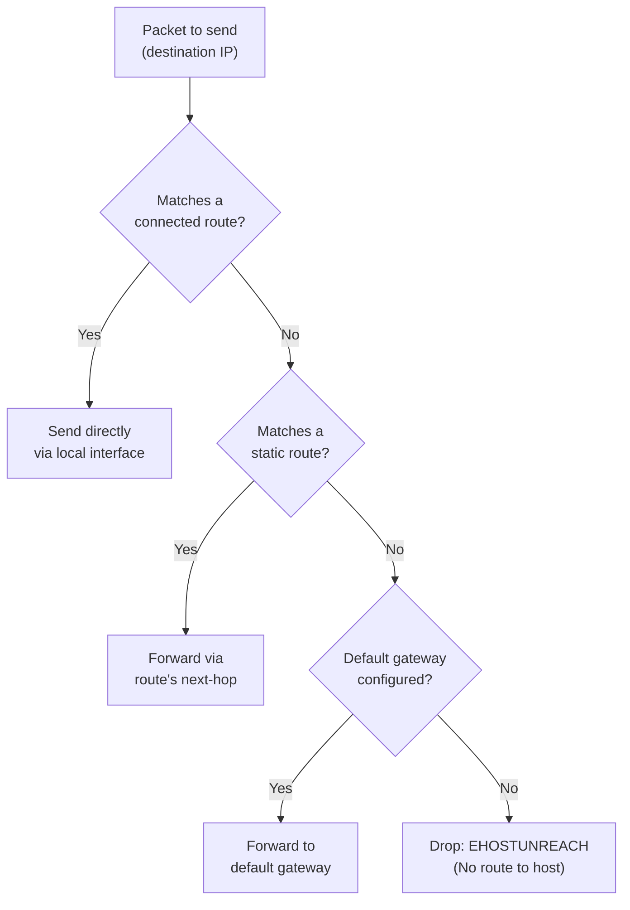

[↑ Back to TOC](#toc)

# Routing + Troubleshooting Method
[](../../LICENSE.md)
[](https://access.redhat.com/products/red-hat-enterprise-linux)
[](https://www.redhat.com)

Routing issues are one of the most common (and most misdiagnosed) network
problems. A systematic method makes them fast to resolve.

At RHCA level, routing knowledge extends beyond "add a default gateway". You
need to understand how the kernel makes routing decisions, how static routes
interact with connected routes and the default route, and how to diagnose
failures at each layer from the physical link up through DNS and TCP. The
most dangerous diagnostic error is jumping to a conclusion too early — treating
a firewall problem as a routing problem, or a DNS failure as an application
failure.

The mental model for routing: the Linux kernel maintains one or more routing
tables. For each packet, it performs a longest-prefix match against the
routing table for the destination address. Connected routes (automatically
added when an IP is assigned) have the longest prefix for directly reachable
networks. Static routes cover specific destinations. The default route
(`0.0.0.0/0`) is the catch-all that catches everything not matched by a more
specific entry. If there is no default route and no matching static or
connected route for a destination, the kernel drops the packet with `EHOSTUNREACH`.

---
<a name="toc"></a>

## Table of contents

- [The Linux routing table](#the-linux-routing-table)
- [Routing decision diagram](#routing-decision-diagram)
- [Route lookup](#route-lookup)
- [Add and remove static routes](#add-and-remove-static-routes)
- [The routing + connectivity troubleshooting method](#the-routing-connectivity-troubleshooting-method)
  - [Step 1 — Is the interface up?](#step-1-is-the-interface-up)
  - [Step 2 — Does the interface have an IP?](#step-2-does-the-interface-have-an-ip)
  - [Step 3 — Can we reach the default gateway?](#step-3-can-we-reach-the-default-gateway)
  - [Step 4 — Can we reach an external IP (bypass DNS)?](#step-4-can-we-reach-an-external-ip-bypass-dns)
  - [Step 5 — Can we resolve names?](#step-5-can-we-resolve-names)
  - [Step 6 — Can we reach the target service?](#step-6-can-we-reach-the-target-service)
- [Useful tools](#useful-tools)
- [Worked example](#worked-example)
- [Common mistakes and how to diagnose them](#common-mistakes-and-how-to-diagnose-them)


## The Linux routing table

The kernel consults the routing table to decide where to send each packet.

```bash
# Show all routes
ip route show

# Or
ip r
```

Example output:

```text
default via 192.168.1.1 dev ens3 proto dhcp metric 100
192.168.1.0/24 dev ens3 proto kernel scope link src 192.168.1.100
```

| Field | Meaning |
|---|---|
| `default via X` | Default gateway — used for all non-matching destinations |
| `192.168.1.0/24 dev ens3` | Local subnet — reach directly via ens3 |
| `proto kernel` | Added by the kernel when an IP is assigned |
| `metric 100` | Route priority (lower = preferred) |
| `scope link` | Directly reachable (no gateway needed) |
| `src 192.168.1.100` | Preferred source address for this route |


[↑ Back to TOC](#toc)

---

## Routing decision diagram



Longest-prefix match wins: a `/24` static route beats the `/0` default route
for addresses in that subnet. A connected `/24` route beats any static route
for the same network.


[↑ Back to TOC](#toc)

---

## Route lookup

```bash
# Which route would be used for a specific destination?
ip route get 8.8.8.8

# Which route to reach another host?
ip route get 192.168.2.50

# Show routes in a table (table main is the default)
ip route show table main

# Show all routing tables
ip route show table all
```

`ip route get` performs a real kernel route lookup and shows the exact
interface and gateway that would be used. This is the definitive answer
to "how would a packet to X be sent?"


[↑ Back to TOC](#toc)

---

## Add and remove static routes

```bash
# Temporary (lost on reboot)
sudo ip route add 10.0.0.0/8 via 192.168.1.254
sudo ip route del 10.0.0.0/8 via 192.168.1.254

# Persistent via nmcli
sudo nmcli connection modify "eth-static" +ipv4.routes "10.0.0.0/8 192.168.1.254"
sudo nmcli connection up "eth-static"

# Persistent with metric
sudo nmcli connection modify "eth-static" +ipv4.routes "10.0.0.0/8 192.168.1.254 200"

# Verify the route is active
ip route show | grep 10.0.0.0
```


[↑ Back to TOC](#toc)

---

## The routing + connectivity troubleshooting method

Work through this in order. Each step eliminates a layer.

### Step 1 — Is the interface up?

```bash
ip link show ens3
```

Look for: `state UP` and `LOWER_UP` (physical link up).

If `NO-CARRIER`: cable problem, wrong switch port, or VM adapter issue.
If `DOWN`: `sudo nmcli device connect ens3`

```bash
# Bring up all interfaces managed by NetworkManager
nmcli device status   # check all devices
sudo nmcli device connect ens3   # connect a specific device
```


[↑ Back to TOC](#toc)

---

### Step 2 — Does the interface have an IP?

```bash
ip addr show ens3
```

Look for: a `inet` line with your expected IP.

If missing: check if NetworkManager has an active connection:
`nmcli device status`

```bash
# Check which connection is active on the device
nmcli -f DEVICE,STATE,CONNECTION device status

# If no connection is active:
sudo nmcli connection up "eth-static"
```


[↑ Back to TOC](#toc)

---

### Step 3 — Can we reach the default gateway?

```bash
ip route show | grep default   # find gateway IP
ping -c 3 <gateway-IP>
```

If ping fails but interface is UP with an IP:
- Wrong gateway configured?
- Firewall on the gateway?
- Layer 2 problem (ARP)? → `ip neigh show`

```bash
# Check the ARP table for the gateway
ip neigh show | grep <gateway-IP>
# If state is FAILED: gateway not responding to ARP
# If entry is missing: try arping
sudo arping -I ens3 <gateway-IP>
```


[↑ Back to TOC](#toc)

---

### Step 4 — Can we reach an external IP (bypass DNS)?

```bash
ping -c 3 8.8.8.8
```

If this fails but gateway works: routing problem between you and the internet.
Check: is there a route to `0.0.0.0/0`? Is NAT configured on the router?

```bash
ip route show | grep default   # confirm default route exists
traceroute 8.8.8.8             # where does it stop?
```


[↑ Back to TOC](#toc)

---

### Step 5 — Can we resolve names?

```bash
ping -c 3 access.redhat.com   # if fails but 8.8.8.8 works → DNS problem
resolvectl status
dig access.redhat.com
dig @8.8.8.8 access.redhat.com   # test with a known-good resolver
```

```bash
# Check what DNS servers are configured per-interface
resolvectl dns ens3

# Check /etc/resolv.conf (often managed by systemd-resolved)
cat /etc/resolv.conf
```


[↑ Back to TOC](#toc)

---

### Step 6 — Can we reach the target service?

```bash
# TCP reachability test
curl -v --max-time 5 http://192.168.1.50:80/
nc -zv 192.168.1.50 80

# Is the service listening on the remote?
ssh user@192.168.1.50 "ss -tlnp | grep :80"

# Is a local firewall blocking outbound?
sudo firewall-cmd --list-all
```

If the connection times out rather than being refused, the problem is likely
a firewall drop rule (no RST sent) rather than a closed port (RST sent
immediately). `tcpdump` can confirm: a timeout with SYN packets going out
but no SYN-ACK coming back means the remote firewall is dropping.


[↑ Back to TOC](#toc)

---

## Useful tools

```bash
# Show ARP table (layer 2 neighbours)
ip neigh show

# Trace path
traceroute 8.8.8.8
tracepath 8.8.8.8    # no root required

# Packet loss stats
mtr 8.8.8.8

# See what interfaces and IPs exist
ip -brief addr
ip -brief link

# Check open ports and listening services
ss -tlnp    # TCP listening
ss -ulnp    # UDP listening
ss -tnp     # TCP connected

# Test TCP port without curl
nc -zv 192.168.1.50 443
timeout 5 bash -c "echo > /dev/tcp/192.168.1.50/443" && echo "open" || echo "closed"
```


[↑ Back to TOC](#toc)

---

## Worked example

**Scenario:** A server cannot reach an application running on `10.50.0.10:8080`.
The server is on `192.168.1.100/24`. Walk through the full troubleshooting method.

```bash
# Step 1: Interface up?
ip link show ens3
# state UP LOWER_UP  ✓

# Step 2: Has an IP?
ip addr show ens3
# inet 192.168.1.100/24  ✓

# Step 3: Gateway reachable?
ip route get 192.168.1.1
# via 192.168.1.1 dev ens3  ✓
ping -c 2 192.168.1.1
# 2 packets transmitted, 2 received  ✓

# Step 4: External IP reachable?
ping -c 2 8.8.8.8
# 2 packets transmitted, 2 received  ✓

# Step 5: DNS works?
dig access.redhat.com +short
# 23.x.x.x  ✓

# Step 6: Target service?
curl -v --max-time 5 http://10.50.0.10:8080/
# curl: (7) Failed to connect: Connection timed out  ✗

# Diagnose: is there a route to 10.50.0.10?
ip route get 10.50.0.10
# 10.50.0.10 via 192.168.1.1 dev ens3
# Goes via default gateway — may not be routed there

# Check if we need a specific route
traceroute 10.50.0.10
# Stops at first hop — router doesn't know 10.50.x.x

# Fix: add a static route to the 10.50.0.0/24 subnet
# via the correct gateway (e.g., 192.168.1.254 is the router to that network)
sudo nmcli connection modify "eth-static" \
  +ipv4.routes "10.50.0.0/24 192.168.1.254"
sudo nmcli connection up "eth-static"

# Verify
ip route show | grep 10.50.0.0
# 10.50.0.0/24 via 192.168.1.254 dev ens3 proto static

# Retry
curl -v --max-time 5 http://10.50.0.10:8080/
# If still timing out, check firewall on 10.50.0.10:
nc -zv 10.50.0.10 8080
# Or capture with tcpdump to see if SYN reaches the target
```


[↑ Back to TOC](#toc)

---

## Common mistakes and how to diagnose them

**1. Static route added with `ip route add` — disappears after reboot**

Symptom: connectivity works until the next reboot.

Fix:
```bash
# Always use nmcli for persistent routes
sudo nmcli connection modify "eth-static" \
  +ipv4.routes "10.50.0.0/24 192.168.1.254"
sudo nmcli connection up "eth-static"
```

---

**2. Two default routes — unpredictable routing**

Symptom: some connections work, others don't; `ip route show` shows two
`default` entries.

Fix:
```bash
ip route show | grep default
# Remove the unwanted one:
sudo ip route del default via <wrong-gateway>
# Or adjust connection priorities in nmcli:
sudo nmcli connection modify "dhcp-conn" connection.autoconnect-priority 5
sudo nmcli connection modify "static-conn" connection.autoconnect-priority 100
```

---

**3. Connection timeout vs connection refused confusion**

Symptom: `curl` times out; admin assumes routing is broken.

Fix: distinguish timeout (firewall drop) from refused (port closed):
```bash
nc -zv 10.50.0.10 8080
# "Connection refused" → port closed → routing works, app problem
# Timeout          → firewall dropping → check iptables/firewalld
```

---

**4. ARP not resolving — Layer 2 failure**

Symptom: IP address is configured, route is correct, but ping fails.

Fix:
```bash
ip neigh show | grep <target-IP>
# If state is FAILED or missing:
sudo arping -I ens3 <target-IP>   # check Layer 2 directly
# If arping fails: VLAN mismatch, switch ACL, or wrong subnet
```

---

**5. DNS resolution works from host but not from container**

Symptom: `dig` works on the host, but container cannot resolve names.

Fix:
```bash
# Check the container's resolv.conf
podman exec mycontainer cat /etc/resolv.conf
# If pointing to localhost (127.0.0.53), it's using host systemd-resolved
# In rootless containers, the DNS may be unreachable
# Fix: set explicit DNS in the Podman network
podman network create --dns 192.168.1.53 mynet
```

---

**6. `traceroute` shows asterisks — ICMP blocked by firewall**

Symptom: `traceroute` shows `* * *` at a hop; admin assumes link is down.

Fix: asterisks mean ICMP time-exceeded is blocked at that hop, not that the
link is down. Use `traceroute -T` (TCP mode) to bypass ICMP-blocking firewalls:
```bash
sudo traceroute -T -p 80 8.8.8.8
```


[↑ Back to TOC](#toc)

---

## Further reading

| Resource | Notes |
|---|---|
| [`ip-route` man page](https://man7.org/linux/man-pages/man8/ip-route.8.html) | Full routing table management reference |
| [iproute2 documentation](https://wiki.linuxfoundation.org/networking/iproute2) | Overview of the iproute2 toolset |
| [RHEL 10 — Configuring routing](https://access.redhat.com/documentation/en-us/red_hat_enterprise_linux/10/html/configuring_and_managing_networking/index) | Static routes, policy routing, and multipath |

---


[↑ Back to TOC](#toc)

## Next step

→ [tcpdump Guided Debugging](03-tcpdump.md)

[↑ Back to TOC](#toc)

---

© 2026 UncleJS — Licensed under CC BY-NC-SA 4.0
