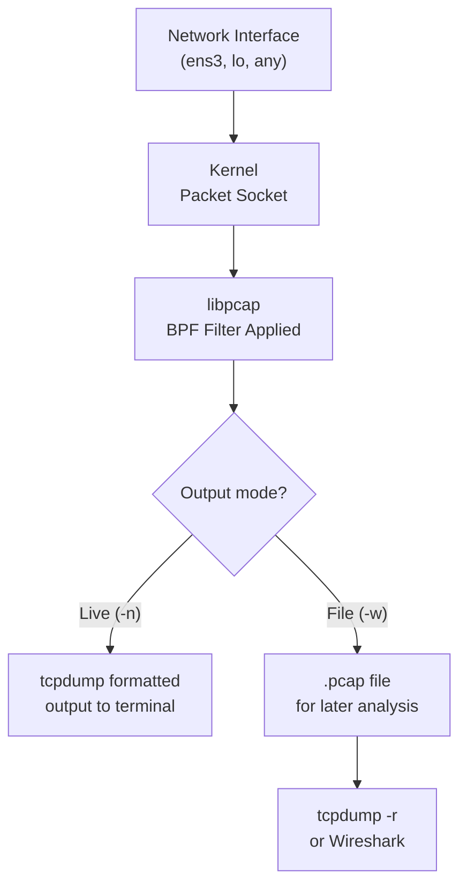

[↑ Back to TOC](#toc)

# tcpdump Guided Debugging
[](../../LICENSE.md)
[](https://access.redhat.com/products/red-hat-enterprise-linux)
[](https://www.redhat.com)

`tcpdump` captures network packets at the interface level. It is the most
powerful network debugging tool available on RHEL without installing anything.

At RHCA level, `tcpdump` is not just for "is traffic flowing" checks — it is
the instrument for diagnosing protocol-level failures that higher-level tools
cannot see. A `curl` returning a generic error tells you something failed; a
`tcpdump` capture tells you *where* and *why*. A TLS handshake failure shows
the alert level and alert description in the capture. A TCP connection that
never completes shows whether the SYN reached the server. A DNS failure shows
whether the query was sent and whether a response arrived.

The mental model for `tcpdump`: every packet that enters or leaves a network
interface passes through the kernel's packet capture interface (libpcap). You
attach a filter (BPF — Berkeley Packet Filter) that selects which packets to
capture. `tcpdump` reads from libpcap and formats the output. Critically, the
capture happens at the kernel level, before or after routing decisions, depending
on which interface you capture on. Capturing on the loopback (`lo`) interface
captures traffic between processes on the same host. Capturing on `ens3` captures
traffic leaving or entering the host.

For production use on busy links, always write to a `.pcap` file (`-w`) rather
than reading live output. Live output floods the terminal and can cause packets
to be dropped. The `.pcap` file can be read back with `tcpdump -r` or analyzed
in Wireshark for deeper protocol inspection.

---
<a name="toc"></a>

## Table of contents

- [Install](#install)
- [Capture flow](#capture-flow)
- [Basic usage](#basic-usage)
- [Filters (BPF syntax)](#filters-bpf-syntax)
- [Verbosity levels](#verbosity-levels)
- [Practical debugging scenarios](#practical-debugging-scenarios)
  - ["Is my DNS query leaving the host?"](#is-my-dns-query-leaving-the-host)
  - ["Is my HTTP request reaching the server?"](#is-my-http-request-reaching-the-server)
  - ["Is there a TCP handshake completing?"](#is-there-a-tcp-handshake-completing)
  - ["Capture traffic to a file and inspect later"](#capture-traffic-to-a-file-and-inspect-later)
  - ["Diagnosing a failed TLS handshake"](#diagnosing-a-failed-tls-handshake)
- [Output format](#output-format)
- [Worked example](#worked-example)
- [Common mistakes and how to diagnose them](#common-mistakes-and-how-to-diagnose-them)


## Install

```bash
sudo dnf install -y tcpdump
```


[↑ Back to TOC](#toc)

---

## Capture flow



The BPF filter is pushed down into the kernel — only packets matching the
filter consume CPU and buffer space. This is why a tight filter is critical
on busy interfaces.


[↑ Back to TOC](#toc)

---

## Basic usage

```bash
# Capture on all interfaces, print to screen
sudo tcpdump -n

# Capture on a specific interface
sudo tcpdump -n -i ens3

# Capture and save to file (for later analysis)
sudo tcpdump -n -i ens3 -w /tmp/capture.pcap

# Read from a saved file
sudo tcpdump -n -r /tmp/capture.pcap

# List available interfaces
sudo tcpdump -D

# Capture on all interfaces simultaneously
sudo tcpdump -n -i any
```

`-n` disables hostname resolution (much faster output).

Key options summary:

| Option | Meaning |
|---|---|
| `-n` | Don't resolve hostnames or port names |
| `-i <iface>` | Capture on specified interface |
| `-w <file>` | Write raw packets to a `.pcap` file |
| `-r <file>` | Read from a `.pcap` file |
| `-c <count>` | Capture only N packets then stop |
| `-s <snaplen>` | Capture N bytes per packet (0 = full packet) |
| `-D` | List available interfaces |
| `-e` | Print Ethernet (Layer 2) header |
| `-p` | Don't put interface in promiscuous mode |

> **Exam tip:** `-w` captures to a `.pcap` file for Wireshark analysis.
> Always capture to file on busy links — do not try to read live output.
> Use `-c 100` to automatically stop after 100 packets.


[↑ Back to TOC](#toc)

---

## Filters (BPF syntax)

Filters make captures targeted and readable:

```bash
# Only traffic to/from a host
sudo tcpdump -n -i ens3 host 192.168.1.50

# Only traffic on a port
sudo tcpdump -n -i ens3 port 80
sudo tcpdump -n -i ens3 port 53    # DNS

# Only TCP traffic
sudo tcpdump -n -i ens3 tcp

# Only UDP
sudo tcpdump -n -i ens3 udp

# Combine filters
sudo tcpdump -n -i ens3 host 192.168.1.50 and port 443

# Source host
sudo tcpdump -n -i ens3 src host 10.0.0.1

# Destination host
sudo tcpdump -n -i ens3 dst host 8.8.8.8

# ICMP only
sudo tcpdump -n -i ens3 icmp

# Network (subnet)
sudo tcpdump -n -i ens3 net 192.168.1.0/24

# Port range
sudo tcpdump -n -i ens3 portrange 8000-9000

# NOT a host (exclude your own SSH traffic)
sudo tcpdump -n -i ens3 not host 192.168.1.100

# Complex filter: DNS from specific host, or HTTP
sudo tcpdump -n -i ens3 \
  "(src host 10.0.0.5 and port 53) or (dst host 192.168.1.50 and port 80)"
```


[↑ Back to TOC](#toc)

---

## Verbosity levels

```bash
-v     # verbose (TTL, IP ID, checksum)
-vv    # more verbose (full DNS/NTP decode)
-vvv   # maximum verbosity
-A     # print payload as ASCII
-X     # print payload as hex+ASCII
```

Use `-A` to read HTTP request/response headers in cleartext. For TLS
traffic, `-A` shows the encrypted payload — use the `.pcap` file with
Wireshark and TLS keys for decryption.


[↑ Back to TOC](#toc)

---

## Practical debugging scenarios

### "Is my DNS query leaving the host?"

```bash
sudo tcpdump -n -i ens3 port 53
```

Then in another terminal:

```bash
dig access.redhat.com
```

Watch for: outbound query on port 53 and the response. If no packets appear,
the query is being intercepted locally (check `/etc/hosts`, `systemd-resolved`).

```bash
# If packets appear on ens3 but no response: DNS server unreachable
# Test with a known-good resolver:
dig @8.8.8.8 access.redhat.com
```


[↑ Back to TOC](#toc)

---

### "Is my HTTP request reaching the server?"

On the **server**:

```bash
sudo tcpdump -n -i ens3 port 80 -A
```

On the **client**:

```bash
curl http://192.168.1.50/
```

If packets appear on the server: connection is reaching the server. Problem is
in the application (service not running, firewall on server app, SELinux).

If no packets appear: the traffic is being blocked before reaching the server
(routing, firewall on the way, NAT issues).


[↑ Back to TOC](#toc)

---

### "Is there a TCP handshake completing?"

```bash
sudo tcpdump -n -i ens3 "tcp[tcpflags] & (tcp-syn|tcp-ack) != 0"
```

Look for:
- `S` (SYN): client sending connection request
- `S.` (SYN-ACK): server accepting
- `.` (ACK): client acknowledging — handshake complete

If you see SYN but no SYN-ACK: server not listening or firewall dropping.
If you see SYN, SYN-ACK, RST: server resets the connection (port closed or SELinux).

```bash
# Capture a complete TCP conversation
sudo tcpdump -n -i ens3 -A \
  "host 192.168.1.50 and port 80 and tcp[tcpflags] & (tcp-syn) != 0"
```


[↑ Back to TOC](#toc)

---

### "Capture traffic to a file and inspect later"

```bash
# Capture 100 packets on port 443
sudo tcpdump -n -i ens3 port 443 -c 100 -w /tmp/https.pcap

# Read back with verbose output
sudo tcpdump -n -r /tmp/https.pcap -v

# Read back filtering for a specific host
sudo tcpdump -n -r /tmp/https.pcap host 93.184.216.34
```


[↑ Back to TOC](#toc)

---

### "Diagnosing a failed TLS handshake"

TLS handshake failures are visible in `tcpdump` as TLS Alert records.

```bash
# Capture TLS traffic (port 443)
sudo tcpdump -n -i ens3 port 443 -w /tmp/tls-debug.pcap

# In another terminal, make the request
curl https://192.168.1.50/

# Read back and look for TLS alerts
sudo tcpdump -n -r /tmp/tls-debug.pcap -X | grep -A5 "Alert"
```

TLS alert record format visible in the hex dump:
- `15 03 03` = TLS Alert (content type 21, TLS 1.2)
- Second byte: `01` = warning, `02` = fatal
- Third byte: alert description
  - `28` (40) = handshake_failure
  - `2a` (42) = bad_certificate
  - `30` (48) = unknown_ca

Common causes of TLS handshake failure:
- Certificate expired or not yet valid
- Certificate hostname mismatch
- Untrusted CA (certificate chain not trusted on client)
- Cipher suite mismatch (rare on modern systems)

For deep TLS analysis, import the `.pcap` into Wireshark with TLS decryption
keys (if available via SSLKEYLOGFILE).


[↑ Back to TOC](#toc)

---

## Output format

```text
HH:MM:SS.ffffff IP src > dst: flags seq ack win length
```

Example:

```text
10:05:23.456789 IP 192.168.1.100.54321 > 8.8.8.8.53: Flags [S]
  seq 1234567, win 64240, length 0
```

| Part | Meaning |
|---|---|
| `192.168.1.100.54321` | Source IP.port |
| `8.8.8.8.53` | Destination IP.port |
| `Flags [S]` | SYN (connection attempt) |
| `[S.]` | SYN-ACK (server accepted) |
| `[.]` | ACK |
| `[P.]` | PUSH+ACK (data payload) |
| `[F.]` | FIN (connection close) |
| `[R]` | RST (connection reset/rejected) |
| `seq N` | Sequence number |
| `ack N` | Acknowledgement number |
| `win N` | TCP receive window size |
| `length N` | Payload length in bytes |


[↑ Back to TOC](#toc)

---

## Worked example

**Scenario:** A client reports that HTTPS connections to an internal server
(`192.168.1.50:443`) fail with "SSL handshake error". Use `tcpdump` to
determine whether the handshake is reaching the server and what alert is
returned.

```bash
# On the server (192.168.1.50): capture TLS traffic
sudo tcpdump -n -i ens3 host 192.168.1.100 and port 443 \
  -c 50 -w /tmp/tls-handshake.pcap &

# On the client (192.168.1.100): attempt the connection
curl -v https://192.168.1.50/
# curl: (35) OpenSSL SSL_connect: SSL_ERROR_SYSCALL ...

# Stop the capture
kill %1

# Read back the capture
sudo tcpdump -n -r /tmp/tls-handshake.pcap -v

# Expected output for a handshake failure:
# 10:15:33 IP 192.168.1.100.55234 > 192.168.1.50.443: Flags [S]    # SYN
# 10:15:33 IP 192.168.1.50.443 > 192.168.1.100.55234: Flags [S.]   # SYN-ACK
# 10:15:33 IP 192.168.1.100.55234 > 192.168.1.50.443: Flags [.]    # ACK
# ... TLS ClientHello ...
# ... TLS Alert (Fatal, handshake_failure or unknown_ca) ...
# 10:15:33 IP 192.168.1.50.443 > 192.168.1.100.55234: Flags [F.]   # FIN

# Interpretation: handshake IS reaching the server (SYN-ACK seen)
# Problem is in TLS negotiation, not routing or firewall

# Further diagnosis on the server:
# Check the certificate
openssl x509 -in /etc/nginx/certs/server.crt -noout -dates -subject
# Check for expiry, hostname mismatch

# Check what the server presents
openssl s_client -connect 192.168.1.50:443 -servername localhost

# Fix: renew or replace the certificate, then restart the service
sudo systemctl restart nginx

# Verify fix
curl -v https://192.168.1.50/ --cacert /path/to/ca.crt
```


[↑ Back to TOC](#toc)

---

## Common mistakes and how to diagnose them

**1. Capturing on the wrong interface — no packets seen**

Symptom: `tcpdump` runs but captures nothing even though traffic is flowing.

Fix:
```bash
sudo tcpdump -D   # list interfaces
# Traffic may be on a different interface than expected
# Try -i any to capture all interfaces:
sudo tcpdump -n -i any port 80
```

---

**2. No filter on a busy interface — output too fast to read**

Symptom: thousands of packets per second flood the terminal; useful packets
scroll off.

Fix: always write to a file on busy interfaces:
```bash
sudo tcpdump -n -i ens3 -w /tmp/capture.pcap host 192.168.1.50 and port 443
# Read back selectively:
sudo tcpdump -n -r /tmp/capture.pcap -c 50
```

---

**3. `-n` not used — hostname resolution slows output**

Symptom: `tcpdump` output appears line-by-line with long pauses; real-time
capture misses packets.

Fix: always use `-n`. DNS lookups for each captured IP block the output thread:
```bash
sudo tcpdump -n -i ens3 port 80   # -n is essential
```

---

**4. Capturing after the problem has occurred — missing the event**

Symptom: `tcpdump` started but the connection failure already happened.

Fix: start `tcpdump` *before* triggering the connection, or use `-w` to
capture continuously and inspect the file after the event:
```bash
# Start capture in background
sudo tcpdump -n -i ens3 port 443 -w /tmp/continuous.pcap &

# Trigger the event
curl https://192.168.1.50/

# Stop capture and inspect
kill %1
sudo tcpdump -n -r /tmp/continuous.pcap
```

---

**5. TLS traffic shows as encrypted — cannot read application data**

Symptom: `-A` flag shows garbled binary output for HTTPS traffic.

Fix: this is expected. TLS encrypts the payload. For application-level
debugging of HTTPS, use one of:
```bash
# Option 1: use curl -v (shows TLS handshake and HTTP headers before encryption)
curl -v https://host/path

# Option 2: use SSLKEYLOGFILE for Wireshark TLS decryption
export SSLKEYLOGFILE=/tmp/tls-keys.log
curl https://host/path
# Import keys into Wireshark: Edit > Preferences > Protocols > TLS > (Pre)-Master-Secret log
```

---

**6. Capture on container network interface — traffic not visible on ens3**

Symptom: traffic between containers is not visible in `tcpdump -i ens3`.

Fix: container-to-container traffic on the same Podman network uses a virtual
bridge interface (`cni-podman0` or `podman0`):
```bash
sudo tcpdump -D | grep -i podman   # find the bridge interface
sudo tcpdump -n -i podman0 port 8080
```


[↑ Back to TOC](#toc)

---

## Further reading

| Resource | Notes |
|---|---|
| [tcpdump filter syntax](https://www.tcpdump.org/manpages/pcap-filter.7.html) | Full Berkeley Packet Filter (BPF) expression reference |
| [Wireshark — Display filters](https://wiki.wireshark.org/DisplayFilters) | GUI-based packet analysis — useful for reading pcap files from `tcpdump -w` |
| [*TCP/IP Illustrated, Vol. 1* by W. Richard Stevens](https://www.oreilly.com/library/view/tcpip-illustrated-volume/9780132808200/) | Definitive guide to understanding what you're capturing |

---


[↑ Back to TOC](#toc)

## Next step

→ [VLAN, Bridge, Bond Concepts](04-l2-concepts.md)

[↑ Back to TOC](#toc)

---

© 2026 UncleJS — Licensed under CC BY-NC-SA 4.0
