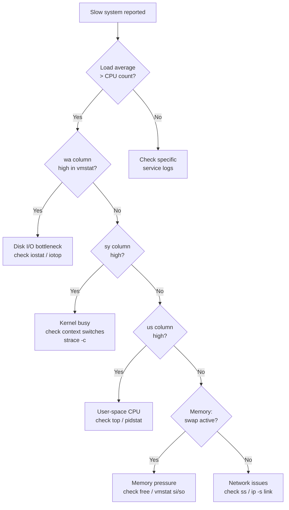

[↑ Back to TOC](#toc)

# Performance Resource Triage
[](../../LICENSE.md)
[](https://access.redhat.com/products/red-hat-enterprise-linux)
[](https://www.redhat.com)

## Overview

When a system is slow, the instinct is to immediately tune or add hardware. The disciplined approach is **triage first**: identify the constrained resource, confirm the bottleneck, then act. This chapter provides a repeatable triage workflow covering CPU, memory, disk I/O, and network.

Performance triage at the RHCA level is a structured investigation, not
intuition. Systems that appear CPU-bound are often I/O-bound when examined
carefully; systems that appear memory-starved are often misconfigured (wrong
`tuned` profile, huge pages disabled, excessive swap). The Brendan Gregg USE
Method — measure Utilisation, Saturation, and Errors for every resource — is
the framework that prevents premature conclusions.

The mental model: every performance problem is a queue building up somewhere.
CPU saturation means the run queue is longer than the number of CPUs. Memory
pressure means the page reclaim queue is always active. Disk I/O saturation
means the device queue depth is sustained at maximum. Network problems mean
the socket send/receive queues are filling and TCP retransmits are occurring.
Find the queue. Find what is filling it. Fix the root cause.

Getting triage wrong in production leads to "fixes" that add hardware cost
without solving the problem, or tuning changes that improve one metric while
degrading another. RHCA candidates are expected to diagnose bottlenecks from
first principles using standard RHEL tools — not rely on "add more RAM" as
the default answer.


[↑ Back to TOC](#toc)

---
<a name="toc"></a>

## Table of contents

- [Overview](#overview)
- [Triage decision tree](#triage-decision-tree)
- [The Triage Hierarchy](#the-triage-hierarchy)
- [Quick Assessment — First 60 Seconds](#quick-assessment-first-60-seconds)
  - [Reading Load Average](#reading-load-average)
- [CPU Triage](#cpu-triage)
  - [Identify CPU consumers](#identify-cpu-consumers)
  - [Distinguish user-space vs kernel-space](#distinguish-user-space-vs-kernel-space)
  - [Syscall overhead](#syscall-overhead)
  - [CPU throttling in containers / cgroups](#cpu-throttling-in-containers-cgroups)
- [Memory Triage](#memory-triage)
  - [Baseline memory usage](#baseline-memory-usage)
  - [Detect swapping](#detect-swapping)
  - [OOM kill history](#oom-kill-history)
  - [Memory overcommit settings](#memory-overcommit-settings)
- [Disk I/O Triage](#disk-io-triage)
  - [iostat — the primary tool](#iostat-the-primary-tool)
  - [Identify the process causing I/O](#identify-the-process-causing-io)
  - [Filesystem saturation](#filesystem-saturation)
  - [I/O scheduler](#io-scheduler)
- [Network Triage](#network-triage)
  - [Interface-level statistics](#interface-level-statistics)
  - [TCP retransmits and errors](#tcp-retransmits-and-errors)
  - [Bandwidth utilization](#bandwidth-utilization)
  - [Connection table saturation](#connection-table-saturation)
- [Worked example — I/O-bound database server](#worked-example-io-bound-database-server)
- [Common mistakes and how to diagnose them](#common-mistakes-and-how-to-diagnose-them)
- [Putting It Together — Triage Worksheet](#putting-it-together-triage-worksheet)
- [Useful One-Liners Reference](#useful-one-liners-reference)
- [Recap](#recap)


## Triage decision tree




[↑ Back to TOC](#toc)

---

## The Triage Hierarchy

```text
Is the system responding?
  └── Yes → Are processes stuck or thrashing?
        └── Check CPU / Memory first
              └── High CPU? → Who owns it? System or user?
              └── High Memory? → Swapping? OOM events?
                    └── I/O wait high? → Disk bottleneck
                          └── Network issues? → Packet drops / retransmits
```

Start at the top. Fix the most constrained layer before optimizing anything else.


[↑ Back to TOC](#toc)

---

## Quick Assessment — First 60 Seconds

Run these in sequence when you first encounter a slow system:

```bash
# 1. Is the system reachable and how loaded?
$ uptime
 14:22:05 up 3 days, 2:14,  2 users,  load average: 8.21, 6.44, 4.12

# 2. What is consuming CPU and memory right now?
$ top -b -n 1 | head -20

# 3. Any OOM kills in recent history?
$ journalctl -k --since "1 hour ago" | grep -i oom

# 4. Disk I/O wait
$ iostat -x 1 3

# 5. Memory pressure
$ free -m

# 6. Network errors
$ ip -s link show ens3
```

### Reading Load Average

| Load average vs CPU count | Interpretation |
|---|---|
| Load < CPU count | System has headroom |
| Load ≈ CPU count | Fully utilized but not overloaded |
| Load > CPU count | Runqueue backed up; likely bottleneck |
| Load >> CPU count | Severe overload — expect process starvation |

```bash
# CPU count
$ nproc
4

# If load average is 8 on a 4-core system → 2× overloaded
```


[↑ Back to TOC](#toc)

---

## CPU Triage

### Identify CPU consumers

```bash
# Sort by CPU%, show top 10 processes
$ ps aux --sort=-%cpu | head -11

# More detailed: show threads, not just processes
$ top -H   # press 'H' in interactive top to toggle threads

# Per-CPU usage (useful for identifying single-threaded bottlenecks)
$ mpstat -P ALL 1 5
```

### Distinguish user-space vs kernel-space

```bash
$ vmstat 1 5
procs -----------memory---------- ---swap-- -----io---- -system-- ------cpu-----
 r  b   swpd   free   buff  cache   si   so    bi    bo   in   cs us sy id wa st
 6  0      0 123456  12345 678901    0    0     0     2 1234 5678 72 15 12  1  0
```

| Column | Meaning |
|---|---|
| `us` | User-space CPU time |
| `sy` | Kernel/system CPU time |
| `id` | Idle |
| `wa` | I/O wait |
| `st` | Stolen time (relevant in VMs) |

**High `sy`:** kernel is busy — check for excessive syscalls, IRQ handling, or context switches.  
**High `us`:** application-level problem — identify the process.  
**High `wa`:** disk or NFS I/O is the real bottleneck, not CPU.

### Syscall overhead

```bash
# How many context switches per second?
$ vmstat 1 | awk '{print $12, $13}'
# columns: interrupts/s  context-switches/s

# Which process is making the most syscalls?
$ strace -c -p <PID>   # attach to running process, Ctrl+C to stop and see summary
```

### CPU throttling in containers / cgroups

```bash
# Is a container being CPU-throttled?
$ systemctl status <service>
# Look for: CPUQuota= in the unit

# cgroup v2 throttling stats
$ cat /sys/fs/cgroup/system.slice/<service.service>/cpu.stat
nr_throttled 1234
throttled_usec 5678000
```


[↑ Back to TOC](#toc)

---

## Memory Triage

### Baseline memory usage

```bash
$ free -m
              total        used        free      shared  buff/cache   available
Mem:           7823        4521         312         234        2990        2834
Swap:          2047          42        2005
```

> **`available`** is the most useful column — it includes reclaimable cache and shows how much memory a new process could actually get.

### Detect swapping

```bash
# Is the system actively swapping? (non-zero si/so is the concern)
$ vmstat 1 5 | awk 'NR>2 {print "swap-in:", $7, "swap-out:", $8}'

# Which processes have the most swap usage?
$ for pid in $(ls /proc | grep -E '^[0-9]+$'); do
    swap=$(awk '/VmSwap/{print $2}' /proc/$pid/status 2>/dev/null)
    [ -n "$swap" ] && [ "$swap" -gt 0 ] && \
      echo "$swap kB  $(cat /proc/$pid/comm 2>/dev/null) (PID $pid)"
  done | sort -rn | head -10
```

### OOM kill history

```bash
# Recent OOM kills from kernel ring buffer
$ journalctl -k | grep -E "oom|killed process" | tail -20

# Identify which cgroup was killed
$ journalctl -k | grep "oom_kill_process"
```

### Memory overcommit settings

```bash
$ sysctl vm.overcommit_memory vm.overcommit_ratio
vm.overcommit_memory = 0    # 0=heuristic, 1=always allow, 2=never overcommit
vm.overcommit_ratio = 50

# Committed virtual memory vs physical
$ cat /proc/meminfo | grep -E "CommitLimit|Committed_AS"
CommitLimit:    5963000 kB
Committed_AS:   4812000 kB
```


[↑ Back to TOC](#toc)

---

## Disk I/O Triage

### iostat — the primary tool

```bash
# Extended stats, 1-second interval, 5 iterations
$ iostat -x 1 5

Device            r/s     w/s     rkB/s     wkB/s  await  %util
vda              0.00   145.00      0.00  18560.00  45.23   98.2
```

| Column | Meaning | Concern threshold |
|---|---|---|
| `r/s` / `w/s` | Read/write operations per second | Depends on device |
| `await` | Average I/O wait time in ms | > 20ms for HDD, > 2ms for SSD |
| `%util` | Device utilization | > 80% sustained = bottleneck |
| `svctm` | Service time (deprecated but still present) | — |

### Identify the process causing I/O

```bash
# iotop: per-process I/O (requires root or CAP_NET_ADMIN)
$ sudo iotop -o -b -n 3 | head -20
# -o = only show processes doing I/O

# Alternative: pidstat
$ pidstat -d 1 5
# Shows per-process disk read/write rates
```

### Filesystem saturation

```bash
# Disk space
$ df -h

# Inode exhaustion (a full inode table looks like a full disk)
$ df -i
Filesystem       Inodes  IUsed   IFree IUse% Mounted on
/dev/vda3        524288 523900     388   99% /var/log   ← inode exhausted

# Find inode hogs
$ find /var/log -xdev -printf '%h\n' | sort | uniq -c | sort -rn | head -10
```

### I/O scheduler

```bash
# Current scheduler for each block device
$ cat /sys/block/vda/queue/scheduler
[none] mq-deadline kyber bfq

# For NVMe/SSDs, 'none' is typically optimal
# For HDDs, 'mq-deadline' reduces latency for sequential workloads
```


[↑ Back to TOC](#toc)

---

## Network Triage

### Interface-level statistics

```bash
# Errors, drops, overruns per interface
$ ip -s link show ens3
    RX: bytes  packets  errors  dropped missed  mcast
    ...        ...      0       12      0       0
    TX: bytes  packets  errors  dropped carrier collsns
    ...        ...      0       0       0       0

# Watch in real-time
$ watch -n 1 'ip -s link show ens3'
```

### TCP retransmits and errors

```bash
# Global TCP stats
$ ss -s
Total: 312
TCP:   45 (estab 18, closed 12, orphaned 0, timewait 12)

# Retransmit counters
$ netstat -s | grep -i retran
    3456 segments retransmitted

# Per-socket retransmit info
$ ss -ti | grep retrans
```

### Bandwidth utilization

```bash
# Install nload or use iftop for live bandwidth
$ sudo dnf install -y nload
$ sudo nload ens3

# Or use sar for historical data
$ sar -n DEV 1 10
```

### Connection table saturation

```bash
# Are we running out of ephemeral ports or conntrack entries?
$ sysctl net.ipv4.ip_local_port_range
net.ipv4.ip_local_port_range = 32768	60999

$ sysctl net.nf_conntrack_max net.netfilter.nf_conntrack_count
# If count is close to max, conntrack is saturated
```


[↑ Back to TOC](#toc)

---

## Worked example — I/O-bound database server

**Scenario:** A PostgreSQL server on RHEL 10 has been experiencing slow query
times since a bulk data import was run overnight. The DBA reports that queries
that previously took 50ms now take 2–8 seconds. Load average is 1.8 on a
4-core host (not CPU saturated).

**Step 1 — quick assessment**

```bash
uptime
# load average: 1.82, 1.75, 1.91  (below CPU count of 4 — not CPU bound)

free -m
#               total   used   free  available
# Mem:          15823   9412    312      5834
# Swap:          4095    234   3861
# Swap is in use — investigate
```

**Step 2 — CPU breakdown with vmstat**

```bash
vmstat 1 5
# r  b  ... us sy id wa st
# 1  3  ...  8  4 12 76  0
#            ^         ^
#            low CPU   HIGH I/O wait (76%)
```

`wa=76` confirms the bottleneck is disk I/O, not CPU.

**Step 3 — identify the I/O hot spot**

```bash
iostat -x 1 5
# Device   r/s   w/s   rkB/s   wkB/s  await  %util
# vda     0.00  980.0  0.00  62720.0   89.1   99.8
# vda is 99.8% utilized, await 89ms — severely saturated
```

```bash
sudo iotop -o -b -n 3
# TID  PRIO  USER   DISK READ   DISK WRITE   COMMAND
# 1842  BE/4 postgres  0 B/s   61.2 MiB/s  postgres: autovacuum
```

The PostgreSQL autovacuum process is generating 61 MB/s of writes, saturating
the single vda volume.

**Step 4 — confirm no memory pressure is compounding the issue**

```bash
vmstat 1 5 | awk 'NR>2 {print "si="$7 " so="$8}'
# si=0 so=12  ← small amount of swap-out; not the primary driver
```

**Step 5 — root cause and fix**

The bulk import left dead tuples that triggered aggressive autovacuum. The
storage is a single HDD with `mq-deadline` scheduler — appropriate, but the
write load is simply above its throughput ceiling.

```bash
# Short-term: throttle autovacuum to allow normal queries
sudo -u postgres psql -c "ALTER TABLE large_table SET (autovacuum_cost_delay = 50);"

# Verify I/O drops
iostat -x 1 3
# vda %util drops from 99.8% to 35% — queries resume normal latency

# Long-term: move PostgreSQL data directory to faster storage (NVMe)
# or use tablespaces to distribute I/O
```

**Step 6 — document findings**

```text
Bottleneck: Disk I/O (vda %util 99.8%, await 89ms)
Root cause: PostgreSQL autovacuum triggered by overnight bulk import
Short-term fix: autovacuum cost delay throttling
Long-term fix: migrate data directory to NVMe volume
Before: query latency 2-8s, iostat await 89ms
After:  query latency <100ms, iostat await <5ms
```


[↑ Back to TOC](#toc)

---

## Common mistakes and how to diagnose them

**1. Concluding CPU is the bottleneck because load average is high**

Symptom: Load average is 6 on a 4-core system, so you suspect CPU. But CPU
`us+sy` is only 20%.
Diagnosis: `vmstat` shows `wa=75`. The load average includes processes
waiting on I/O (D-state), not just CPU-runnable processes.
Fix: Check `iostat -x` for disk saturation. High load + low CPU + high wa =
I/O bottleneck, not CPU.

**2. Using `free` column instead of `available`**

Symptom: `free -m` shows only 200 MB free. Alarm raised about memory
starvation. But performance is normal.
Diagnosis: The `available` column is 4.5 GB — reclaimable cache is abundant.
Fix: Use the `available` column for capacity decisions, not `free`.

**3. Not checking inode exhaustion**

Symptom: Application fails with "No space left on device" but `df -h` shows
80% free.
Diagnosis: `df -ih` shows `IUse% = 100%` on `/var/spool` or `/tmp`.
Fix: Find and remove the inode hog using
`find /var/spool -xdev -printf '%h\n' | sort | uniq -c | sort -rn | head`.

**4. Ignoring `st` (stolen CPU time) in VMs**

Symptom: VM appears CPU-saturated but `top` shows no individual process
consuming high CPU. Mysteriously slow.
Diagnosis: `vmstat` shows `st > 5%` — the hypervisor is stealing CPU cycles
from this VM to service other guests.
Fix: This is a hypervisor scheduling problem, not an OS problem. Escalate to
the virtualisation team or migrate the VM to a less-contended host.

**5. Using `kill -9` on a process in D state**

Symptom: A process is stuck in uninterruptible sleep (D state). Sending
SIGKILL does nothing — the process remains.
Diagnosis: `ps aux | awk '$8=="D"'` — process in D state cannot be killed
with SIGKILL because it is waiting inside a kernel I/O operation.
Fix: The underlying I/O must complete or fail. Check `iostat` and
`dmesg | grep -i error` for storage errors. If NFS, check the NFS server.
The process will either complete or need a reboot if the storage is
permanently unavailable.

**6. Tuning before measuring a baseline**

Symptom: After changing `vm.swappiness` and `vm.dirty_ratio`, performance
is worse. Cannot determine which change caused it.
Fix: Capture a full triage worksheet (load average, `vmstat`, `iostat`,
`free`, `ss -s`) before any tuning change. Make one change at a time.
Measure again. Revert if performance degrades.


[↑ Back to TOC](#toc)

---

## Putting It Together — Triage Worksheet

When responding to a performance issue, capture these data points before making changes:

```text
Date/Time of investigation:
Reported symptom:

--- CPU ---
Load average (1/5/15):
CPU count:
Top CPU consumer (process + %):
us/sy/id/wa breakdown:

--- Memory ---
Total / Used / Available:
Swap used / active swapping (si/so):
Recent OOM kills (Y/N):

--- Disk ---
vda %util:
await (ms):
Top I/O process:
Disk space / inode usage:

--- Network ---
RX/TX errors or drops:
TCP retransmit rate:
Conntrack utilization:

--- Conclusion ---
Primary bottleneck:
Secondary bottleneck (if any):
Recommended action:
```


[↑ Back to TOC](#toc)

---

## Useful One-Liners Reference

```bash
# Top 10 memory-consuming processes
$ ps aux --sort=-%mem | head -11

# Processes in uninterruptible sleep (D state) — usually stuck on I/O
$ ps aux | awk '$8=="D"'

# Open file count per process
$ lsof | awk '{print $1}' | sort | uniq -c | sort -rn | head -10

# Listening ports and owning processes
$ ss -tlnp

# Which process has a specific port open?
$ ss -tlnp sport = :8080

# Interrupt distribution across CPUs
$ cat /proc/interrupts | sort -k2 -rn | head -20

# Huge pages (important for databases)
$ grep -E "HugePages|Hugepagesize" /proc/meminfo
```


[↑ Back to TOC](#toc)

---

## Recap

Effective performance triage is systematic: start with load average, identify the bottleneck layer (CPU → memory → disk → network), then zoom into the specific process or subsystem. **Never tune what you haven't measured.** Capture a before snapshot, make one change, measure again.


[↑ Back to TOC](#toc)

---

## Further reading

| Resource | Notes |
|---|---|
| [Brendan Gregg — Linux Performance](https://www.brendangregg.com/linuxperf.html) | The definitive performance tools map and methodology |
| [USE Method](https://www.brendangregg.com/usemethod.html) | Utilisation, Saturation, Errors — the systematic triage framework |
| [`sar` man page](https://man7.org/linux/man-pages/man1/sar.1.html) | System Activity Reporter — historical performance data |
| [*Systems Performance* by Brendan Gregg](https://www.brendangregg.com/systems-performance-2nd-edition-book.html) | Essential book for RHCA-level performance work |

---


[↑ Back to TOC](#toc)

## Next step

→ [tuned Profiles and Kernel Parameter Tuning](02-tuned.md)

[↑ Back to TOC](#toc)

---

© 2026 UncleJS — Licensed under CC BY-NC-SA 4.0
