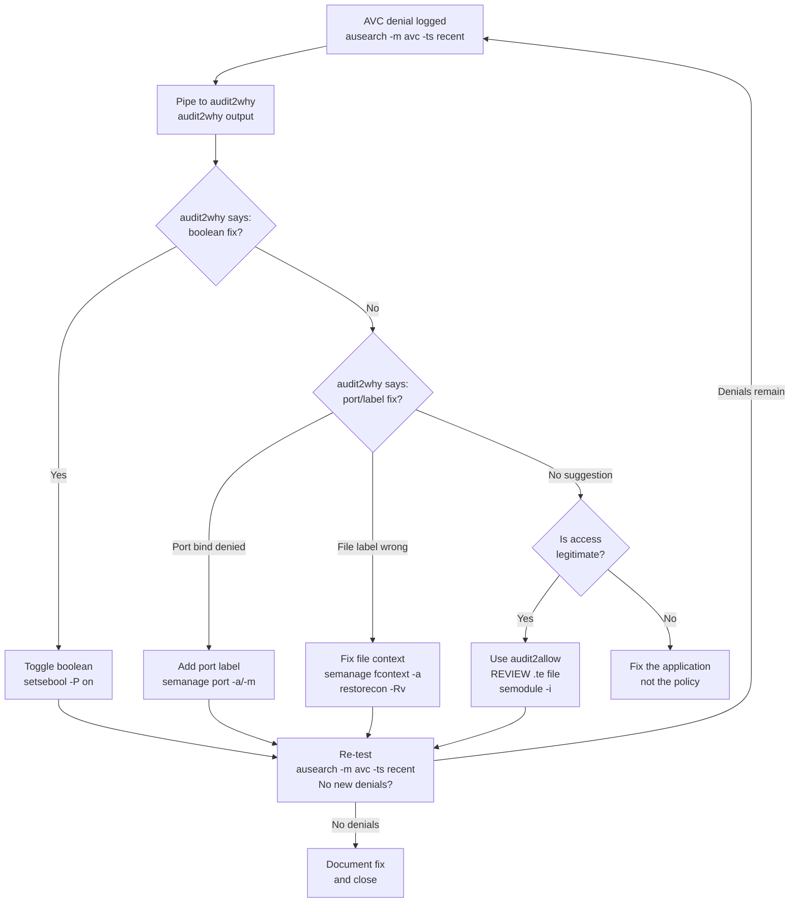

[↑ Back to TOC](#toc)

# Audit Workflow — ausearch, sealert, audit2why
[](../../LICENSE.md)
[](https://access.redhat.com/products/red-hat-enterprise-linux)
[](https://www.redhat.com)

The audit subsystem logs all SELinux denials and security-relevant events.
A systematic audit workflow lets you diagnose and fix issues quickly and
correctly.

At the RHCA level, reading an AVC record and interpreting its fields is a
fundamental skill — as fundamental as reading an nginx error log or a Java
stack trace. The audit subsystem is a structured event stream; every SELinux
denial produces a record with a precise, parseable format. `ausearch`,
`audit2why`, and `sealert` are tools for filtering and interpreting that
stream. The workflow is: find the record → understand the denial → choose
the correct fix from the taxonomy → verify the fix works.

The mental model: the audit log is a journal of every security decision the
kernel made. Every access that SELinux evaluated is either permitted (and
typically not logged) or denied (always logged when in enforcing mode). In
permissive mode, denied accesses are still logged with `permissive=1` — this
is the primary mechanism for testing policy before switching to enforcing.

Getting the audit workflow wrong means either missing the root cause (looking
at the wrong AVC record — perhaps a secondary denial triggered by the first),
or applying the wrong fix type (see the fix taxonomy in the previous chapter).
A systematic workflow prevents both errors.

---
<a name="toc"></a>

## Table of contents

- [The audit subsystem](#the-audit-subsystem)
- [ausearch — targeted queries](#ausearch-targeted-queries)
- [Read an AVC record](#read-an-avc-record)
- [audit2why — explain denials](#audit2why-explain-denials)
- [aureport — summary statistics](#aureport-summary-statistics)
- [sealert — rich analysis](#sealert-rich-analysis)
- [The systematic workflow](#the-systematic-workflow)
- [AVC denial decision tree (Mermaid)](#avc-denial-decision-tree-mermaid)
- [Logging permissive denials (don't miss them)](#logging-permissive-denials-dont-miss-them)
- [Worked example — diagnosing a multi-step AVC chain](#worked-example-diagnosing-a-multi-step-avc-chain)
- [Common mistakes and how to diagnose them](#common-mistakes-and-how-to-diagnose-them)


## The audit subsystem

| Component | Role |
|---|---|
| `auditd` | Audit daemon — writes events to `/var/log/audit/audit.log` |
| `ausearch` | Query and filter audit events |
| `aureport` | Generate summary reports from audit log |
| `audit2why` | Explain AVC denials in plain language |
| `audit2allow` | Generate policy from denials (last resort) |
| `sealert` | Rich analysis with ranked fix suggestions |

```bash
# Ensure auditd is running
sudo systemctl status auditd
```

**Install setroubleshoot for sealert:**

```bash
sudo dnf install -y setroubleshoot-server
```


[↑ Back to TOC](#toc)

---

## ausearch — targeted queries

```bash
# Recent AVC denials (last 10 minutes)
sudo ausearch -m avc -ts recent

# Today's AVC denials
sudo ausearch -m avc -ts today

# AVC denials for a specific process
sudo ausearch -m avc -c httpd

# AVC denials for a specific user
sudo ausearch -m avc -ui alice

# AVC denials for a specific object (filename)
sudo ausearch -m avc -f index.html

# Between two timestamps
sudo ausearch -m avc -ts "02/23/2026 08:00:00" -te "02/23/2026 09:00:00"

# Raw output (for piping to audit2why)
sudo ausearch -m avc -ts today --raw
```

**Useful `ausearch` flags:**

| Flag | Meaning |
|---|---|
| `-m avc` | Filter to AVC (access vector cache) denial records |
| `-ts recent` | Last 10 minutes |
| `-ts today` | Since midnight |
| `-ts boot` | Since last boot |
| `-c <comm>` | Filter by process name (`comm` field) |
| `-ui <uid>` | Filter by numeric UID |
| `-f <file>` | Filter by filename fragment |
| `--raw` | Output raw records (for piping) |
| `-i` | Interpret numeric UIDs, GIDs, and timestamps |


[↑ Back to TOC](#toc)

---

## Read an AVC record

```text
type=AVC msg=audit(1708692000.123:456): avc:  denied  { read } for
  pid=1234 comm="httpd" name="index.html"
  dev="vda3" ino=1234567
  scontext=system_u:system_r:httpd_t:s0
  tcontext=user_u:object_r:user_home_t:s0
  tclass=file permissive=0
```

| Field | Value | Meaning |
|---|---|---|
| `denied { read }` | read | The permission being denied |
| `comm` | httpd | The process name |
| `name` | index.html | The target file |
| `scontext` | `httpd_t` | Source (process) SELinux type |
| `tcontext` | `user_home_t` | Target (file) SELinux type |
| `tclass` | file | Object class |
| `permissive` | 0 | 0=enforcing (was blocked), 1=permissive (was allowed but logged) |

**Interpreting scontext and tcontext:**

Each SELinux context has the format `user:role:type:level`. In practice:
- `scontext`: the process type is in the third field (e.g., `httpd_t`)
- `tcontext`: the file type is in the third field (e.g., `user_home_t`)

The denial means: process of type `httpd_t` tried to `read` a file of type
`user_home_t`, and the policy has no `allow` rule for this combination.

**Object classes and what they represent:**

| tclass | Object type |
|---|---|
| `file` | Regular file |
| `dir` | Directory |
| `tcp_socket` | TCP socket operation (e.g., `name_bind`, `connect`) |
| `udp_socket` | UDP socket operation |
| `process` | Process operations (fork, signal, ptrace) |
| `capability` | Linux capability check |


[↑ Back to TOC](#toc)

---

## audit2why — explain denials

```bash
# Explain all recent denials
sudo ausearch -m avc -ts recent | sudo audit2why

# Explain denials for one process
sudo ausearch -m avc -c httpd | sudo audit2why
```

`audit2why` will tell you:
- What the denial means in plain language
- Whether a boolean fix exists
- Whether the target needs a different label

**Sample `audit2why` output:**

```text
type=AVC msg=audit(1708692000.123:456): avc: denied { name_bind } for
  pid=1234 comm="httpd" src=9090 ...

Was caused by:
        Missing type enforcement (TE) allow rule.

        You can use audit2allow to generate a loadable module to allow this access.
        OR

        If you believe that httpd should be allowed name_bind access on
        the tcp_socket with port 9090 by default, then you should report
        this as a bug. Otherwise, you can use the following command to
        fix this:
            semanage port -a -t PORT_TYPE -p tcp 9090
        where PORT_TYPE is one of the following: http_cache_port_t, http_port_t, ...
```

This output directly suggests the `semanage port` fix — the correct fix type
for a port binding denial.


[↑ Back to TOC](#toc)

---

## aureport — summary statistics

```bash
# Summary of all events
sudo aureport

# AVC denial summary
sudo aureport --avc

# Failed access summary
sudo aureport --failed

# Authentication events
sudo aureport --auth

# Summary for today
sudo aureport --start today --end now
```

`aureport --avc` is the fastest way to see how many AVC denials occurred,
which processes caused them, and how they are distributed over time —
without reading individual records:

```bash
sudo aureport --avc
# AVC Report
# ==========================================================
# # date time comm subj syscall class permission obj result event
# ...
# 1. 02/23/2026 08:12:34 httpd httpd_t 49 tcp_socket name_bind denied 456
# 2. 02/23/2026 08:12:34 httpd httpd_t 21 file read denied 457
```


[↑ Back to TOC](#toc)

---

## sealert — rich analysis

Requires `setroubleshoot-server` installed:

```bash
sudo dnf install -y setroubleshoot-server

# Analyse the audit log
sudo sealert -a /var/log/audit/audit.log
```

`sealert` output shows:
- Description of the denial
- Probability-ranked list of fixes
- The exact command to run for each fix
- Whether it is a known policy bug

**Example sealert output:**

```text
SELinux is preventing httpd from name_bind access on the tcp_socket port 9090.

*****  Plugin bind_ports (92.2 confidence) suggests   ************************

If you want to allow httpd to bind to network port 9090
Then you need to modify the port type.
Do
# semanage port -a -t PORT_TYPE -p tcp 9090
where PORT_TYPE is one of the following: http_cache_port_t, http_port_t, ...

*****  Plugin catchall (8.26 confidence) suggests  ***************************

If you believe that httpd should be allowed name_bind access ...
Then you should report this as a bug.

Additional Information:
Source Context: system_u:system_r:httpd_t:s0
Target Context: system_u:object_r:unreserved_port_t:s0
Target Objects:  [ tcp_socket ]
```

The confidence percentages indicate how likely each fix is to be the
correct one. Use `sealert` for complex denials where `audit2why` output
is ambiguous.


[↑ Back to TOC](#toc)

---

## The systematic workflow

```text
1. Reproduce the problem
2. ausearch -m avc -ts recent  → identify the AVC
3. audit2why                   → understand the denial
4. Apply fix taxonomy (label/boolean/port/policy)
5. Re-test
6. ausearch -m avc -ts recent  → confirm no new denials
7. Document the fix
```


[↑ Back to TOC](#toc)

---

## AVC denial decision tree (Mermaid)




[↑ Back to TOC](#toc)

---

## Logging permissive denials (don't miss them)

Even in permissive mode, denials are logged with `permissive=1`.
This lets you audit what *would* be denied before switching to enforcing:

```bash
sudo setenforce 0            # permissive (temporary)
# reproduce the problem
sudo ausearch -m avc -ts recent   # see permissive denials
sudo setenforce 1            # back to enforcing
```

**Strategy for deploying a new application:**

1. Set the domain to permissive mode only (without switching the whole system):
   ```bash
   sudo semanage permissive -a httpd_t
   # httpd_t is now permissive; everything else remains enforcing
   ```
2. Exercise the application fully (all code paths).
3. Collect all denials:
   ```bash
   sudo ausearch -m avc -c httpd -ts boot | sudo audit2why
   ```
4. Apply all required fixes.
5. Remove the per-domain permissive setting:
   ```bash
   sudo semanage permissive -d httpd_t
   ```
6. Re-test in full enforcing mode.

> **Exam tip:** Per-domain permissive mode (`semanage permissive -a <type>`)
> is safer than `setenforce 0` because it only relaxes enforcement for one
> process type. The rest of the system stays enforcing. Use this for
> testing new application policy.


[↑ Back to TOC](#toc)

---

## Worked example — diagnosing a multi-step AVC chain

**Scenario:** A Node.js API server `nodeapi` fails on startup. The unit file
runs the process as `nodeapi_t` (a custom domain from a policy module
installed by the package). The service binds port 4000 and reads a config
file from `/etc/nodeapi/config.json`.

**Step 1 — initial ausearch**

```bash
sudo ausearch -m avc -c node -ts recent
```

Three AVC records appear — two from startup, one from the first request:

```text
# Record 1
avc: denied { name_bind } for pid=5521 comm="node" src=4000
  scontext=system_u:system_r:nodeapi_t:s0
  tcontext=system_u:object_r:unreserved_port_t:s0
  tclass=tcp_socket

# Record 2
avc: denied { read open } for pid=5521 comm="node" name="config.json"
  scontext=system_u:system_r:nodeapi_t:s0
  tcontext=system_u:object_r:default_t:s0
  tclass=file

# Record 3
avc: denied { connectto } for pid=5522 comm="node"
  scontext=system_u:system_r:nodeapi_t:s0
  tcontext=system_u:system_r:mysqld_t:s0
  tclass=unix_stream_socket
```

**Step 2 — audit2why each record**

```bash
sudo ausearch -m avc -c node -ts recent | sudo audit2why
```

- Record 1: port 4000 → `semanage port -a -t http_port_t -p tcp 4000`
- Record 2: config.json in `/etc/nodeapi/` has `default_t` → `semanage fcontext` fix
- Record 3: nodeapi connecting to mysqld via Unix socket → check for boolean

```bash
sudo getsebool -a | grep -i mysql
# httpd_can_network_connect_db  off
# Not quite right — this is for httpd, not nodeapi_t

# Check if there's a specific boolean for the domain
sudo getsebool -a | grep nodeapi
# No boolean found — may need a custom policy or the Unix socket path fix
```

**Step 3 — apply fixes in order**

```bash
# Fix 1: port label
sudo semanage port -a -t http_port_t -p tcp 4000

# Fix 2: file context
sudo semanage fcontext -a -t etc_t '/etc/nodeapi(/.*)?'
sudo restorecon -Rv /etc/nodeapi/

# Fix 3: MySQL socket — check the socket path
ls -Z /var/lib/mysql/mysql.sock
# Check if nodeapi_t needs a policy module for this
# For now, test if the service functions with fixes 1 and 2
```

**Step 4 — restart and verify**

```bash
sudo systemctl restart nodeapi.service
sudo systemctl status nodeapi.service
# Active: active (running)

sudo ausearch -m avc -ts recent
# Only Record 3 remains — service is functional, MySQL connection is a secondary issue
```

The key insight: fix Record 1 and Record 2 first. Record 3 (MySQL socket)
is a secondary failure that only manifests once the service starts
successfully. Always resolve AVC chains from the first denial, not all at once.


[↑ Back to TOC](#toc)

---

## Common mistakes and how to diagnose them

**1. Querying the wrong time range**

Symptom: `ausearch -m avc -ts recent` returns nothing, but the service is
failing right now.
Diagnosis: `recent` covers only the last 10 minutes. If the failure occurred
earlier or was intermittent, records may be older.
Fix: Use `ausearch -m avc -ts today` or `ausearch -m avc -ts boot`.

**2. Missing secondary AVC denials**

Symptom: Applied the fix suggested by `audit2why` for the first denial, but
the service still fails.
Diagnosis: There is a chain of denials — fixing the first allows the second
to be reached. `ausearch -m avc -ts recent` shows new denials not visible
before the first fix.
Fix: Re-run the full workflow: restart the service, collect all new denials,
apply fixes for each. Repeat until no new denials appear.

**3. `sealert` not installed**

Symptom: `sealert: command not found`.
Fix: `sudo dnf install -y setroubleshoot-server`. Note: installing this
package also starts `setroubleshootd` which can add CPU overhead on busy
systems. Consider using `audit2why` as a lighter alternative.

**4. Audit log rotated — old records not available**

Symptom: `ausearch -m avc -ts today` returns nothing for a problem that
occurred yesterday.
Diagnosis: `aureport` may show fewer events than expected; `ls /var/log/audit/`
shows only `audit.log` with no numbered archives.
Fix: Check `/etc/audit/auditd.conf` for `num_logs` and `max_log_file`.
Increase both for longer retention. `ausearch` can search older log files:
`ausearch -m avc -if /var/log/audit/audit.log.1`.

**5. Conflating `audit2why` with `audit2allow`**

Symptom: Engineer runs `audit2allow` directly (skipping `audit2why`) and
immediately loads the generated policy module without reviewing the `.te` file.
Diagnosis: `semodule -l | grep local` shows a custom module. `cat <module>.te`
reveals it grants broad access.
Fix: Always run `audit2why` first. Use `audit2allow` only when `audit2why`
cannot suggest a fix from the taxonomy. Always review the `.te` file.

**6. Permissive mode left enabled after testing**

Symptom: After permissive mode testing with `semanage permissive -a httpd_t`,
the domain was never returned to enforcing.
Diagnosis: `semanage permissive -l` shows `httpd_t` still in the permissive
list.
Fix: `sudo semanage permissive -d httpd_t` to remove the domain-level
permissive setting.


[↑ Back to TOC](#toc)

---

## Further reading

| Resource | Notes |
|---|---|
| [`ausearch` man page](https://man7.org/linux/man-pages/man8/ausearch.8.html) | Query the audit log by type, time, user, or AVC |
| [`auditd` man page](https://man7.org/linux/man-pages/man8/auditd.8.html) | Audit daemon configuration and log rotation |
| [RHEL 10 — Auditing the system](https://access.redhat.com/documentation/en-us/red_hat_enterprise_linux/10/html/security_hardening/auditing-the-system_security-hardening) | Official audit configuration and rule writing guide |

---


[↑ Back to TOC](#toc)

## Next step

→ [Lab: Non-Default Port](labs/01-nondefault-port.md)

[↑ Back to TOC](#toc)

---

© 2026 UncleJS — Licensed under CC BY-NC-SA 4.0
